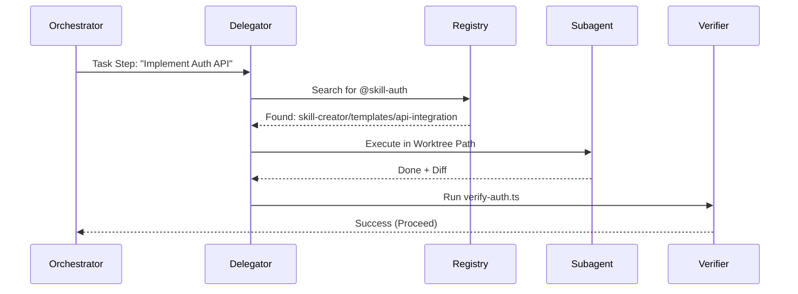

# GreenForge — 06: API e Extensibilidade

> **Status:** ✅ | **Versão:** 1.0.0 | **Data:** 2026-06-08
> **Referências:** Model Context Protocol (MCP), Gemini CLI Extension API.

### 📋 Changelog v0.0 → v1.0
| Categoria | Mudança | Status |
|---|---|---|
| Extensibilidade | Contrato de Subagentes e MCP Integration | ✅ |

---

## 1. Protocolo de Subagentes (Subagent Delegator)

O GreenForge não implementa lógica de domínio. Ele delega tarefas a especialistas.

### 1.1 Interface de Extensão (Skill/MCP)
Para que uma Skill ou servidor MCP seja compatível com o GreenForge, ele deve expor:
- **`metadata`**: Descrição clara das capacidades (usada pelo `Delegator`).
- **`verify`**: Comando ou script para auto-validação após a tarefa.

### 1.2 Fluxo de Delegação


---

## 2. Integração com MCP (Model Context Protocol)

O GreenForge atua como um **MCP Client**.
- **Context Discovery**: O orquestrador mapeia recursos MCP disponíveis para a tarefa atual.
- **Tool Mapping**: Transpõe ferramentas MCP para o contexto do `Plan Mode`.

---

## 3. Comandos Steering (Override)

O operador pode injetar instruções no orquestrador em runtime através do comando:
`gemini forge steer --task <id> --instruction "Stop and clarify before next file"`

### Contrato de Steering
```typescript
interface SteeringCommand {
  type: 'ABORT' | 'CLARIFY' | 'SKIP_VERIFICATION';
  epochId: number; // Rejeitar se o plano já mudou
}
```

---

## 4. Protocolo de Handoff de Artefatos

O GreenForge utiliza um sistema de handoff determinístico para garantir a integridade entre subtarefas.

```typescript
interface AgentArtifact {
  producedBy: string;       // ID da subtarefa produtora
  type: 'DIFF' | 'TEST_REPORT' | 'DOCS' | 'LINT_REPORT';
  path: string;             // Caminho do arquivo no worktree
  hash: string;             // SHA-256 para validação de integridade
  consumedBy: string[];     // IDs das subtarefas que dependem deste artefato
}
```

**Regra de Ouro**: Nenhuma subtarefa é marcada como `DONE` sem que seu `AgentArtifact` correspondente seja validado por hash e registrado no SQLite. Se o artefato estiver ausente ou corrompido, a subtarefa transita para `FAILED`.

---

## 5. Rastreabilidade
→ Este documento referencia: `03-technical-spec-and-data.md`
→ Este documento é referenciado por: `README.md`
