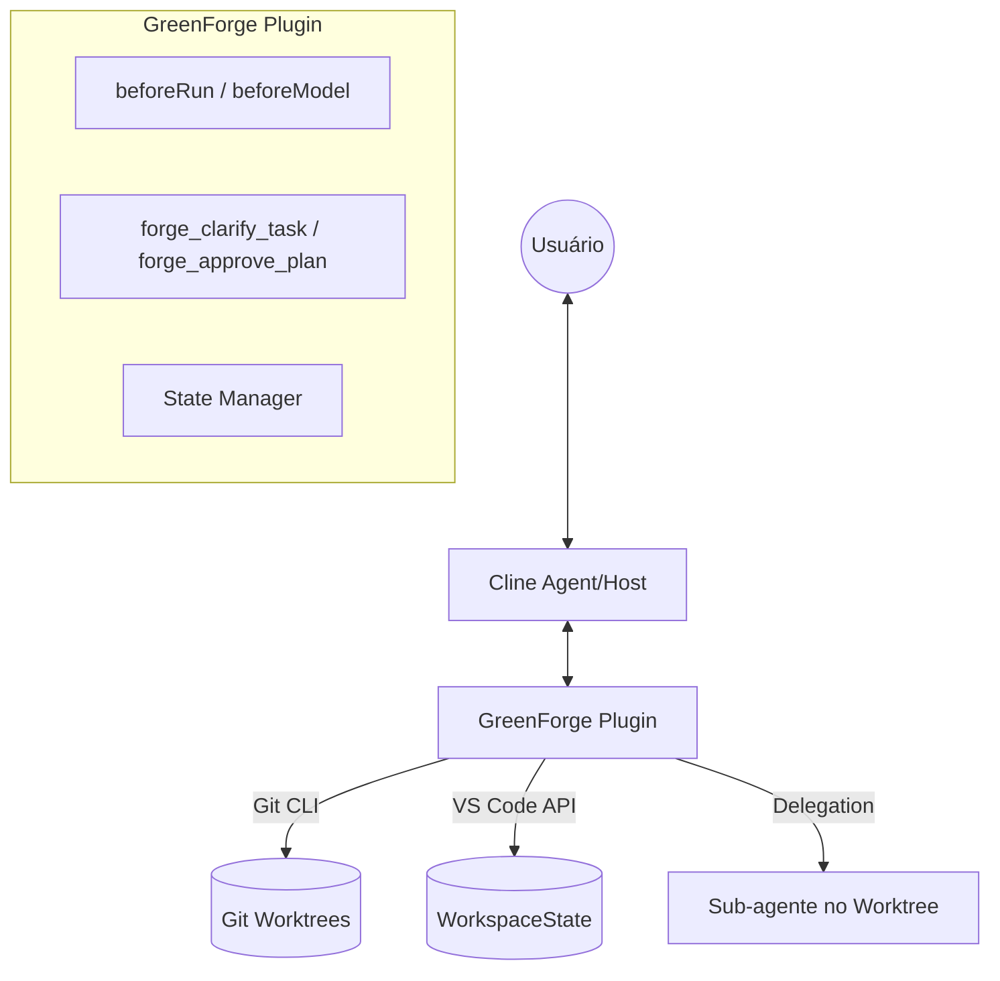

# 🏗️ GreenForge: Cline Orchestrator Plugin Design

> **Status:** 🛠️ DRAFT
> **Version:** 1.0.0-mvp
> **Date:** 2026-06-09
> **Target Platform:** Cline (VS Code Extension / CLI)

---

## 1. Resumo Executivo (Executive Summary)

O **GreenForge** é um plugin para o ecossistema Cline que adiciona uma camada de orquestração inteligente e isolamento físico determinístico sobre o agente de IA. Inspirado no Verdant AI e no design original do GreenForge, este plugin transforma o Cline de um executor direto em um engenheiro orquestrado.

### Proposta de Valor:
- **Segurança:** Isolamento total em `git worktrees`, protegendo a branch principal.
- **Qualidade:** Fase obrigatória de clarificação e planejamento antes da escrita de código.
- **Eficiência:** Redução de alucinações através de contexto cirúrgico e planos estruturados.

---

## 2. Análise de Reaproveitamento (Reuse Analysis)

Em vez de reconstruir infraestrutura, o GreenForge para Cline aproveita as capacidades nativas do SDK do Cline.

| Recurso GreenForge Antigo | Implementação no Plugin Cline (MVP) | Justificativa |
|---------------------------|-------------------------------------|---------------|
| **Intention Router**      | Hook `beforeRun` + LLM (Flash)      | Intercepta a tarefa no início do ciclo de vida do agente. |
| **Worktree Manager**      | `@cline/core` + Shell Git           | Cline já possui lógica de worktree no CLI; plugin reutiliza via shell ou SDK. |
| **Plan Mode Engine**      | Native Plan Mode + Custom Tool      | Estende o modo Plan do Cline com `forge_clarify_task`. |
| **Context Capsules**      | `.clinerules` + Search Tools        | Integra com o sistema de regras e indexação existente do Cline. |
| **Persistence (SQLite)**  | `workspaceState` do VS Code         | Simplifica o MVP evitando gerenciar um DB externo manualmente. |
| **UI (Webview)**          | Chat + Comandos VS Code             | Foca no valor funcional e evita complexidade de UI customizada no MVP. |

---

## 3. Arquitetura do Plugin (Plugin Architecture)

O plugin é implementado seguindo o contrato `AgentPlugin` do SDK do Cline, atuando como um "Middleware Inteligente".

### Componentes Principais:
1. **ForgeOrchestrator (Hooks):** Utiliza `beforeRun` para interceptar novas tarefas e gerenciar a transição de estados (`PLANNING` -> `BUILDING`).
2. **ForgeTools (Tools):** Registra ferramentas customizadas para interação com o usuário.
3. **WorktreeIsolator:** Lógica para criação e gestão de diretórios de trabalho isolados.

### Diagrama de Integração:


### Contrato do Plugin:
```typescript
const plugin: AgentPlugin = {
    name: "greenforge-orchestrator",
    manifest: {
        capabilities: ["hooks", "tools", "rules"]
    },
    setup(api, ctx) {
        // Registro de ferramentas e regras
        api.registerTool(forge_clarify_task);
        api.registerTool(forge_approve_plan);
    },
    hooks: {
        beforeRun: async (context) => {
            // Lógica de interceptação e orquestração
        }
    }
};
```

---

## 4. Fluxo de Trabalho do MVP (MVP Workflow)

O orquestrador GreenForge segue um ciclo de vida rigoroso para garantir qualidade e isolamento.

### Passos do Fluxo:

1. **Interceptação:** 
   - O usuário inicia uma tarefa no chat do Cline.
   - O comando `/forge start <descrição>` pode ser usado para forçar o modo GreenForge, ou o hook `beforeRun` pode detectar intenções de desenvolvimento complexas.
   - O orquestrador marca o estado da tarefa como `PLANNING`.

2. **Clarificação e Plano:**
   - O orquestrador utiliza a ferramenta `forge_clarify_task` para fazer perguntas ao usuário.
   - Com base nas respostas, ele gera um arquivo `GREENFORGE_PLAN.md` na raiz do projeto (ou no workspace temporário).
   - O plano detalha: Objetivos, Arquivos Afetados, Riscos e Testes.

3. **Aprovação:**
   - O agente Cline apresenta o plano ao usuário.
   - O usuário aprova o plano através da ferramenta `forge_approve_plan`.
   - O estado da tarefa muda para `BUILDING`.

4. **Orquestração e Isolamento:**
   - O plugin executa o comando `git worktree add` para criar um ambiente isolado em `.cline/worktrees/<task-id>`.
   - O plugin utiliza `createDelegatedAgent` (SDK) para spawnar um sub-agente Cline operando exclusivamente dentro do worktree.
   - O sub-agente executa a implementação e os testes auto-verificáveis.

5. **Conclusão:**
   - Após a verificação (Lint/Test), o sub-agente sinaliza a conclusão.
   - O plugin apresenta o diff final ao usuário no ambiente principal para revisão e merge.

---

## 5. Plano de Implementação (TDD)

A implementação seguirá o ciclo **Red-Green-Refactor**, focando primeiro nos componentes de orquestração.

### Fase 1: Core & Tools (RED)
- **Teste:** Verificar se `forge_clarify_task` retorna as perguntas corretas baseadas em um prompt inicial.
- **Implementação:** Definir o schema da ferramenta e a lógica básica de prompt.

### Fase 2: State Management
- **Teste:** Garantir que o estado transiciona de `PLANNING` para `BUILDING` apenas após o chamado de `forge_approve_plan`.
- **Implementação:** Integrar com o `workspaceState` do VS Code.

### Fase 3: Worktree Isolation
- **Teste:** Validar se um novo diretório de worktree é criado corretamente e se o sub-agente consegue ler arquivos apenas desse diretório.
- **Implementação:** Wrapper sobre o comando `git worktree` e configuração do `createDelegatedAgent`.

---

## 6. Riscos e Mitigações (Risks & Mitigations)

| Risco | Impacto | Mitigação |
|-------|---------|-----------|
| **Conflitos de Worktree** | Alto | O plugin deve gerenciar IDs únicos de tarefas e realizar limpeza (`prune`) de worktrees órfãos no boot. |
| **Limitações do SDK** | Médio | Caso o SDK não exponha `createDelegatedAgent` com `cwd` customizado em todas as versões, utilizaremos execução direta via Shell como fallback. |
| **Overhead de Contexto** | Baixo | O sub-agente receberá apenas o `GREENFORGE_PLAN.md` e os arquivos relevantes como contexto inicial. |
| **Segurança de Path** | Alto | Utilizar `SafeResolve` para garantir que o agente não escape do diretório do worktree. |

