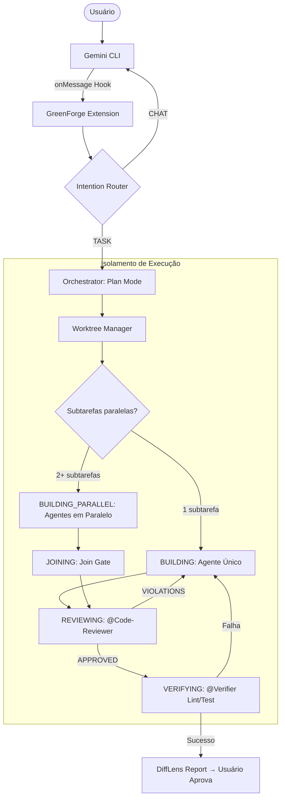

# 🌌 GREENFORGE_DESIGN.md — Architectural Source of Truth v1.4.0

> **Status:** ✅ FINAL | **Versão:** 1.4.0 | **Data:** 2026-06-08
> **Projeto:** GreenForge (The Orchestrator's Anvil)
> **Descrição:** Extensão de orquestração avançada para Gemini CLI baseada nos princípios do Verdant AI.

---

## 1. RESUMO EXECUTIVO
O **GreenForge** é uma extensão de nova geração para o Gemini CLI que automatiza o ciclo **Plan-Code-Verify**. Ele transforma o agente de uma interface de chat reativa em um engenheiro autônomo, utilizando **Git Worktrees** para isolamento físico de tarefas e um **Intention Router** inteligente para distinguir entre conversas casuais e solicitações de desenvolvimento.

---

## 2. ARQUITETURA DE ALTO NÍVEL

O GreenForge segue uma **Arquitetura Hexagonal** para garantir testabilidade e independência de infraestrutura.

### 2.1 Macro-Componentes
- **Intention Router (GF-ROUTER)**: Classifica inputs via Gemini 1.5 Flash.
- **Orchestrator Core**: Máquina de estado que gerencia o ciclo de vida da tarefa.
- **Worktree Manager (GF-ISOLATOR)**: Abstração de comandos Git para isolamento físico.
- **Persistence Layer**: SQLite (WAL Mode) para estado determinístico.
- **Delegator & Verifier**: Executa subagentes (Skills/MCP) e valida outputs (Lint/Test).

### 2.2 Diagrama de Fluxo (Mermaid)


### 2.3 Subagentes Especializados

**Subagente @Explorer (GF-EXPLORER)**
- **Responsabilidade**: Varrer o codebase para responder perguntas de arquitetura antes e durante a execução. Leitura global, sem escrita.
- **Input**: Query de busca (símbolo, padrão, arquivo).
- **Output**: Lista de ocorrências com caminho, linha e snippet de contexto.
- **Invocação**: Automática quando o Orquestrador precisa localizar dependências; ou manual via `@Explorer`.

**Subagente @Code-Reviewer (GF-REVIEWER)**
- **Responsabilidade**: Auditar o diff gerado por um agente de implementação. Verificar segurança, padrões de código e aderência ao plano aprovado.
- **Input**: Diff do worktree + hash do plano aprovado.
- **Output**: Relatório com aprovação (`APPROVED`) ou lista de violações (`VIOLATIONS: [...]`).
- **Invocação**: Automática após cada ciclo de BUILDING antes de transitar para VERIFYING.

**Subagente @Verifier (GF-VERIFIER)**
- **Responsabilidade**: Executar lint e testes no worktree isolado e reportar exit codes.
- **Input**: Worktree path + lista de comandos de verificação do plano.
- **Output**: `{ lint: 0|1, test: 0|1, details: string }`.
- **Invocação**: Automática na fase VERIFYING.

**Política de Acesso**: Todos os subagentes têm **leitura global** do repositório principal, mas **escrita restrita ao próprio worktree**. Tentativas de escrita fora do worktree atribuído lançam `WorktreeAccessViolationError`.

### 2.4 DiffLens (GF-DIFFLENS)

- **Responsabilidade**: Receber o diff consolidado de todos os worktrees após o join gate e gerar uma explicação em linguagem natural do que foi alterado e por quê, referenciando o plano aprovado.
- **Input**: `{ diff: string, planMarkdown: string, subtasksGraph: SubtaskNode[] }`.
- **Output**: `DiffReport { summary: string, fileChanges: Array<{ file, reason, riskLevel: 'LOW'|'MEDIUM'|'HIGH' }> }`.
- **Invocação**: Automática na transição `JOINING → REVIEWING`.
- **Persistência**: O `DiffReport` é persistido no SQLite e exibido ao usuário antes da aprovação final.

---

## 3. INTEGRAÇÃO COM GEMINI CLI

### 3.1 Ponto de Entrada e Hooks
A extensão implementa o contrato `GeminiExtension`:

- **Ponto de entrada:** Exporta `activate(context: ExtensionContext)` e `deactivate()`.

#### ExtensionContext Contract
```typescript
interface ExtensionContext {
  registerTool(name: string, handler: ToolHandler): void;
  getWorkspace(): { path: string; gitBranch: string };
  onMessage(callback: (message: UserMessage) => Promise<void>): void;
  onToolCall(callback: (toolCall: ToolCall) => Promise<ToolResult>): void;
  onStateChange(callback: (state: SessionState) => void): void;
}
```
Estes métodos são utilizados dentro do `activate()` para subscrever aos eventos do kernel e registrar as ferramentas do GreenForge.

- **Hooks Utilizados:**
  - `onMessage`: Intercepta o input do usuário para o `IntentionRouter`.
  - `onToolCall`: Augmenta ferramentas nativas ou injeta ferramentas do GreenForge (ex: `forge_approve`).
  - `onStateChange`: Monitora resets de sessão para limpeza de cache de memória.

### 3.2 Registro de Ferramentas (Custom Tools)
- `forge_start_task(prompt)`: Força o início de uma tarefa ignorando o router.
- `forge_list_tasks()`: Lista worktrees ativos e status.
- `forge_approve_plan(hash)`: Aprova o plano local e inicia a fase de `BUILDING`.

### 3.3 Sistema de Regras Comportamentais

O GreenForge suporta dois arquivos de regras carregados no boot da extensão via `activate()`:

| Arquivo | Escopo | Versionado? | Localização |
|---|---|---|---|
| `FORGE_RULES.md` | Preferências pessoais do usuário | Não | `~/.forge/FORGE_RULES.md` |
| `AGENTS.md` | Padrões do projeto e da equipe | Sim | `<project_root>/AGENTS.md` |

**Regra de precedência:** Quando uma mesma chave de comportamento existe nos dois arquivos, `AGENTS.md` sempre sobrescreve `FORGE_RULES.md`. O orquestrador carrega `FORGE_RULES.md` primeiro e depois aplica `AGENTS.md` por cima, sobrescrevendo conflitos.

**Formato canônico obrigatório do `AGENTS.md`:**

O arquivo é Markdown puro. Seções reconhecidas pelo parser do GreenForge:

- `## Code Style` — lista de convenções de código aplicadas pelo `@Code-Reviewer`.
- `## Constraints` — lista de restrições de acesso e modificação. **Cada item desta seção é avaliado pelo `@Code-Reviewer` contra o diff antes de aprovar.**
- `## Max Parallelism` — número inteiro definindo o máximo de agentes paralelos permitidos neste projeto. Sobrescreve o padrão global de 5.

**Exemplo canônico:**

```markdown
# GreenForge Agent Rules

## Code Style
- Linguagem: TypeScript strict mode obrigatório
- Testes: obrigatórios para toda função pública

## Constraints
- Proibido modificar arquivos em /src/shared sem aprovação explícita
- Proibido alterar arquivos .env ou package.json diretamente

## Max Parallelism
3
```

**Contrato de validação para RF-07:**

O `@Code-Reviewer` deve, para cada item listado em `## Constraints`:
1. Verificar se algum arquivo no diff corresponde ao path descrito na constraint.
2. Se sim, adicionar uma entrada em `DiffReport.violations` com o texto exato da constraint violada.
3. Retornar `VIOLATIONS` se `violations.length > 0`, bloqueando a transição para `VERIFYING`.

**Critério de aceite verificável em `rules.test.ts`:**
```typescript
// Dado um AGENTS.md com constraint "Proibido modificar /src/shared"
// E um diff contendo modificação em /src/shared/SafeResolve.ts
// O @Code-Reviewer deve retornar:
expect(result.status).toBe('VIOLATIONS');
expect(result.violations[0]).toContain('Proibido modificar /src/shared');
```

---

## 4. ESPECIFICAÇÃO TÉCNICA E DADOS

### 4.1 Persistência (SQLite v3)
**Decisão de Stack (ADR-05):** Node.js v20+ com `better-sqlite3`.
**Justificativa:** Estabilidade máxima com Gemini CLI e suporte nativo a transações síncronas rápidas.

#### Tabela: `tasks`
| Campo | Tipo | Descrição |
|---|---|---|
| `id` | UUID | PK única da tarefa. |
| `status` | ENUM | PENDING, CLARIFYING, PLANNING, BUILDING, BUILDING_PARALLEL, JOINING, REVIEWING, VERIFYING, COMPLETED, FAILED. |
| `worktree_path` | TEXT | Caminho realpath do isolamento físico. |
| `plan_hash` | TEXT | Hash SHA-256 do `GREENFORGE_PLAN.md` aprovado. |
| `subtasks_graph` | TEXT | JSON serializado: array de `SubtaskNode[]` com grafo de dependências. |

```typescript
interface SubtaskNode {
  id: string;               // Ex: "ST-01"
  title: string;            // Ex: "Implementar endpoint POST /login"
  assignedAgent: 'CODER' | 'TESTER' | 'DOCS' | null;
  dependsOn: string[];      // IDs de subtarefas que devem completar antes
  status: 'PENDING' | 'RUNNING' | 'DONE' | 'FAILED';
  worktreePath: string | null;
  artifactOutput: string | null; // Path do artefato produzido (diff, arquivo, etc.)
}
```

**Regras de transição de estado da tarefa principal:**
- `PLANNING → BUILDING` quando há exatamente 1 subtarefa sem dependências pendentes.
- `PLANNING → BUILDING_PARALLEL` quando há 2+ subtarefas sem dependências que podem iniciar simultaneamente.
- `BUILDING_PARALLEL → JOINING` quando todas as subtarefas ativas atingem `status: DONE`.
- `JOINING → REVIEWING` automaticamente após o join gate confirmar que todos os `artifactOutput` estão presentes no SQLite.
- `REVIEWING → VERIFYING` após `@Code-Reviewer` retornar `APPROVED`.
- `REVIEWING → BUILDING` se `@Code-Reviewer` retornar `VIOLATIONS` (ciclo de correção com relatório de violações como contexto).

### 4.2 Componente GF-ROUTER (Algoritmo)
1. Recebe `input` raw.
2. Chama Gemini 1.5 Flash com System Prompt de classificação binária.
3. Se `confidence < 0.7`, retorna `NORMAL_CHAT` (Pass-through).
4. Se `intent == TASK`, dispara `GF-ISOLATOR.provision()`.

---

## 5. ESTRATÉGIA DE TESTES (TDD)

### 5.1 Matriz de Testes
| Componente | Tipo de Teste | Ferramenta | Objetivo |
|---|---|---|---|
| **Router** | Unitário | Vitest + Mock API | Validar classificação de 50+ prompts padrão. |
| **Isolator** | Integração | Vitest + Git CLI | Validar criação/remoção de worktrees reais. |
| **Hardening** | Segurança | Vitest | Tentar Path Traversal em `safeResolve`. |
| **Resiliência** | Stress | Vitest | Simular crash em `atomicWrite` (check integridade). |

### 5.2 Cenários Gherkin Mínimos

#### CENÁRIO 1: Roteamento com baixa confiança
DADO que o usuário envia um prompt ambíguo
E o Intention Router retorna `confidence: 0.6`
QUANDO a extensão processa a mensagem
ENTÃO o sistema deve retornar `NORMAL_CHAT`
E nenhum processo de orquestração deve ser iniciado.

#### CENÁRIO 2: Transição de estado bloqueada
DADO uma tarefa no estado `PLANNING`
E o plano `GREENFORGE_PLAN.md` ainda não foi aprovado pelo usuário
QUANDO o agente tenta iniciar a escrita de código
ENTÃO o Orchestrator deve bloquear a transição para `BUILDING`
E retornar um erro de pré-condição.

#### CENÁRIO 3: Worktree com branch duplicada
DADO que já existe uma branch `forge/task-123` no repositório
QUANDO o Worktree Manager tenta provisionar uma nova tarefa com o mesmo ID
ENTÃO o sistema deve lançar um erro `DuplicateBranchError`
E não deve criar nenhum diretório físico órfão.

#### CENÁRIO 4: Crash durante atomicWrite
DADO que uma operação de escrita atômica está em curso
QUANDO o processo sofre um crash (SIGKILL) entre o `sync` e o `rename`
ENTÃO, após o reinício, o arquivo original deve estar intacto
E o arquivo `.tmp` residual deve ser removido pelo `BootReconciler`.

#### CENÁRIO 5: Execução paralela com join gate
DADO um plano com 3 subtarefas onde ST-01 e ST-02 não têm dependências
E ST-03 declara dependsOn: ["ST-01"]
QUANDO o Orquestrador inicia a execução
ENTÃO ST-01 e ST-02 devem iniciar simultaneamente no mesmo tick
E ST-03 só deve iniciar após ST-01 ter status DONE
E o status da tarefa principal deve ser BUILDING_PARALLEL enquanto houver subtarefas RUNNING
E deve transitar para JOINING quando todas as subtarefas tiverem status DONE.

#### CENÁRIO 6: Violação de acesso entre worktrees
DADO dois agentes rodando em paralelo com worktrees distintos WT-A e WT-B
QUANDO o agente do WT-A tenta escrever um arquivo em um path dentro de WT-B
ENTÃO o sistema deve lançar WorktreeAccessViolationError
E nenhuma escrita deve ocorrer em WT-B
E o evento deve ser registrado no SQLite como incidente de segurança.

#### CENÁRIO 7: Code-Reviewer bloqueia transição por violação de AGENTS.md
DADO que o BUILDING completou e o diff foi gerado
E o AGENTS.md declara "Proibido modificar arquivos em /src/shared sem aprovação explícita"
E o diff contém uma modificação em /src/shared/SafeResolve.ts
QUANDO o @Code-Reviewer audita o diff
ENTÃO o status deve retornar para BUILDING
E o agente responsável deve receber o relatório de violações como contexto adicional
E o campo violations_count do DiffReport deve ser maior que zero.

---

## 6. SEGURANÇA E HARDENING (INVIOLÁVEIS)

### 6.1 Contratos de Blindagem
- **SafeResolve**: NUNCA usar `path.resolve` puro. SEMPRE usar `fs.realpathSync` e validar se o prefixo resultante corresponde ao root do Worktree autorizado.
- **Atomic Write (ADR-04)**: Escrita via `.tmp` -> `fsync` -> `rename`.
  - *Nota Windows:* `fsync` é mantido por segurança, embora opcional em NTFS para performance, garante durabilidade.
- **No-Shell Policy**: Uso exclusivo de `execa` com `shell: false` e arrays de argumentos.

---

## 7. RECUPERAÇÃO E RESILIÊNCIA

### 7.1 Protocolo de Recuperação de SQLite (INC-003)
Em caso de detecção de corrupção ou lock persistente:
1. **Recuperação via Dump:** Tentar `sqlite3 data.db ".dump" | sqlite3 new.db`.
2. **BootReconciler Algorithm:**
   - Escanear diretórios em `.gemini/worktrees/`.
   - Verificar no Git se as branches correspondentes existem.
   - Se o DB estiver inacessível, recriar entidades no novo DB baseado nos metadados encontrados no filesystem.
3. **Fallback:** Se falhar, notificar o usuário e solicitar deleção manual.

---

## 8. DECISÕES ARQUITETURAIS (ADRs)

### 8.1 ADR-05: Runtime Stack
- **Decisão:** Node.js (v20+) + `better-sqlite3` + `execa`.
- **Justificativa:** 100% compatível com o ecossistema do Gemini CLI, sem riscos de instabilidade em runtime.

### 8.2 ADR-07: Indexação Semântica Adiada
- **Decisão**: Adiar indexação prévia do codebase para o MVP. No MVP, usar Context Capsules com tree-sitter extraídas sob demanda.
- **Alternativa futura**: Índice vetorial persistente (ex: SQLite com extensão `sqlite-vec`) alimentado por embeddings do codebase completo.
- **Critério de revisão**: Implementar quando o tamanho médio dos projetos ultrapassar 50.000 LOC ou tempo de montagem de Context Capsules > 2s.

---

## 9. RASTREABILIDADE (RF/RNF)

| ID | Requisito | Critério de Aceite Verificável em Teste | Teste (File) |
|---|---|---|---|
| RF-01 | Roteamento | Retorna `TASK` se input técnico; `NORMAL` se confidence < 0.7. | `router.test.ts` |
| RF-02 | Planejamento | `plan.questions.length` deve estar entre 5 e 7. | `planner.test.ts` |
| RF-03 | Isolamento | `git worktree list` deve refletir exatamente os worktrees ativos no DB. | `worktree.test.ts` |
| RF-04 | Verificação | Exit codes de `lint` e `test` devem ser 0 para status `COMPLETED`. | `verifier.test.ts` |
| RF-05 | Auto-healing | Falha na verificação dispara retry (max 3) com notificação. | `resilience.test.ts` |
| RF-06 | DiffLens | `diffReport.fileChanges.length === gitDiff.files.length`. | `difflens.test.ts` |
| RF-07 | AGENTS.md | Violação de regra detectada pelo @Code-Reviewer. | `rules.test.ts` |
| RF-08 | Paralelismo | ST-01 e ST-02 iniciam no mesmo tick quando `dependsOn: []`. | `parallel.test.ts` |
| RF-09 | Handoff | `AgentArtifact.hash` registrado no SQLite antes de `DONE`. | `handoff.test.ts` |
| RNF-01 | Latência | Tempo entre `onMessage` e resposta do router < 1.2s. | `performance.test.ts` |
| RNF-02 | Segurança | Tentativa de Path Traversal lança `SecurityError`. | `security.test.ts` |
| RNF-03 | Command Inj. | Meta-caracteres de shell em argumentos são tratados como literais. | `security.test.ts` |
| RNF-04 | Contexto | Volume de contexto enviado reduzido em > 80% via signatures. | `context.test.ts` |
| RNF-05 | Concorrência | Sistema suporta 5 subtarefas paralelas em 16GB RAM sem OOM. | `stress.test.ts` |

---
**Este documento é a Fonte Única da Verdade. Proibido implementar qualquer funcionalidade que divirja destes contratos.**
