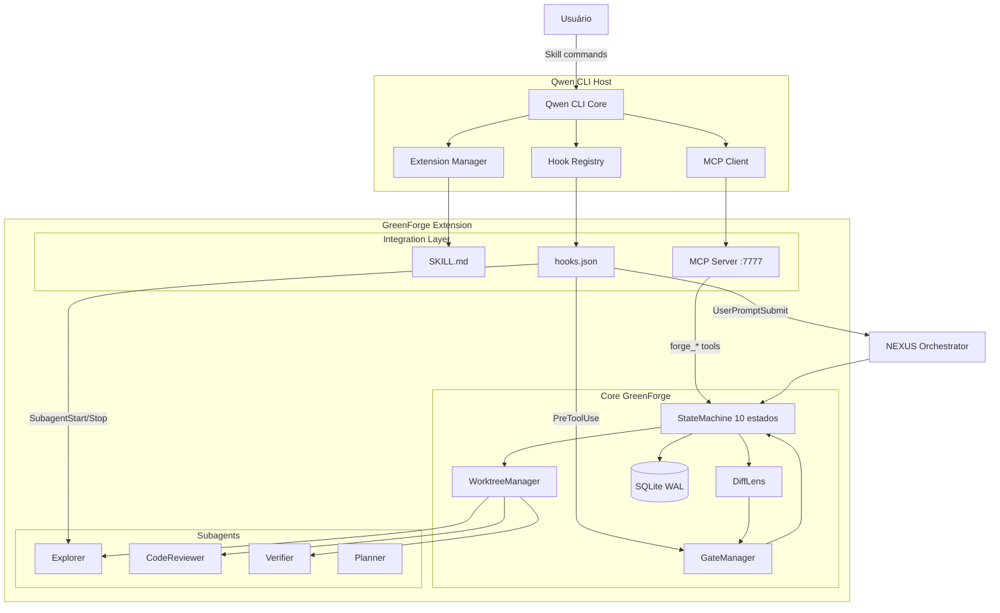

# GreenForge — Plano de Migração Documental v2.0 FINAL
## Gemini CLI Extension → Qwen CLI Extension

**Data:** 2026-06-11  
**Status:** ✅ COMPLETO — Material suficiente para reescrita total da documentação

---

## VEREDICTO: TEMOS MATERIAL SUFICIENTE

Sim. Com os dois arquivos de raspagem (documentação original + código/docs do Qwen CLI), temos tudo para fechar o escopo. O relatório abaixo é o checklist definitivo: documento por documento, o que muda, o que fica, e exatamente o que escrever no lugar.

---

## CONTEXTO CRÍTICO DESCOBERTO NA RASPAGEM

Três descobertas que mudam o design da integração:

**1. Não existe `registerTool()` runtime no Qwen CLI.**  
O Qwen usa Skill manifest estático (`SKILL.md` com frontmatter YAML) para ferramentas simples, e MCP Server para ferramentas dinâmicas. Isso não é limitação — é na verdade mais poderoso, mas muda o modelo mental de toda a Seção 3 do GREENFORGE_DESIGN.md.

**2. `onStateChange` não existe no Qwen CLI.**  
O workaround documentado na raspagem é combinar `PreToolUse` + `PostToolUse` para simular o comportamento. Isso afeta a seção de integração do NEXUS_GREENENED.

**3. Qwen CLI tem suporte nativo a subagentes com hooks `SubagentStart`/`SubagentStop`.**  
Isso é melhor do que o Gemini CLI. O GreenForge pode aproveitar isso para seus subagentes especializados (Explorer, CodeReviewer, Verifier), o que não estava documentado e precisa ser incorporado.

---

## TABELA DEFINITIVA: DOCUMENTO × AÇÃO NECESSÁRIA

| Documento | Impacto | O que fazer |
|---|---|---|
| `GREENFORGE_DESIGN.md` | 🔴 CRÍTICO | Reescrever Seção 3 completa (ver abaixo) |
| `06-api-and-extensibility.md` | 🔴 CRÍTICO | Reescrever do zero (ver abaixo) |
| `INTEGRACAO_STATUS.md` | 🔴 CRÍTICO | Zerar e reescrever do zero (ver abaixo) |
| `README.md` | 🟠 ALTO | Reescrever seções de Instalação, Uso e Variáveis (ver abaixo) |
| `01-vision-and-architecture.md` | 🟠 ALTO | Substituir diagrama Mermaid e descrição da Camada 1 (ver abaixo) |
| `000_ler_primeiro_CONTEXT_TRANSFER.md` | 🟡 MÉDIO | Atualizar Stack Tecnológica, Componentes e links (ver abaixo) |
| `03-technical-spec-and-data.md` | 🟡 MÉDIO | Atualizar Requisitos de Compatibilidade e seção de Testes (ver abaixo) |
| `NEXUS_GREENFORGE.md` | 🟡 MÉDIO | Atualizar fluxo de execução e tabela de hooks (ver abaixo) |
| `NEXUS_GREENFORGE_DEEPENED.md` | 🟡 MÉDIO | Atualizar SessionContext e referências à Extension API |
| `GREENFORGE_MAESTRO.md` | 🟢 BAIXO | Substituição nominal: "Gemini CLI" → "Qwen CLI" |
| `02-functional-requirements.md` | 🟢 BAIXO | Substituição nominal apenas |
| `04-operational-playbooks.md` | 🟢 BAIXO | Atualizar comandos de terminal (gemini → qwen) |
| `05-governance-and-security.md` | 🟢 BAIXO | Adicionar vetor T-08: MCP Server injection (novo risco) |
| `09-hardening-deterministic-contracts.md` | 🟢 BAIXO | Substituição nominal + adicionar nota sobre MCP |
| `CHANGELOG_HARDENING.md` | 🟢 BAIXO | Adicionar nota de contexto no topo; não reescrever histórico |

---

## INSTRUÇÕES PRECISAS POR DOCUMENTO

### 🔴 1. GREENFORGE_DESIGN.md — Seção 3

**Apagar completamente e substituir por:**

```
## Seção 3 — Camada de Integração com Qwen CLI

### 3.1 Visão Geral

O GreenForge se integra ao Qwen CLI através de três mecanismos complementares:

1. **Skill Manifest** (`.qwen/extensions/greenforge/skills/greenforge/SKILL.md`) — expõe comandos estáticos e instrui o modelo sobre quando usar o GreenForge
2. **Hooks JSON** (`.qwen/settings.json`) — intercepta eventos do ciclo de vida da sessão e das ferramentas
3. **MCP Server** (`src/mcp-server/`) — expõe ferramentas dinâmicas (forge_start_task, forge_approve_plan, etc.) via Model Context Protocol

Arquitetura em camadas:

┌──────────────────────────────────────────────────────┐
│                  Qwen CLI Host                       │
│  (Extension Manager + Hook Registry + MCP Client)   │
├──────────────────────────────────────────────────────┤
│            Camada de Integração GreenForge           │
│  ┌─────────────┐  ┌──────────────┐  ┌────────────┐  │
│  │ SKILL.md    │  │ hooks.json   │  │ MCP Server │  │
│  │ (estático)  │  │ (eventos)    │  │ (dinâmico) │  │
│  └─────────────┘  └──────────────┘  └────────────┘  │
├──────────────────────────────────────────────────────┤
│                   Core GreenForge                    │
│        (StateMachine, Worktree, Diff, Gates)         │
└──────────────────────────────────────────────────────┘

### 3.2 Manifesto da Extensão (qwen-extension.json)

O arquivo raiz da extensão é qwen-extension.json:

{
  "name": "greenforge",
  "version": "1.0.0",
  "mcpServers": {
    "greenforgeServer": {
      "command": "node",
      "args": ["${extensionPath}${/}dist${/}mcp-server.js"],
      "cwd": "${extensionPath}"
    }
  },
  "skills": "skills",
  "contextFileName": "QWEN.md"
}

### 3.3 Skill Manifest (SKILL.md)

O SKILL.md instrui o modelo quando e como usar o GreenForge:

---
name: greenforge
description: Gerencia tarefas de desenvolvimento com isolamento via git worktrees.
  Use quando o usuário pedir para iniciar, listar, aprovar ou abortar tarefas.
argument-hint: '<command> [args]'
---

Comandos disponíveis:
- start <task-name>: Inicia nova tarefa com worktree isolado
- status: Mostra estado das tarefas ativas
- list [--status active|completed|all]: Lista tarefas
- approve <plan-id>: Aprova plano e inicia execução
- abort <task-id>: Aborta tarefa com rollback

### 3.4 Mapeamento de Hooks

| Gemini CLI (antigo) | Qwen CLI (novo) | Configuração | Observação |
|---|---|---|---|
| activate(context) | SessionStart hook | hooks.json | Inicializa Database e StateMachine |
| deactivate() | SessionEnd hook | hooks.json | Salva estado e libera recursos |
| onMessage(handler) | UserPromptSubmit hook | hooks.json | Intercepta prompts do usuário |
| onToolCall(handler) | PreToolUse hook | hooks.json | Valida ferramentas antes de executar |
| onStateChange(handler) | PreToolUse + PostToolUse | hooks.json | Não existe nativo; usar combinação |
| registerTool(name, schema, fn) | MCP Server tool | src/mcp-server/ | Registro dinâmico via MCP |
| SubagentStart/Stop | SubagentStart/Stop hooks | hooks.json | NOVO: nativo no Qwen, melhor que Gemini |

### 3.5 Configuração de Hooks (.qwen/settings.json)

{
  "hooks": {
    "SessionStart": [{
      "hooks": [{"type": "command", "command": "greenforge-init", "timeout": 5000}]
    }],
    "SessionEnd": [{
      "hooks": [{"type": "command", "command": "greenforge-cleanup", "timeout": 3000}]
    }],
    "UserPromptSubmit": [{
      "hooks": [{"type": "http", "url": "http://localhost:7777/prompt-submit", "timeout": 2000}]
    }],
    "PreToolUse": [{
      "matcher": "WriteFile|Edit|Bash",
      "hooks": [{"type": "http", "url": "http://localhost:7777/pre-tool", "timeout": 5000}]
    }],
    "PostToolUse": [{
      "hooks": [{"type": "http", "url": "http://localhost:7777/post-tool", "timeout": 3000}]
    }],
    "SubagentStart": [{
      "hooks": [{"type": "http", "url": "http://localhost:7777/subagent-start", "timeout": 3000}]
    }],
    "SubagentStop": [{
      "hooks": [{"type": "http", "url": "http://localhost:7777/subagent-stop", "timeout": 3000}]
    }]
  }
}

### 3.6 Ferramentas MCP (substitui registerTool)

O MCP Server expõe as mesmas 3 ferramentas anteriores, agora via protocolo MCP:

- forge_start_task(taskName, branchName?, subagents?)
- forge_list_tasks(status?, limit?)
- forge_approve_plan(planId, taskId)

### 3.7 Persistência de Estado

| Gemini CLI (antigo) | Qwen CLI (novo) | Decisão |
|---|---|---|
| globalState (Memento) | Storage.global do Qwen | MANTER SQLite — mais robusto |
| workspaceState (Memento) | Storage.workspace do Qwen | MANTER SQLite — suporta WAL e transações |
| extensionPath | ${extensionPath} variável | Usar variável nativa do Qwen |

O SQLite permanece como banco principal. O sistema de Storage do Qwen pode ser usado
apenas para dados efêmeros de sessão (ex: flag "GreenForge ativo nesta sessão").

### 3.8 Ciclo de Vida da Extensão

Inicialização:
1. Qwen CLI carrega qwen-extension.json
2. MCP Server é iniciado em localhost:7777
3. Hook SessionStart dispara → greenforge-init inicializa Database + StateMachine
4. SKILL.md é carregado pelo modelo para descoberta de comandos

Shutdown:
1. Hook SessionEnd dispara → greenforge-cleanup salva estado e fecha conexões
2. MCP Server é encerrado
```

---

### 🔴 2. INTEGRACAO_STATUS.md — Zerar e reescrever

**Apagar tudo. Substituir por:**

```
# Status de Integração GreenForge × Qwen CLI

**Última atualização:** [DATA]
**Versão do Qwen CLI:** v0.4+
**Node.js mínimo:** v22+

## Componentes de Integração

| Componente | Mecanismo | Status | Observações |
|---|---|---|---|
| Inicialização | SessionStart hook | ⬜ Pendente | Substitui activate() |
| Shutdown | SessionEnd hook | ⬜ Pendente | Substitui deactivate() |
| Interceptação de prompt | UserPromptSubmit hook | ⬜ Pendente | Substitui onMessage() |
| Validação de ferramentas | PreToolUse hook | ⬜ Pendente | Substitui onToolCall() |
| Sync de estado | PreToolUse + PostToolUse | ⬜ Pendente | Workaround para onStateChange ausente |
| Ferramentas dinâmicas | MCP Server :7777 | ⬜ Pendente | Substitui registerTool() |
| Comandos slash | SKILL.md manifest | ⬜ Pendente | Substitui comandos slash Gemini |
| Controle de subagentes | SubagentStart/Stop hooks | ⬜ Pendente | NOVO — nativo no Qwen |
| Persistência global | SQLite (mantido) | ⬜ Pendente | globalState → SQLite direto |
| Persistência workspace | SQLite (mantido) | ⬜ Pendente | workspaceState → SQLite direto |

## Dívidas Técnicas Herdadas

1. Testes de integração: mocks são do Gemini CLI, precisam ser reescritos para MockQwenHookRunner
2. Error handling: falhas no MCP Server não têm tratamento uniforme definido
3. onStateChange sem equivalente direto: definir contrato de polling via PreToolUse + PostToolUse

## Variáveis de Ambiente

| Variável | Obrigatória | Descrição |
|---|---|---|
| QWEN_API_KEY | ✅ | Chave de API do Qwen |
| GF_WORKTREE_ROOT | ❌ | Raiz dos worktrees (default: .git/greenforge-worktrees) |
| GF_MAX_PARALLEL | ❌ | Máximo de tarefas simultâneas (default: 3) |
| GF_DB_PATH | ❌ | Caminho do SQLite (default: ~/.greenforge/greenforge.db) |
| GF_MCP_PORT | ❌ | Porta do MCP Server (default: 7777) |
| GF_LOG_LEVEL | ❌ | Nível de log: debug, info, warn, error (default: info) |
```

---

### 🔴 3. 06-api-and-extensibility.md — Reescrever do zero

**Apagar toda referência à Extension API do Gemini. Substituir por:**

```
## API e Extensibilidade

### Ponto de Extensão 1: Skill Manifest

Localização: .qwen/extensions/greenforge/skills/greenforge/SKILL.md
Tipo: Estático (YAML frontmatter + Markdown)
Função: Instruir o modelo quando e como usar o GreenForge

[Incluir spec completa do SKILL.md conforme seção 3.3 do GREENFORGE_DESIGN.md]

### Ponto de Extensão 2: Hooks JSON

Localização: .qwen/settings.json (ou .qwen/extensions/greenforge/settings.json)
Tipo: Declarativo (JSON)
Função: Interceptar eventos do ciclo de vida do Qwen CLI

Hooks disponíveis utilizados pelo GreenForge:
- SessionStart → inicialização
- SessionEnd → cleanup
- UserPromptSubmit → interceptação de prompts (substitui onMessage)
- PreToolUse → validação pré-execução (substitui onToolCall)
- PostToolUse → sync de estado pós-execução
- SubagentStart → inicialização de subagente
- SubagentStop → finalização de subagente

[Incluir configuração completa conforme seção 3.5 do GREENFORGE_DESIGN.md]

### Ponto de Extensão 3: MCP Server

Localização: src/mcp-server/index.ts
Porta: localhost:7777 (configurável via GF_MCP_PORT)
Função: Expor ferramentas dinâmicas ao modelo (substitui registerTool)

Ferramentas expostas:
- forge_start_task
- forge_list_tasks
- forge_approve_plan

[Incluir interface AgentArtifact e protocolo de handoff — conteúdo inalterado do arquivo 11 da raspagem]

### Interface IPluginHost (novo)

Para testabilidade, o GreenForge define IPluginHost como abstração do host CLI.
O QwenPluginAdapter implementa esta interface sobre os 3 mecanismos acima.

[Manter todo o restante do arquivo original que não menciona Gemini CLI]
```

---

### 🟠 4. README.md — Reescrever seções específicas

**Substituir apenas as seções: Visão Geral, Requisitos, Instalação, Uso Básico, Variáveis de Ambiente, Troubleshooting.**

Conteúdo novo:

```markdown
## Visão Geral

O GreenForge transforma o Qwen CLI em uma plataforma de desenvolvimento assistido por IA,
com isolamento completo de mudanças via git worktrees, state machine de 10 estados para
orquestração previsível, e subagentes especializados para exploração, revisão e verificação
de código.

## Requisitos

- **Qwen CLI**: v0.4+
- **Node.js**: v22+
- **Git**: >= 2.30.0
- **npm** ou **pnpm**

## Instalação

### Passo 1: Instalar Qwen CLI
npm install -g @qwen-code/cli

### Passo 2: Configurar API Key
export QWEN_API_KEY="sua-api-key-aqui"

### Passo 3: Instalar Extensão GreenForge
qwen extensions install https://github.com/seu-org/greenforge

### Passo 4: Verificar Instalação
qwen extensions list
# Deve exibir "greenforge" na lista

## Uso Básico

### Iniciar Nova Tarefa
qwen
/greenforge start "Refatorar módulo de autenticação"

### Listar Tarefas Ativas
/greenforge status

### Aprovar Plano Gerado
/greenforge approve <plan-id>

### Abortar Tarefa
/greenforge abort <task-id>

## Variáveis de Ambiente

| Variável | Obrigatória | Descrição |
|---|---|---|
| QWEN_API_KEY | ✅ | Chave de API do Qwen |
| GF_WORKTREE_ROOT | ❌ | Raiz dos worktrees (default: .git/greenforge-worktrees) |
| GF_MAX_PARALLEL | ❌ | Máximo de tarefas simultâneas (default: 3) |
| GF_DB_PATH | ❌ | Caminho do SQLite (default: ~/.greenforge/greenforge.db) |
| GF_MCP_PORT | ❌ | Porta do MCP Server (default: 7777) |

## Troubleshooting

### Problema: Extensão não carrega
qwen --debug
# Verificar logs de carregamento da extensão

### Problema: MCP Server não responde
curl http://localhost:7777/health
# Se falhar, reiniciar: qwen extensions restart greenforge

### Problema: SQLite corrompido
rm ~/.greenforge/greenforge.db
qwen  # Recria automaticamente via SessionStart hook

### Problema: Worktree não é criado
git --version  # Deve ser >= 2.30.0
```

---

### 🟠 5. 01-vision-and-architecture.md — Substituir diagrama e Camada 1

**Substituir o diagrama Mermaid existente por:**



**Substituir a descrição textual da Camada 1** de "Gemini CLI Host" para:

```
**Camada 1: Qwen CLI Host**
- Extension Manager carrega qwen-extension.json e inicializa a extensão
- Hook Registry processa hooks.json e dispara eventos para o GreenForge
- MCP Client conecta ao MCP Server do GreenForge para ferramentas dinâmicas
- Usuário interage via Skill commands (/greenforge <command>)
```

---

### 🟡 6. 000_ler_primeiro_CONTEXT_TRANSFER.md — Atualizar 4 pontos

**Ponto 1 — Substituir tabela de Stack Tecnológica:**

| Camada | Tecnologia |
|---|---|
| Runtime | Node.js v22+ |
| Banco de dados | SQLite (WAL Mode) via `better-sqlite3` |
| Execução de processos | `execa` com `shell: false` (obrigatório) |
| Testes | Vitest |
| Integração CLI | Qwen CLI Extension (Skill + Hooks + MCP) |
| Roteamento de intenção | Qwen 2.5 (ou modelo configurado) |
| MCP Server | `@modelcontextprotocol/sdk` v1.x |

**Ponto 2 — Substituir "Gemini CLI Extension API" → "Qwen CLI Extension (Skill + Hooks + MCP)"**

**Ponto 3 — Substituir tabela de Componentes Centrais:**

| Componente | ID | Arquivo | Teste |
|---|---|---|---|
| Intention Router | GF-ROUTER | `src/infrastructure/llm/QwenRouter.ts` | `router.test.ts` |
| Qwen Plugin Adapter | GF-ADAPTER | `src/plugin/QwenPluginAdapter.ts` | `adapter.test.ts` |
| MCP Server | GF-MCP | `src/mcp-server/index.ts` | `mcp.test.ts` |
| Worktree Manager | GF-ISOLATOR | `src/infrastructure/git/WorktreeManager.ts` | `worktree.test.ts` |
| (demais componentes inalterados) | | | |

**Ponto 4 — Substituir link de recurso adicional:**

De: `[API do Gemini CLI](https://github.com/google/gemini-cli/blob/main/docs/extension-api.md)`  
Para: `[Qwen CLI Extensions](https://github.com/QwenLM/qwen-code/blob/main/docs/users/extension/introduction.md)`

---

### 🟡 7. 03-technical-spec-and-data.md — Atualizar 2 pontos

**Ponto 1 — Substituir requisitos de compatibilidade:**

De: `Gemini CLI v2.0+, Node.js v20+`  
Para: `Qwen CLI v0.4+, Node.js v22+, @modelcontextprotocol/sdk v1.x`

**Ponto 2 — Substituir estrutura de mocks de teste:**

De:
```
tests/mocks/
  MockExtensionContext.ts
  MockGlobalState.ts
  MockToolRegistry.ts
```

Para:
```
tests/mocks/
  MockPluginHost.ts        ← abstração IPluginHost mockada
  MockQwenConfig.ts        ← Config do Qwen CLI mockada
  MockHookRunner.ts        ← Hook runner mockado
  MockMcpClient.ts         ← Cliente MCP mockado
  MockSkillRegistry.ts     ← Registry de skills mockado
```

---

### 🟡 8. NEXUS_GREENFORGE.md — Atualizar fluxo e tabela

**Substituir o fluxo de execução:**

De:
```
Usuário → /greenforge-start "refatorar auth"
  ↓
onMessage hook intercepta
  ↓
NEXUS parseia comando
```

Para:
```
Usuário → /greenforge start "refatorar auth"
  ↓
Skill manifest identifica comando
  ↓
UserPromptSubmit hook notifica MCP Server
  ↓
NEXUS parseia comando via forge_start_task
  ↓
StateMachine → INITIALIZED
  ↓
WorktreeManager cria worktree isolado
  ↓
SubagentStart hook dispara para cada subagente
  ↓
Dispatch para Explorer → CodeReviewer → Verifier
  ↓
SubagentStop hook confirma finalização
  ↓
Resultado consolidado → Usuário
```

**Substituir tabela de Hooks Utilizados por subagente:**

| Subagente | Responsabilidade | Hooks Qwen CLI |
|---|---|---|
| Explorer | Descobrir estrutura do projeto | SubagentStart, PreToolUse (read_file, glob) |
| CodeReviewer | Analisar qualidade do código | SubagentStart, PreToolUse (grep, read_many_files) |
| Verifier | Validar mudanças e testes | SubagentStart, PostToolUse (run_tests, git_diff) |
| Planner | Gerar plano de execução | UserPromptSubmit, forge_approve_plan (MCP) |

---

### 🟢 9. DOCUMENTOS COM SUBSTITUIÇÃO NOMINAL

Para estes documentos, o único trabalho é substituição textual em massa. Não há redesign.

**Em todos os documentos listados abaixo**, fazer as seguintes substituições:

| De | Para |
|---|---|
| `Gemini CLI` | `Qwen CLI` |
| `gemini-cli` | `qwen-code` |
| `Extension API` | `Plugin API (Skill + Hooks + MCP)` |
| `gemini-extension.json` | `qwen-extension.json` |
| `~/.gemini/` | `~/.qwen/` |
| `gemini` (comando) | `qwen` (comando) |
| `GEMINI_API_KEY` | `QWEN_API_KEY` |
| `npm install -g gemini-cli` | `npm install -g @qwen-code/cli` |
| `Node.js v20+` | `Node.js v22+` |

**Documentos que recebem apenas essa substituição:**
- `GREENFORGE_MAESTRO.md`
- `02-functional-requirements.md`
- `04-operational-playbooks.md`
- `09-hardening-deterministic-contracts.md`

---

### 🟢 10. 05-governance-and-security.md — Substituição + 1 adição

Além da substituição nominal, adicionar uma nova ameaça ao modelo T-01~T-07:

```
## T-08: MCP Server Injection

**Vetor**: Atacante envia payload malicioso via hook HTTP para o MCP Server do GreenForge
**Impacto**: Execução arbitrária de comandos no contexto do MCP Server
**Mitigação**:
- Validar schema rigoroso em todos os endpoints MCP (taskName, planId, taskId)
- Bind do MCP Server apenas em localhost (nunca 0.0.0.0)
- Autenticação por token compartilhado entre hooks e MCP Server
- Rate limiting: máximo 10 req/s por endpoint
```

---

### 🟢 11. CHANGELOG_HARDENING.md — Apenas nota de contexto

Adicionar no topo do arquivo, antes de qualquer conteúdo existente:

```
> **NOTA DE MIGRAÇÃO**: Este changelog documenta vulnerabilidades resolvidas quando o 
> GreenForge era uma extensão do Gemini CLI. O histórico é preservado para referência.
> A partir da v1.0.0, o GreenForge opera como extensão do Qwen CLI.
> Novas entradas de changelog devem referenciar o contexto Qwen CLI.
```

---

## NOVOS ARQUIVOS A CRIAR

Além de editar os existentes, três novos arquivos precisam ser criados:

| Arquivo | Onde | Conteúdo |
|---|---|---|
| `qwen-extension.json` | raiz do projeto | Manifesto da extensão (ver Seção 3.2 do DESIGN) |
| `.qwen/skills/greenforge/SKILL.md` | pasta .qwen | Skill manifest (ver Seção 3.3 do DESIGN) |
| `MIGRATION_GUIDE.md` | docs/ | Guia para usuários migrando do Gemini CLI |

---

## ESTRUTURA DE PASTAS FINAL DO PROJETO

```
greenforge/
├── qwen-extension.json          ← NOVO: manifesto da extensão
├── package.json
├── tsconfig.json
├── vitest.config.ts
│
├── .qwen/
│   ├── skills/
│   │   └── greenforge/
│   │       └── SKILL.md         ← NOVO: skill manifest
│   └── settings.json            ← NOVO: configuração de hooks
│
├── src/
│   ├── plugin/                  ← NOVO: camada de integração Qwen
│   │   ├── QwenPluginAdapter.ts
│   │   └── index.ts             ← ponto de entrada da extensão
│   │
│   ├── mcp-server/              ← NOVO: MCP Server (substitui registerTool)
│   │   └── index.ts
│   │
│   ├── core/                    ← INALTERADO
│   │   ├── StateMachine.ts
│   │   ├── WorktreeManager.ts
│   │   ├── DiffLens.ts
│   │   ├── GateManager.ts
│   │   └── agents/
│   │       ├── Explorer.ts
│   │       ├── CodeReviewer.ts
│   │       ├── Verifier.ts
│   │       └── Planner.ts
│   │
│   ├── persistence/             ← INALTERADO
│   │   ├── Database.ts
│   │   └── WALIntentLog.ts
│   │
│   └── interfaces/
│       ├── IPluginHost.ts       ← NOVO: abstração do host CLI
│       └── IAgent.ts            ← INALTERADO
│
├── tests/
│   ├── unit/                    ← INALTERADO
│   ├── integration/             ← ATUALIZAR: novos mocks
│   ├── e2e/                     ← ATUALIZAR: usa QwenPluginAdapter
│   └── mocks/
│       ├── MockPluginHost.ts    ← NOVO (substitui MockExtensionContext)
│       ├── MockQwenConfig.ts    ← NOVO
│       ├── MockHookRunner.ts    ← NOVO
│       └── MockMcpClient.ts     ← NOVO
│
└── docs/
    ├── 000_ler_primeiro_CONTEXT_TRANSFER.md  ← ATUALIZAR
    ├── 01-vision-and-architecture.md         ← ATUALIZAR
    ├── 02-functional-requirements.md         ← NOMINAL
    ├── 03-technical-spec-and-data.md         ← ATUALIZAR
    ├── 04-operational-playbooks.md           ← NOMINAL
    ├── 05-governance-and-security.md         ← NOMINAL + T-08
    ├── 06-api-and-extensibility.md           ← REESCREVER
    ├── 09-hardening-deterministic-contracts.md ← NOMINAL
    ├── GREENFORGE_DESIGN.md                  ← REESCREVER SEÇÃO 3
    ├── GREENFORGE_MAESTRO.md                 ← NOMINAL
    ├── INTEGRACAO_STATUS.md                  ← ZERAR E REESCREVER
    ├── MIGRATION_GUIDE.md                    ← CRIAR NOVO
    ├── NEXUS_GREENFORGE.md                   ← ATUALIZAR
    └── NEXUS_GREENFORGE_DEEPENED.md          ← ATUALIZAR
```

---

## RESUMO PARA EXECUÇÃO

**11 documentos existentes para editar:**

| Prioridade | Documento | Tipo de trabalho |
|---|---|---|
| 🔴 1 | `GREENFORGE_DESIGN.md` | Reescrever Seção 3 |
| 🔴 2 | `INTEGRACAO_STATUS.md` | Zerar e reescrever |
| 🔴 3 | `06-api-and-extensibility.md` | Reescrever |
| 🟠 4 | `README.md` | Reescrever seções específicas |
| 🟠 5 | `01-vision-and-architecture.md` | Substituir diagrama + Camada 1 |
| 🟡 6 | `000_ler_primeiro_CONTEXT_TRANSFER.md` | Atualizar 4 pontos |
| 🟡 7 | `03-technical-spec-and-data.md` | Atualizar 2 pontos |
| 🟡 8 | `NEXUS_GREENFORGE.md` | Atualizar fluxo e tabela |
| 🟡 9 | `NEXUS_GREENFORGE_DEEPENED.md` | Substituir SessionContext + referências |
| 🟢 10 | 5 documentos (MAESTRO, RF, playbooks, hardening, changelog) | Substituição nominal |
| 🟢 11 | `05-governance-and-security.md` | Nominal + adicionar T-08 |

**3 novos arquivos a criar:**
- `qwen-extension.json`
- `.qwen/skills/greenforge/SKILL.md`
- `docs/MIGRATION_GUIDE.md`