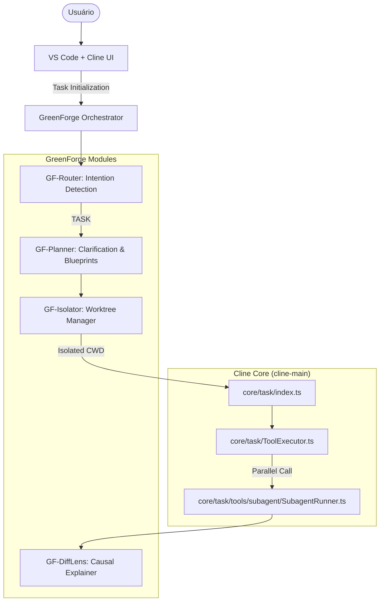

# GreenForge — 01: Visão e Arquitetura

> **Status:** ✅ | **Versão:** 2.0.0 | **Data:** 2026-06-09
> **Referências:** Verdant AI, Cline SDK, core/task/index.ts

### 📋 Changelog v1.4 → v2.0
| Categoria | Mudança | Status |
|---|---|---|
| Rebase | Migração de arquitetura standalone para plugin do Cline. | ✅ |
| Core | Integração com `AgentConfigLoader` para subagentes. | ✅ |
| UI | Mapeamento de `Plan Mode` para o estado `plan` do Cline. | ✅ |

---

## 1. Visão do Produto

O **GreenForge (Cline Edition)** é um sistema de orquestração de agentes de IA que transforma o VS Code em um ambiente de engenharia autônomo de alta fidelidade. Ele resolve o problema de falta de previsibilidade e isolamento em agentes tradicionais, impondo o workflow do Verdant AI sobre a infraestrutura do Cline.

**Princípio central: Planejamento determinístico e isolamento físico são pré-requisitos para qualquer modificação de código.**

### 1.1 Comparativo com Alternativas
| Dimensão | Cline Padrão | GreenForge (Cline Plugin) |
|---|---|---|
| **Fluxo de Trabalho** | Reativo (Chat-and-Code) | Estruturado (Research-Plan-Act) |
| **Isolamento** | Workspace atual (Shared) | Git Worktrees Isolados (Physical) |
| **Planejamento** | Opcional / Textual | Obrigatório / Blueprint Visual |
| **Subagentes** | Sequencial / Manual | Paralelo / Especializado (@Verifier) |
| **Revisão** | Manual pelo usuário | Automatizada (@Reviewer) + DiffLens |

---

## 2. Arquitetura Geral

O GreenForge estende o núcleo do Cline através de uma camada de orquestração que gerencia o ciclo de vida da tarefa.

---

## 3. Fluxo Central do Sistema

O workflow do GreenForge segue um ciclo de vida rigoroso de 5 fases:

1.  **RECEPTIVE**: O `onMessage` hook em `common.ts` intercepta o input. O `GF-Router` decide se é uma tarefa de engenharia.
2.  **CLARIFYING**: Se for tarefa, o sistema entra em loop de clarificação (5-7 perguntas).
3.  **PLANNING**: Geração do `GREENFORGE_PLAN.md` e diagramas. Requer aprovação via `forge_approve`.
4.  **BUILDING**: Execução em worktree isolado. Se houver paralelismo, múltiplos `SubagentRunner` são disparados.
5.  **REVIEWING**: O `@Code-Reviewer` audita o diff contra o `AGENTS.md`. O `DiffLens` gera o relatório final.

---

## 4. ADRs (Architectural Decision Records)

#### ADR-GF-03: Persistência via StateManager
**Contexto:** O Cline já possui um sistema de persistência robusto (`StateManager`).
**Decisão:** Utilizar o `StateManager` do Cline para armazenar o estado das tarefas do GreenForge, injetando uma chave `greenforge_task_metadata`.
**Alternativas Rejeitadas:** Banco SQLite separado (duplicação de estado e risco de dessincronização).
**Consequências:** Simplicidade de implementação e herança dos mecanismos de backup do Cline.
**Status:** Accepted.

#### ADR-GF-04: Orquestração Paralela de Subagentes
**Contexto:** O Verdant permite múltiplos agentes trabalhando em paralelo.
**Decisão:** Utilizar o suporte nativo a chamadas paralelas de ferramentas do Cline (`isParallelToolCallingEnabled`) para disparar múltiplos `SubagentRunner`. Cada subagente recebe um sub-path dentro do worktree principal.
**Consequências:** Redução drástica no tempo de entrega de features complexas.
**Status:** Accepted.

---

## 5. Roadmap

| Versão | Foco | Features Principais | Estimativa |
|---|---|---|---|
| v2.1 | Clarification Pro | AI-driven questionnaire based on codebase gaps. | Q3 2026 |
| v2.2 | Visual Canvas | Interface gráfica para edição de Blueprints. | Q4 2026 |
| v2.3 | Multi-Model Join | Orquestração de subagentes usando modelos diferentes (GPT/Claude). | Q1 2027 |

---
**Documento base para a implementação do GreenForge sobre o código fonte do Cline.**
