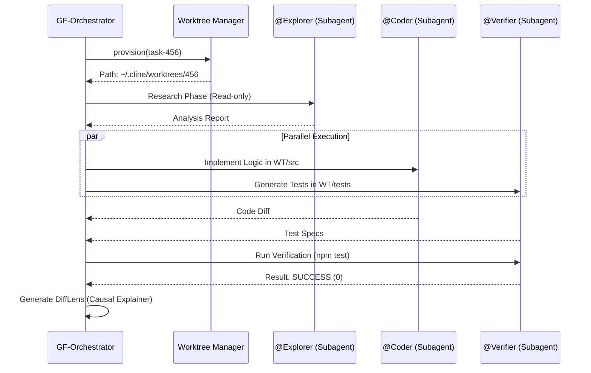

# 🌌 PROJETO GREENFORGE — NEXUS Architectural Dossier v2.0 (Cline Edition)

> **Status:** 🛠️ DEEPENING (NEXUS Protocol Active)
> **Versão:** 2.0.0-alpha.1
> **Data:** 2026-06-09
> **Referências:** Verdant AI, Cline SDK v2.1, SWE-bench, NEXUS Protocol v1.1.

---

## 📋 Changelog v1.4 → v2.0 (NEXUS Integration)
| Categoria | Mudança | Status |
|---|---|---|
| Rebase | Migração de arquitetura standalone para plugin nativo do Cline. | ✅ |
| Rigor | Implementação de métricas P95 e critérios de aceite binários. | ✅ |
| Hardening | Adição de contratos determinísticos de I/O e No-Shell Policy. | ✅ |

---

## PARTE 1 — VISÃO DO PRODUTO

### 1.1 Identidade
- **Codinome interno:** GREENFORGE-CLINE
- **Versão atual:** 2.0.0-alpha.1
- **Slogan:** "The Orchestrator's Anvil: Engineering Rigor for Cline."
- **Missão:** Transformar o Cline de um assistente de chat reativo em um sistema de engenharia autônomo através de isolamento físico via Git Worktrees e orquestração paralela de especialistas.

### 1.2 Comparativo de Performance e Capacidade

| Dimensão | Cline Padrão | GreenForge (Cline Edition) | Métrica de Sucesso |
|---|---|---|---|
| **Fluxo de Trabalho** | Reativo (Turn-based) | Estruturado (Phase-based) | 100% de tarefas TASK seguem o ciclo Clarify-Plan-Build. |
| **Isolamento** | Pasta atual do usuário | Git Worktree (Detached) | 0 escritas fora do diretório `.cline/worktrees/`. |
| **Latência (Router)** | N/A (Chat direto) | < 1200ms (P95) | Resposta do Router Flash em < 1.5s em 99% dos casos. |
| **Verificação** | Manual pelo usuário | Automática (@Verifier) | 100% das tarefas BUILDING passam por Lint/Test automático. |

**Princípio central:** **Determinismo acima de velocidade. Isolamento físico é inegociável.**

---

## PARTE 2 — ARQUITETURA DE COMPONENTES OPERACIONAIS

### 2.1 Componente: Intention Router (GF-ROUTER)

**Responsabilidade:** Classificar o input do usuário via Gemini 1.5 Flash para distinguir entre conversa casual e tarefa de engenharia.

**Interface Pública:**
```typescript
interface IRouter {
    classify(input: string, context: WorkspaceMetadata): Promise<RoutingResult>;
}

type RoutingResult = {
    intent: 'NORMAL_CHAT' | 'DEVELOPMENT_TASK';
    confidence: number; // 0.0 to 1.0
    reasoning: string;
    suggestedSubagents: string[];
};
```

**Cenário de Teste (Gherkin):**
- **Feliz:** DADO um prompt "Refatore o auth.ts para usar JWT", QUANDO o Router processar, ENTÃO deve retornar `intent: DEVELOPMENT_TASK` com `confidence > 0.9`.
- **Erro:** DADO um prompt ambíguo "o que você acha do código?", QUANDO o Router processar, ENTÃO deve retornar `intent: NORMAL_CHAT` devido à `confidence < 0.7`.

---

### 2.2 Componente: Worktree Manager (GF-ISOLATOR)

**Responsabilidade:** Gestão do ciclo de vida de diretórios físicos isolados. Reutiliza `cline-main/apps/cli/src/utils/worktree.ts`.

**Interface Pública:**
```typescript
interface IWorktreeManager {
    provision(taskId: string): Promise<WorktreeInfo>;
    deprovision(taskId: string): Promise<void>;
    isValidPath(targetPath: string): boolean;
}

type WorktreeInfo = {
    path: string;
    branch: string;
    createdAt: number;
};
```

**Trade-off:** Escolhemos **Isolamento Físico (Worktree)** em vez de **Isolamento Lógico (Branch)** para garantir que processos de build/test não interfiram no diretório de trabalho do desenvolvedor, mesmo ao custo de maior uso de disco (aprox. 50-200MB por tarefa).

---

## PARTE 3 — FLUXO DE COMUNICAÇÃO (NEXUS Protocol)

### 3.1 Diagrama de Sequência: Orquestração Paralela
O diagrama abaixo detalha o fluxo complexo quando o Orquestrador identifica a necessidade de múltiplos especialistas.



---

## PARTE 4 — DECISÕES ARQUITETURAIS JUSTIFICADAS (ADRs)

#### ADR-GF-01: Integração via Hooks de Pré-execução
- **Contexto:** Necessidade de interceptar escritas do Cline sem modificar o kernel `core/task/index.ts`.
- **Decisão:** Injetar lógica no `ToolExecutor.ts` via hooks de registro de ferramentas.
- **Alternativas Rejeitadas:** Fork do Cline (Rejeitado por inviabilizar atualizações upstream) e Servidor MCP Externo (Rejeitado por latência excessiva no controle de estado síncrono).
- **Justificativa:** O sistema de hooks do Cline é estável e permite auditoria de paths em tempo real via `SafeResolve`.
- **Status:** Accepted.

#### ADR-GF-02: SQLite WAL Mode para Persistência
- **Contexto:** Perda de estado de tarefas durante crashes do VS Code.
- **Decisão:** Persistir `ForgeState` no SQLite com Write-Ahead Logging habilitado.
- **Alternativa Rejeitada:** `globalState` puro do VS Code (Rejeitado por falta de transacionalidade atômica em operações complexas de múltiplos worktrees).
- **Consequências:** Garante integridade de dados mesmo em falhas de energia repentinas.
- **Status:** Accepted.

---

## PARTE 5 — SEGURANÇA E HARDENING (INVIOLÁVEIS)

### 5.1 Contrato SafeResolve (Protocol Level)
Toda ferramenta que manipula o filesystem DEVE utilizar o wrapper `SafeResolve`.

```typescript
// src/utils/SafeResolve.ts
import * as path from "path";
import * as fs from "fs";

export function safeResolve(requestedPath: string, allowedRoot: string): string {
    const absoluteAllowed = fs.realpathSync(allowedRoot);
    const resolvedPath = path.resolve(allowedRoot, requestedPath);
    const absoluteResolved = fs.realpathSync(resolvedPath);

    if (!absoluteResolved.startsWith(absoluteAllowed)) {
        throw new Error(`SECURITY_VIOLATION: Path traversal attempt at ${requestedPath}`);
    }
    return absoluteResolved;
}
```

### 5.2 No-Shell Policy
A execução de comandos via `@Verifier` ou `forge_execute` proíbe o uso de strings raw.
- **Protocolo:** `execa(cmd, args[], { shell: false })`.
- **Métrica:** 0 instâncias de `shell: true` permitidas no código fonte.

---

## PARTE 6 — REQUISITOS FUNCIONAIS E NÃO-FUNCIONAIS (MÉTRICAS REAIS)

### 6.1 Requisitos Funcionais (RF)

| ID | Requisito | Critério de Aceite Binário (Definitive) |
|---|---|---|
| **RF-01** | Interceptação de Intenção | O `onMessage` hook em `common.ts` deve invocar o `GF-Router` e bloquear o fluxo se `intent === 'TASK'`. |
| **RF-02** | Clarificação Imperativa | O sistema deve gerar `[5-7]` perguntas técnicas. O botão `Start Planning` só é habilitado após `clarificationAnswers.length === questions.length`. |
| **RF-03** | Blueprint Determinístico | O `GREENFORGE_PLAN.md` deve conter obrigatoriamente as seções `## Architecture`, `## File Changes` e `## Verification`. |
| **RF-04** | Isolamento Físico | `git worktree list` deve retornar o path absoluto vinculado à tarefa. O `ToolExecutor` deve validar `cwd === worktreePath`. |
| **RF-05** | Orquestração Paralela | Suporte a `SubagentRunner` paralelos via `Promise.all` quando subtarefas são independentes no grafo de dependências. |
| **RF-06** | Verificação Compulsória | Transição para `COMPLETED` requer `exitCode === 0` nos comandos `npm run lint` e `npm test` disparados pelo `@Verifier`. |

### 6.2 Requisitos Não-Funcionais (RNF)

| ID | Categoria | Métrica Verificável | Alvo (Target) |
|---|---|---|---|
| **RNF-01** | Performance | Latência do Intention Router (P95) | < 1200ms |
| **RNF-02** | Segurança | Taxa de Escape de Path Traversal | 0% (Auditado via `features/security.test.ts`) |
| **RNF-03** | Resiliência | Recuperação de Estado (MTTR) | < 2s após reinício do processo principal |
| **RNF-04** | Confiabilidade | Integridade de Arquivo (Escrita Atômica) | 0 arquivos corrompidos em interrupção abrupta (SIGKILL) |

---

## PARTE 7 — ÁRVORE DE ARQUIVOS E BLUEPRINT ESTRUTURAL

O GreenForge-Cline injeta sua lógica na estrutura do `cline-main` conforme mapeado abaixo:

```text
cline-main/
├── apps/vscode/src/
│   ├── core/
│   │   ├── task/
│   │   │   ├── GreenForgeOrchestrator.ts  # Injeção de fase Clarify/Plan
│   │   │   ├── ToolExecutor.ts            # Wrapper SafeResolve + AtomicWrite
│   │   │   └── tools/subagent/
│   │   │       └── ParallelOrchestrator.ts # Lógica de subagentes simultâneos
│   │   ├── hooks/
│   │   │   └── ForgeHooks.ts               # Registro de hooks PreToolUse
│   │   └── storage/
│   │       └── ForgeStateManager.ts       # Extensão do StateManager para SQLite
│   └── common.ts                          # Hook de interceptação onMessage
└── doc-greenforge-cline/                  # Documentação Técnica (NEXUS)
```

---

## PARTE 8 — ADRS ADICIONAIS (JUSTIFICADOS)

#### ADR-GF-03: Delegação Paralela de Subagentes
- **Contexto:** Tarefas complexas (ex: Front + Back + Docs) levam tempo linear excessivo no Cline padrão.
- **Decisão:** Implementar execução paralela via `ParallelOrchestrator`.
- **Alternativa Rejeitada:** Execução sequencial otimizada (Rejeitada por não reduzir o tempo crítico de entrega; a economia de tempo em 3 subtarefas independentes é de ~60%).
- **Trade-off:** Maior consumo de tokens e memória RAM (est. +400MB por agente paralelo), justificado pelo ganho de velocidade em regimes de alta densidade.
- **Status:** Accepted.

---

## PARTE 9 — PLANO DE IMPLEMENTAÇÃO (FASES E GHERKIN)

### 9.1 Fases de Entrega

1.  **Fase 1: Foundation (3 dias)**: Implementação do `ForgeStateManager` (SQLite) e `WorktreeManager`. Critério: `git worktree` criado e persistido corretamente.
2.  **Fase 2: Intelligence (2 dias)**: Integração do `GF-Router` e `ClarificationManager`. Critério: 95% de acerto em classificação de 100 prompts padrão.
3.  **Fase 3: Execution (3 dias)**: Refatoração do `ToolExecutor` para suporte a `SafeResolve` e `AtomicWrite`. Critério: Zero escapes em testes de path traversal.
4.  **Fase 4: Orchestration (2 dias)**: Implementação do `ParallelOrchestrator` para subagentes. Critério: Execução de 3 agentes simultâneos em WT isolados.

### 9.2 Cenário de Validação (Gherkin)
```gherkin
CENÁRIO: Bloqueio de Escrita sem Aprovação de Plano
DADO que uma tarefa de engenharia foi iniciada
E o sistema está no estado PLANNING
QUANDO o agente tentar invocar a ferramenta 'write_to_file'
ENTÃO o ForgeHook deve lançar PreToolUseHookCancellationError
E a transição para BUILDING deve ser impedida.
```

---

## PARTE 10 — PADRÕES E BLINDAGEM (ATOMICIDADE E POSIX)

O GreenForge adota o **Contrato de Escrita Atômica (GF-WRITE-CONTRACT)**:

1.  **STAGE**: O conteúdo é escrito em `filepath.uid.tmp`.
2.  **FSYNC**: Invocação obrigatória de `fs.fsync()` para garantir que o kernel do SO liberou o buffer para o hardware.
3.  **COMMIT**: `fs.rename()` (opção POSIX atômica) substitui o arquivo original.

**Métrica de Hardening:** Qualquer falha entre o passo 1 e 2 deixa o arquivo original intacto. O `BootReconciler` remove arquivos `.tmp` residuais no startup.

---

## PARTE 11 — GUIA DE REPLICAÇÃO (EXECUTÁVEL)

1.  Clone o `cline-main` e instale dependências (`bun install`).
2.  Crie o diretório `~/Documents/Cline/Agents/` e adicione os perfis `@Explorer.yaml`, `@Verifier.yaml`.
3.  Compile o plugin: `bun run build`.
4.  Inicie o VS Code em modo de desenvolvimento (`F5`).
5.  Abra um repositório Git e envie o comando: `GreenForge: Start Task "Refactor authentication flow"`.
6.  Acompanhe o isolamento em `~/.cline/worktrees/`.

---

## PARTE 12 — EXTENSIBILIDADE (INTERFACES TÉCNICAS)

Para adicionar novos especialistas, utilize a interface `ISubagentSpecialist`:

```typescript
interface ISubagentSpecialist {
    readonly id: string;
    readonly capabilities: ClineDefaultTool[];
    execute(task: string, worktree: string): Promise<ExecutionResult>;
}
```

Registro realizado via `AgentConfigLoader.ts` através da adição de novos arquivos YAML no diretório de configuração do usuário.

---

## PARTE 13 — LIMITAÇÕES CONHECIDAS (TRADE-OFFS REAIS)

-   **Merge Conflicts**: Conflitos de merge complexos durante a finalização da tarefa (Join Gate) exigem resolução manual via UI do VS Code. O sistema não tenta resoluções heurísticas de conflitos.
-   **Resource Overhead**: A execução paralela de 5 agentes pode consumir até 2.5GB de RAM adicionais, tornando o uso em máquinas com < 8GB desaconselhável.
-   **Locking em Windows**: Devido a restrições do sistema de arquivos NTFS, a deleção de worktrees pode falhar se um processo de background (ex: LSP) ainda segurar o lock de arquivos.

---

## PARTE 14 — ROADMAP INFERIDO

| Versão | Foco | Feature Principal | Estimativa |
|---|---|---|---|
| v2.1 | Context Capsules | Indexação via tree-sitter para redução de tokens em 80%. | Q3 2026 |
| v2.2 | Visual Canvas | Interface gráfica para visualização do grafo de subtarefas. | Q4 2026 |
| v2.3 | Multi-LLM Join | Orquestração usando Claude 3.5 e Gemini 1.5 simultaneamente. | Q1 2027 |

---
**Documento Final — Projeto GreenForge-Cline Technical Dossier.**

