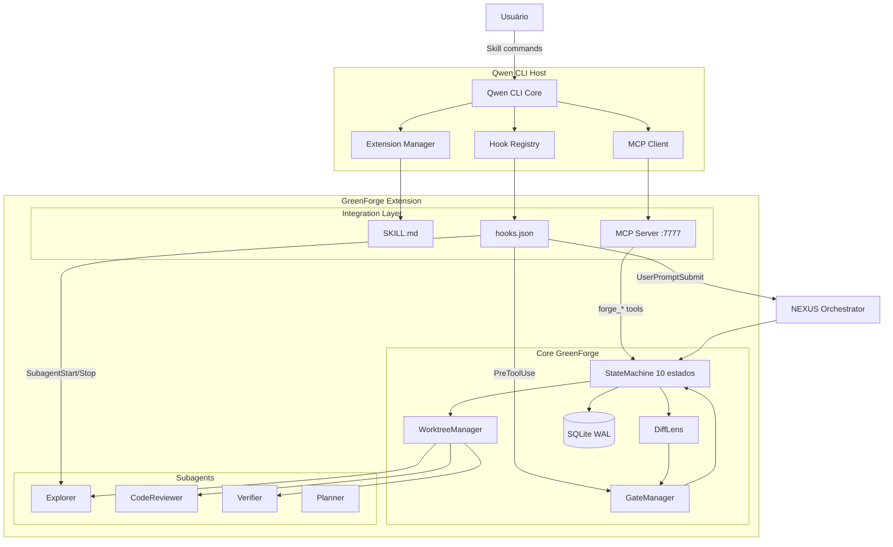

# GreenForge — 01: Visão e Arquitetura

> **Status:** ✅ | **Versão:** 1.0.1 | **Data:** 2026-06-08
> **Referências:** Verdant AI, SWE-bench Verified, Git Worktree Documentation, Agentic Workflows (Andrew Ng).

### 📋 Changelog v1.0 → v1.0.1
| Categoria | Mudança | Status |
|---|---|---|
| Arquitetura | Definição do Central Gateway e Intention Router | ✅ |
| Isolamento | Estratégia de Worktree-per-Task | ✅ |
| Planejamento | Implementação do Plan Mode de 5 fases | ✅ |

---

## 1. Visão Geral e Justificativa

O **GreenForge** aborda o principal gargalo no desenvolvimento assistido por IA em 2026: o **overhead de coordenação** e a **poluição de contexto**. Em vez de tratar cada entrada como um prompt de chat, o GreenForge atua como um sistema operacional de engenharia para o Qwen CLI.

### 1.1 Objetivos Estratégicos
- **Isolamento de Erro**: Garantir que uma tarefa experimental nunca corrompa a branch principal (`main`) através de Git Worktrees.
- **Redução de Alucinação**: Utilizar o "Plan Mode" (read-only) para forçar o modelo a pensar antes de agir, aumentando a taxa de sucesso no primeiro commit (pass@1).
- **Escalabilidade Multi-Agente**: Permitir que subagentes especializados (através de MCP ou Skills) trabalhem em paralelo em diferentes worktrees.

---

## 2. Arquitetura de Alto Nível

O sistema é dividido em três camadas fundamentais: **Intention**, **Orchestration** e **Execution**.

### 2.1 Diagrama de Macro-Arquitetura (Mermaid)

**Camada 1: Qwen CLI Host**
- Extension Manager carrega qwen-extension.json e inicializa a extensão
- Hook Registry processa hooks.json e dispara eventos para o GreenForge
- MCP Client conecta ao MCP Server do GreenForge para ferramentas dinâmicas
- Usuário interage via Skill commands (/greenforge <command>)

---

## 3. Componentes Centrais

### 3.1 Intention Router (The Sentinel)
Responsável por interceptar cada comando antes de chegar ao kernel do Qwen CLI.
- **Input**: Texto raw do usuário + contexto do projeto (arquivos abertos, git status).
- **Lógica**: Classificação probabilística via LLM para distinguir entre conversa (Chat) e mudança de estado (Task).
- **Ação**: Redireciona para o `Orchestrator` ou permite o `pass-through` para o chat normal.

### 3.2 Plan Mode Engine (The Architect)
Implementa o rigoroso ciclo de design do Verdant AI.
- **Fase de Clarificação**: Identifica lacunas na solicitação (ex: "Em qual arquivo devo adicionar a rota?").
- **Geração de GREENFORGE_PLAN.md**: Um artefato persistente que descreve a arquitetura proposta e os critérios de aceitação.

### 3.3 Worktree Manager (The Isolator)
Garante a integridade do repositório.
- **Comando**: `git worktree add ../temp-task-branch branch-name`.
- **Benefício**: Permite rodar testes, builds e linting em um diretório físico separado sem interferir no diretório de trabalho principal do desenvolvedor.

---

## 4. Estratégia de Verificação (TDD & Verifiers)

Diferente de extensões "gera-e-cola", o GreenForge não considera uma tarefa concluída após a escrita do código.
1. **Auto-Lint**: Execução de linters locais.
2. **Auto-Test**: Execução de testes unitários existentes e novos.
3. **Verifier Agent**: Um subagente secundário revisa o diff contra o `GREENFORGE_PLAN.md`.

---

## 5. Rastreabilidade
→ Este documento referencia: `GREENFORGE_MAESTRO.md`
→ Este documento é referenciado por: `02-functional-requirements.md`, `03-technical-spec-and-data.md`
