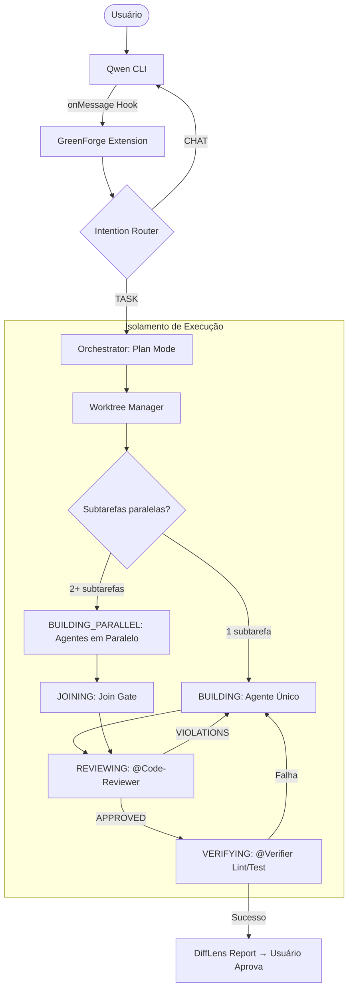

# 🌌 GREENFORGE_DESIGN.md — Architectural Source of Truth v1.4.0

> **Status:** ✅ FINAL | **Versão:** 1.4.0 | **Data:** 2026-06-08
> **Projeto:** GreenForge (The Orchestrator's Anvil)
> **Descrição:** Extensão de orquestração avançada para Qwen CLI baseada nos princípios do Verdant AI.

---

## 1. RESUMO EXECUTIVO
O **GreenForge** é uma extensão de nova geração para o Qwen CLI que automatiza o ciclo **Plan-Code-Verify**. Ele transforma o agente de uma interface de chat reativa em um engenheiro autônomo, utilizando **Git Worktrees** para isolamento físico de tarefas e um **Intention Router** inteligente para distinguir entre conversas casuais e solicitações de desenvolvimento.

---

## 2. ARQUITETURA DE ALTO NÍVEL

O GreenForge segue uma **Arquitetura Hexagonal** para garantir testabilidade e independência de infraestrutura.

### 2.1 Macro-Componentes
- **Intention Router (GF-ROUTER)**: Classifica inputs via Qwen 2.5.
- **Orchestrator Core**: Máquina de estado que gerencia o ciclo de vida da tarefa.
- **Worktree Manager (GF-ISOLATOR)**: Abstração de comandos Git para isolamento físico.
- **Persistence Layer**: SQLite (WAL Mode) para estado determinístico.
- **Delegator & Verifier**: Executa subagentes (Skills/MCP) e valida outputs (Lint/Test).

### 2.2 Diagrama de Fluxo (Mermaid)


### 2.3 Subagentes Especializados

**Subagente @Explorer (GF-EXPLORER)**
- **Responsabilidade**: Varrer o codebase para responder perguntas de arquitetura antes e durante a execução. Leitura global, sem escrita.
- **Input**: Query de busca (símbolo, padrão, arquivo).
- **Output**: Lista de ocorrências com caminho, linha e snippet de contexto.
- **Invocação**: Automática quando o Orquestrador precisa localizar dependências; ou manual via `@Explorer`.

**Subagente @Code-Reviewer (GF-REVIEWER)**
- **Responsabilidade**: Auditar o diff gerado por um agente de implementação. Verificar segurança, padrões de código e aderência ao plano aprovado.
- **Input**: Diff do worktree + hash do plano aprovado.
- **Output**: Relatório com aprovação (`APPROVED`) ou lista de violações (`VIOLATIONS: [...]`).
- **Invocação**: Automática após cada ciclo de BUILDING antes de transitar para VERIFYING.

**Subagente @Verifier (GF-VERIFIER)**
- **Responsabilidade**: Executar lint e testes no worktree isolado e reportar exit codes.
- **Input**: Worktree path + lista de comandos de verificação do plano.
- **Output**: `{ lint: 0|1, test: 0|1, details: string }`.
- **Invocação**: Automática na fase VERIFYING.

**Política de Acesso**: Todos os subagentes têm **leitura global** do repositório principal, mas **escrita restrita ao próprio worktree**. Tentativas de escrita fora do worktree atribuído lançam `WorktreeAccessViolationError`.

### 2.4 DiffLens (GF-DIFFLENS)

- **Responsabilidade**: Receber o diff consolidado de todos os worktrees após o join gate e gerar uma explicação em linguagem natural do que foi alterado e por quê, referenciando o plano aprovado.
- **Input**: `{ diff: string, planMarkdown: string, subtasksGraph: SubtaskNode[] }`.
- **Output**: `DiffReport { summary: string, fileChanges: Array<{ file, reason, riskLevel: 'LOW'|'MEDIUM'|'HIGH' }> }`.
- **Invocação**: Automática na transição `JOINING → REVIEWING`.
- **Persistência**: O `DiffReport` é persistido no SQLite e exibido ao usuário antes da aprovação final.

---

## 3. Seção 3 — Camada de Integração com Qwen CLI

### 3.1 Visão Geral

O GreenForge se integra ao Qwen CLI através de três mecanismos complementares:

1. **Skill Manifest** (`.qwen/extensions/greenforge/skills/greenforge/SKILL.md`) — expõe comandos estáticos e instrui o modelo sobre quando usar o GreenForge
2. **Hooks JSON** (`.qwen/settings.json`) — intercepta eventos do ciclo de vida da sessão e das ferramentas
3. **MCP Server** (`src/mcp-server/`) — expõe ferramentas dinâmicas (forge_start_task, forge_approve_plan, etc.) via Model Context Protocol

Arquitetura em camadas:

┌──────────────────────────────────────────────────────┐
│                  Qwen CLI Host                       │
│  (Extension Manager + Hook Registry + MCP Client)   │
├──────────────────────────────────────────────────────┤
│            Camada de Integração GreenForge           │
│  ┌─────────────┐  ┌──────────────┐  ┌────────────┐  │
│  │ SKILL.md    │  │ hooks.json   │  │ MCP Server │  │
│  │ (estático)  │  │ (eventos)    │  │ (dinâmico) │  │
│  └─────────────┘  └──────────────┘  └────────────┘  │
├──────────────────────────────────────────────────────┤
│                   Core GreenForge                    │
│        (StateMachine, Worktree, Diff, Gates)         │
└──────────────────────────────────────────────────────┘

### 3.2 Manifesto da Extensão (qwen-extension.json)

O arquivo raiz da extensão é qwen-extension.json:

{
  "name": "greenforge",
  "version": "1.0.0",
  "mcpServers": {
    "greenforgeServer": {
      "command": "node",
      "args": ["${extensionPath}${/}dist${/}mcp-server.js"],
      "cwd": "${extensionPath}"
    }
  },
  "skills": "skills",
  "contextFileName": "QWEN.md"
}

### 3.3 Skill Manifest (SKILL.md)

O SKILL.md instrui o modelo quando e como usar o GreenForge:

---
name: greenforge
description: Gerencia tarefas de desenvolvimento com isolamento via git worktrees.
  Use quando o usuário pedir para iniciar, listar, aprovar ou abortar tarefas.
argument-hint: '<command> [args]'
---

Comandos disponíveis:
- start <task-name>: Inicia nova tarefa com worktree isolado
- status: Mostra estado das tarefas ativas
- list [--status active|completed|all]: Lista tarefas
- approve <plan-id>: Aprova plano e inicia execução
- abort <task-id>: Aborta tarefa com rollback

### 3.4 Mapeamento de Hooks

| Gemini CLI (antigo) | Qwen CLI (novo) | Configuração | Observação |
|---|---|---|---|
| activate(context) | SessionStart hook | hooks.json | Inicializa Database e StateMachine |
| deactivate() | SessionEnd hook | hooks.json | Salva estado e libera recursos |
| onMessage(handler) | UserPromptSubmit hook | hooks.json | Intercepta prompts do usuário |
| onToolCall(handler) | PreToolUse hook | hooks.json | Valida ferramentas antes de executar |
| onStateChange(handler) | PreToolUse + PostToolUse | hooks.json | Não existe nativo; usar combinação |
| registerTool(name, schema, fn) | MCP Server tool | src/mcp-server/ | Registro dinâmico via MCP |
| SubagentStart/Stop | SubagentStart/Stop hooks | hooks.json | NOVO: nativo no Qwen, melhor que Gemini |

### 3.5 Configuração de Hooks (.qwen/settings.json)

{
  "hooks": {
    "SessionStart": [{
      "hooks": [{"type": "command", "command": "greenforge-init", "timeout": 5000}]
    }],
    "SessionEnd": [{
      "hooks": [{"type": "command", "command": "greenforge-cleanup", "timeout": 3000}]
    }],
    "UserPromptSubmit": [{
      "hooks": [{"type": "http", "url": "http://localhost:7777/prompt-submit", "timeout": 2000}]
    }],
    "PreToolUse": [{
      "matcher": "WriteFile|Edit|Bash",
      "hooks": [{"type": "http", "url": "http://localhost:7777/pre-tool", "timeout": 5000}]
    }],
    "PostToolUse": [{
      "hooks": [{"type": "http", "url": "http://localhost:7777/post-tool", "timeout": 3000}]
    }],
    "SubagentStart": [{
      "hooks": [{"type": "http", "url": "http://localhost:7777/subagent-start", "timeout": 3000}]
    }],
    "SubagentStop": [{
      "hooks": [{"type": "http", "url": "http://localhost:7777/subagent-stop", "timeout": 3000}]
    }]
  }
}

### 3.6 Ferramentas MCP (substitui registerTool)

O MCP Server expõe as mesmas 3 ferramentas anteriores, agora via protocolo MCP:

- forge_start_task(taskName, branchName?, subagents?)
- forge_list_tasks(status?, limit?)
- forge_approve_plan(planId, taskId)

### 3.7 Persistência de Estado

| Gemini CLI (antigo) | Qwen CLI (novo) | Decisão |
|---|---|---|
| globalState (Memento) | Storage.global do Qwen | MANTER SQLite — mais robusto |
| workspaceState (Memento) | Storage.workspace do Qwen | MANTER SQLite — suporta WAL e transações |
| extensionPath | ${extensionPath} variável | Usar variável nativa do Qwen |

O SQLite permanece como banco principal. O sistema de Storage do Qwen pode ser usado
apenas para dados efêmeros de sessão (ex: flag "GreenForge ativo nesta sessão").

### 3.8 Ciclo de Vida da Extensão

Inicialização:
1. Qwen CLI carrega qwen-extension.json
2. MCP Server é iniciado em localhost:7777
3. Hook SessionStart dispara → greenforge-init inicializa Database + StateMachine
4. SKILL.md é carregado pelo modelo para descoberta de comandos

Shutdown:
1. Hook SessionEnd dispara → greenforge-cleanup salva estado e fecha conexões
2. MCP Server é encerrado

---

## 4. ESPECIFICAÇÃO TÉCNICA E DADOS

### 4.1 Persistência (SQLite v3)
**Decisão de Stack (ADR-05):** Node.js v22+ com `better-sqlite3`.
**Justificativa:** Estabilidade máxima com Qwen CLI e suporte nativo a transações síncronas rápidas.

#### Tabela: `tasks`
| Campo | Tipo | Descrição |
|---|---|---|
| `id` | UUID | PK única da tarefa. |
| `status` | ENUM | PENDING, CLARIFYING, PLANNING, BUILDING, BUILDING_PARALLEL, JOINING, REVIEWING, VERIFYING, COMPLETED, FAILED. |
| `worktree_path` | TEXT | Caminho realpath do isolamento físico. |
| `plan_hash` | TEXT | Hash SHA-256 do `GREENFORGE_PLAN.md` aprovado. |
| `subtasks_graph` | TEXT | JSON serializado: array de `SubtaskNode[]` com grafo de dependências. |

```typescript
interface SubtaskNode {
  id: string;               // Ex: "ST-01"
  title: string;            // Ex: "Implementar endpoint POST /login"
  assignedAgent: 'CODER' | 'TESTER' | 'DOCS' | null;
  dependsOn: string[];      // IDs de subtarefas que devem completar antes
  status: 'PENDING' | 'RUNNING' | 'DONE' | 'FAILED';
  worktreePath: string | null;
  artifactOutput: string | null; // Path do artefato produzido (diff, arquivo, etc.)
}
```

**Regras de transição de estado da tarefa principal:**
- `PLANNING → BUILDING` quando há exatamente 1 subtarefa sem dependências pendentes.
- `PLANNING → BUILDING_PARALLEL` quando há 2+ subtarefas sem dependências que podem iniciar simultaneamente.
- `BUILDING_PARALLEL → JOINING` quando todas as subtarefas ativas atingem `status: DONE`.
- `JOINING → REVIEWING` automaticamente após o join gate confirmar que todos os `artifactOutput` estão presentes no SQLite.
- `REVIEWING → VERIFYING` após `@Code-Reviewer` retornar `APPROVED`.
- `REVIEWING → BUILDING` se `@Code-Reviewer` retornar `VIOLATIONS` (ciclo de correção com relatório de violações como contexto).

### 4.2 Componente GF-ROUTER (Algoritmo)
1. Recebe `input` raw.
2. Chama Qwen 2.5 com System Prompt de classificação binária.
3. Se `confidence < 0.7`, retorna `NORMAL_CHAT` (Pass-through).
4. Se `intent == TASK`, dispara `GF-ISOLATOR.provision()`.

---

## 5. ESTRATÉGIA DE TESTES (TDD)

### 5.1 Matriz de Testes
| Componente | Tipo de Teste | Ferramenta | Objetivo |
|---|---|---|---|
| **Router** | Unitário | Vitest + Mock API | Validar classificação de 50+ prompts padrão. |
| **Isolator** | Integração | Vitest + Git CLI | Validar criação/remoção de worktrees reais. |
| **Hardening** | Segurança | Vitest | Tentar Path Traversal em `safeResolve`. |
| **Resiliência** | Stress | Vitest | Simular crash em `atomicWrite` (check integridade). |

### 5.2 Cenários Gherkin Mínimos

#### CENÁRIO 1: Roteamento com baixa confiança
DADO que o usuário envia um prompt ambíguo
E o Intention Router retorna `confidence: 0.6`
QUANDO a extensão processa a mensagem
ENTÃO o sistema deve retornar `NORMAL_CHAT`
E nenhum processo de orquestração deve ser iniciado.

#### CENÁRIO 2: Transição de estado bloqueada
DADO uma tarefa no estado `PLANNING`
E o plano `GREENFORGE_PLAN.md` ainda não foi aprovado pelo usuário
QUANDO o agente tenta iniciar a escrita de código
ENTÃO o Orchestrator deve bloquear a transição para `BUILDING`
E retornar um erro de pré-condição.

#### CENÁRIO 3: Worktree com branch duplicada
DADO que já existe uma branch `forge/task-123` no repositório
QUANDO o Worktree Manager tenta provisionar uma nova tarefa com o mesmo ID
ENTÃO o sistema deve lançar um erro `DuplicateBranchError`
E não deve criar nenhum diretório físico órfão.

#### CENÁRIO 4: Crash durante atomicWrite
DADO que uma operação de escrita atômica está em curso
QUANDO o processo sofre um crash (SIGKILL) entre o `sync` e o `rename`
ENTÃO, após o reinício, o arquivo original deve estar intacto
E o arquivo `.tmp` residual deve ser removido pelo `BootReconciler`.

#### CENÁRIO 5: Execução paralela com join gate
DADO um plano com 3 subtarefas onde ST-01 e ST-02 não têm dependências
E ST-03 declara dependsOn: ["ST-01"]
QUANDO o Orquestrador inicia a execução
ENTÃO ST-01 e ST-02 devem iniciar simultaneamente no mesmo tick
E ST-03 só deve iniciar após ST-01 ter status DONE
E o status da tarefa principal deve ser BUILDING_PARALLEL enquanto houver subtarefas RUNNING
E deve transitar para JOINING quando todas as subtarefas tiverem status DONE.

#### CENÁRIO 6: Violação de acesso entre worktrees
DADO dois agentes rodando em paralelo com worktrees distintos WT-A e WT-B
QUANDO o agente do WT-A tenta escrever um arquivo em um path dentro de WT-B
ENTÃO o sistema deve lançar WorktreeAccessViolationError
E nenhuma escrita deve ocorrer em WT-B
E o evento deve ser registrado no SQLite como incidente de segurança.

#### CENÁRIO 7: Code-Reviewer bloqueia transição por violação de AGENTS.md
DADO que o BUILDING completou e o diff foi gerado
E o AGENTS.md declara "Proibido modificar arquivos em /src/shared sem aprovação explícita"
E o diff contém uma modificação em /src/shared/SafeResolve.ts
QUANDO o @Code-Reviewer audita o diff
ENTÃO o status deve retornar para BUILDING
E o agente responsável deve receber o relatório de violações como contexto adicional
E o campo violations_count do DiffReport deve ser maior que zero.

---

## 6. SEGURANÇA E HARDENING (INVIOLÁVEIS)

### 6.1 Contratos de Blindagem
- **SafeResolve**: NUNCA usar `path.resolve` puro. SEMPRE usar `fs.realpathSync` e validar se o prefixo resultante corresponde ao root do Worktree autorizado.
- **Atomic Write (ADR-04)**: Escrita via `.tmp` -> `fsync` -> `rename`.
  - *Nota Windows:* `fsync` é mantido por segurança, embora opcional em NTFS para performance, garante durabilidade.
- **No-Shell Policy**: Uso exclusivo de `execa` com `shell: false` e arrays de argumentos.

---

## 7. RECUPERAÇÃO E RESILIÊNCIA

### 7.1 Protocolo de Recuperação de SQLite (INC-003)
Em caso de detecção de corrupção ou lock persistente:
1. **Recuperação via Dump:** Tentar `sqlite3 data.db ".dump" | sqlite3 new.db`.
2. **BootReconciler Algorithm:**
   - Escanear diretórios em `.qwen/worktrees/`.
   - Verificar no Git se as branches correspondentes existem.
   - Se o DB estiver inacessível, recriar entidades no novo DB baseado nos metadados encontrados no filesystem.
3. **Fallback:** Se falhar, notificar o usuário e solicitar deleção manual.

---

## 8. DECISÕES ARQUITETURAIS (ADRs)

### 8.1 ADR-05: Runtime Stack
- **Decisão:** Node.js (v22+) + `better-sqlite3` + `execa`.
- **Justificativa:** 100% compatível com o ecossistema do Qwen CLI, sem riscos de instabilidade em runtime.

### 8.2 ADR-07: Indexação Semântica Adiada
- **Decisão**: Adiar indexação prévia do codebase para o MVP. No MVP, usar Context Capsules com tree-sitter extraídas sob demanda.
- **Alternativa futura**: Índice vetorial persistente (ex: SQLite com extensão `sqlite-vec`) alimentado por embeddings do codebase completo.
- **Critério de revisão**: Implementar quando o tamanho médio dos projetos ultrapassar 50.000 LOC ou tempo de montagem de Context Capsules > 2s.

---

## 9. RASTREABILIDADE (RF/RNF)

| ID | Requisito | Critério de Aceite Verificável em Teste | Teste (File) |
|---|---|---|---|
| RF-01 | Roteamento | Retorna `TASK` se input técnico; `NORMAL` se confidence < 0.7. | `router.test.ts` |
| RF-02 | Planejamento | `plan.questions.length` deve estar entre 5 e 7. | `planner.test.ts` |
| RF-03 | Isolamento | `git worktree list` deve refletir exatamente os worktrees ativos no DB. | `worktree.test.ts` |
| RF-03.4 | Auto-cleanup | Após deprovision(), git worktree list não deve conter o path removido. | `worktree.test.ts` |
| RF-04 | Verificação | Exit codes de `lint` e `test` devem ser 0 para status `COMPLETED`. | `verifier.test.ts` |
| RF-05 | Auto-healing | Falha na verificação dispara retry (max 3) com notificação. | `resilience.test.ts` |
| RF-06 | DiffLens | `diffReport.fileChanges.length === gitDiff.files.length`. | `difflens.test.ts` |
| RF-07 | AGENTS.md | Violação de regra detectada pelo @Code-Reviewer. | `rules.test.ts` |
| RF-08 | Paralelismo | ST-01 e ST-02 iniciam no mesmo tick quando `dependsOn: []`. | `parallel.test.ts` |
| RF-09 | Handoff | `AgentArtifact.hash` registrado no SQLite antes de `DONE`. | `handoff.test.ts` |
| RNF-01 | Latência | Tempo entre `onMessage` e resposta do router < 1.2s. | `performance.test.ts` |
| RNF-02 | Persistência | PRAGMA journal_mode retorna WAL após inicialização. | `handoff.test.ts` |
| RNF-06 | Segurança | Tentativa de Path Traversal lança `SecurityError`. | `security.test.ts` |
| RNF-03 | Command Inj. | Meta-caracteres de shell em argumentos são tratados como literais. | `security.test.ts` |
| RNF-04 | Contexto | Volume de contexto enviado reduzido em > 80% via signatures. | `context.test.ts` |
| RNF-05 | Concorrência | Sistema suporta 5 subtarefas paralelas em 16GB RAM sem OOM. | `stress.test.ts` |

---
**Este documento é a Fonte Única da Verdade. Proibido implementar qualquer funcionalidade que divirja destes contratos.**
