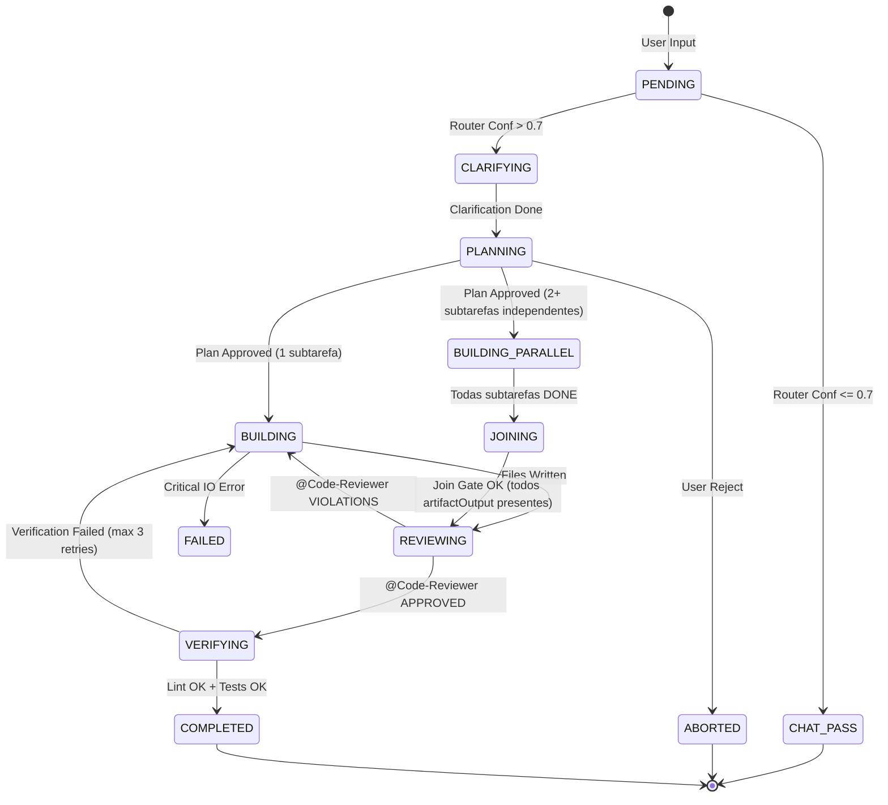
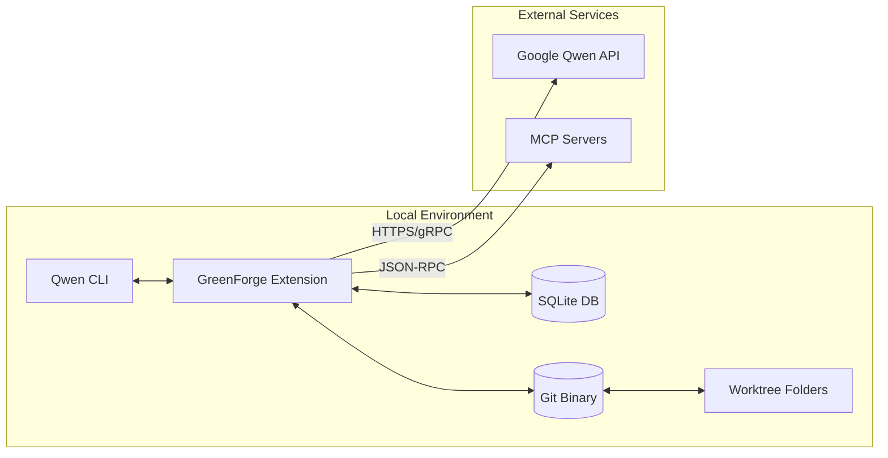
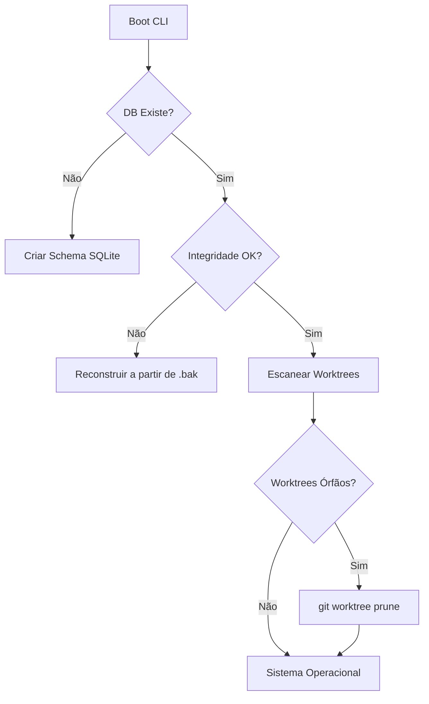

# 🌌 PROJETO GREENFORGE — NEXUS Architectural Dossier v1.1
> **Status:** 🛠️ EM GERAÇÃO (NEXUS Protocol Active)
> **Versão:** 1.0.0-alpha.1
> **Data:** 2026-06-08
> **Referências:** Verdant AI, SWE-bench Verified, NEXUS Protocol v1.1.

---

## 📋 Changelog v1.0 → v1.1 (NEXUS Integration)
| Categoria | Mudança | Status |
|---|---|---|
| Estrutura | Migração completa para o Protocolo NEXUS v1.1 | ✅ |
| Detalhamento | Expansão de Contratos de Componentes e State Machines | ✅ |
| Rigor | Adição de Matriz de Rastreabilidade e Critérios Binários | ✅ |

---

## PARTE 1 — VISÃO DO PRODUTO

### 1.1 Identidade
- **Codinome interno:** GREENFORGE (The Orchestrator's Anvil)
- **Versão atual:** 1.0.0-alpha.1
- **Declaração de visão:** Orquestrar o desenvolvimento assistido por IA através de isolamento físico determinístico e fluxos de planejamento estruturados, eliminando o overhead de coordenação em repositórios de alta escala.

### 1.2 Problema e Solução

| Problema | Impacto | Como o Sistema Resolve |
|---|---|---|
| Corrupção de Branch | O agente de IA faz commits errôneos diretamente na branch `main`. | **Worktree Isolation**: Força toda alteração em um diretório físico separado (`git worktree`). |
| Poluição de Contexto | Envio de arquivos irrelevantes estoura o limite de tokens e causa alucinação. | **Context Capsules**: Fornece apenas o código relevante e esqueletos de dependências indexados via SQLite. |
| Falta de Verificação | Código gerado quebra o build ou testes existentes silenciosamente. | **Verify Mode**: Ciclo automático de Lint -> Test -> Verify antes de qualquer proposta de merge. |
| Indeterminismo | O usuário não sabe o que a IA vai fazer até que os arquivos sejam alterados. | **Plan Mode (Read-Only)**: Gera um plano Markdown revisável antes de qualquer escrita no disco. |

### 1.3 Público-Alvo

| Segmento | Perfil (nome fictício + dor específica) | Prioridade (P0/P1/P2) |
|---|---|---|
| Tech Lead | "Marcos": Precisa revisar centenas de PRs gerados por IA e teme por segurança. | P0 |
| Engenheiro de IA | "Ana": Quer automatizar tarefas repetitivas (ex: CRUDs) sem perder o controle. | P1 |
| Dev de Infra/SRE | "Carlos": Precisa garantir que agentes de IA não saturem APIs ou corrompam o DB. | P2 |

### 1.4 Princípios Arquiteturais

| Princípio | Descrição Concreta | Implicação Técnica |
|---|---|---|
| **Isolamento Total** | Nenhuma tarefa de escrita pode ocorrer no diretório raiz do projeto. | Uso obrigatório de `git worktree add` para cada ID de tarefa. |
| **Planejamento Primeiro** | A fase de escrita de código (Agent Mode) é bloqueada até que um plano seja aprovado. | State machine impede transição de `PLANNING` para `BUILDING` sem sinal de aprovação. |
| **Auditabilidade** | Todo passo da IA deve ser registrado em um banco de dados imutável. | Registro de logs estruturados e checkpoints no SQLite (WAL Mode). |
| **Contexto Cirúrgico** | O agente recebe o mínimo de contexto necessário para a máxima precisão. | Implementação de `ContextCapsule` com extração de assinaturas via tree-sitter. |
| **Fail-Fast** | Qualquer erro de infraestrutura (Git/DB) aborta a tarefa imediatamente. | Verificação de integridade (Pre-flight) no boot e em cada transição. |

---

## PARTE 2 — ARQUITETURA DE COMPONENTES

### 2.1 Componente: Intention Router (GF-ROUTER)

**Ficha Técnica**

| Atributo | Valor |
|---|---|
| ID interno | GF-ROUTER-01 |
| Dependências | Qwen Flash API, Local Context Index |
| Modo de Operação | Síncrono (Request-Response) |
| Permissões | Read-only (Prompt + Workspace Metadata) |

**Responsabilidade**
Analisar o input bruto do usuário e classificar a intenção entre conversa casual ou tarefa de desenvolvimento, aplicando heurísticas de confiança para evitar falsos positivos.

**Inputs Detalhados**

| Input | Tipo | Descrição | Origem |
|---|---|---|---|
| `user_input` | String | O texto digitado pelo usuário. | CLI stdin |
| `project_state` | Object | Status do Git, arquivos abertos, branch atual. | Workspace Metadata |

**Output (Exemplo JSON)**
```json
{
  "task_id": "8f2a-4c91",
  "intention": "DEVELOPMENT_TASK",
  "confidence": 0.98,
  "metadata": {
    "suggested_title": "Implementar JWT Auth",
    "entities_detected": ["JWT", "AuthService", "Middleware"]
  }
}
```

**System Prompt (NEXUS Hardened)**
1. Você é um roteador de intenções binário.
2. Classifique apenas como `NORMAL_CHAT` ou `DEVELOPMENT_TASK`.
3. Se o input solicitar alteração de arquivos, criação de novas funcionalidades ou correção de bugs, use `DEVELOPMENT_TASK`.
4. Em caso de dúvida, ou se a confiança for < 0.7, retorne `NORMAL_CHAT`.

---

### 2.2 Componente: Worktree Manager (GF-ISOLATOR)

**Ficha Técnica**

| Atributo | Valor |
|---|---|
| ID interno | GF-ISOLATOR-01 |
| Dependências | Git Binary (>= 2.30.0), Node.js `fs` |
| Modo de Operação | Síncrono (Operações de IO Bloqueantes) |
| Permissões | Escrita em diretório temporário, Gestão de Branches |

**Responsabilidade**
Criar, listar e destruir diretórios físicos (`worktrees`) vinculados a branches git para cada tarefa ativa, garantindo isolamento total da branch `main`.

**Algoritmo Central (Pseudo-código)**
```typescript
async function createIsolation(taskId: string): Promise<string> {
  const branchName = `forge/task-${taskId}`;
  const targetPath = path.resolve(GF_ROOT, 'worktrees', taskId);
  
  await git.exec(`branch ${branchName}`);
  await git.exec(`worktree add ${targetPath} ${branchName}`);
  
  return targetPath;
}
```

---

## PARTE 3 — FLUXO DE COMUNICAÇÃO E CONTRATOS

### 3.1 Fluxo de Execução Migrado

Usuário → `/greenforge start "refatorar auth"`
  ↓
Skill manifest identifica comando
  ↓
UserPromptSubmit hook notifica MCP Server
  ↓
NEXUS parseia comando via forge_start_task
  ↓
StateMachine → INITIALIZED
  ↓
WorktreeManager cria worktree isolado
  ↓
SubagentStart hook dispara para cada subagente
  ↓
Dispatch para Explorer → CodeReviewer → Verifier
  ↓
SubagentStop hook confirma finalização
  ↓
Resultado consolidado → Usuário

### 3.2 Tabela de Hooks Utilizados por subagente

| Subagente | Responsabilidade | Hooks Qwen CLI |
|---|---|---|
| Explorer | Descobrir estrutura do projeto | SubagentStart, PreToolUse (read_file, glob) |
| CodeReviewer | Analisar qualidade do código | SubagentStart, PreToolUse (grep, read_many_files) |
| Verifier | Validar mudanças e testes | SubagentStart, PostToolUse (run_tests, git_diff) |
| Planner | Gerar plano de execução | UserPromptSubmit, forge_approve_plan (MCP) |

### 3.3 Diagrama de Estado: Ciclo de Vida da Tarefa


--- CONTINUAÇÃO PENDENTE (próximo: PARTE 4 — INFRAESTRUTURA E INTEGRAÇÃO) ---

## PARTE 4 — INFRAESTRUTURA E INTEGRAÇÃO

### 4.1 Diagrama de Infraestrutura


### 4.2 Requisitos de Hardware/Ambiente

| Perfil | Especificações | Notas |
|---|---|---|
| Mínimo | 4GB RAM, 2-core CPU, 500MB Disk | Para tarefas simples e scripts isolados. (Node.js v20+) |
| Recomendado | 16GB RAM, 8-core CPU, 5GB Disk | Necessário para rodar builds e testes pesados em paralelo. |
| Enterprise | 32GB+ RAM, CI/CD Integration | Para orquestração de múltiplos agentes em pipelines. |

### 4.3 Integrações Externas

| SERVICE | Motivo | Alternativa Rejeitada | Fallback |
|---|---|---|---|
| **Qwen 1.5 Flash** | Baixa latência para roteamento. | GPT-4o-mini (custo de latência) | Heurística Local (Regex) |
| **Qwen 1.5 Pro** | Raciocínio superior para planejamento. | Claude 3.5 Sonnet (integração nativa) | Modo Offline (Manual) |
| **Git Worktrees** | Isolamento físico nativo. | Docker Containers (overhead de boot) | Branch Checkout (Risco de sujeira) |

### 4.4 Segurança: Modelo de Ameaças

| # | Ameaça | Vetor | Mitigação |
|---|---|---|---|
| **A-01** | Prompt Injection | Input do usuário tenta forçar `rm -rf`. | **Intention Router**: Valida intenção antes de permitir o Planejamento. |
| **A-02** | Path Traversal | Agente tenta ler `/etc/passwd`. | **SafeResolve**: Validação de prefixo contra o root do worktree. |
| **A-03** | Command Injection | `; curl malicioso.com` em comandos. | **Execa Wrapper**: Desabilita o shell intermediário (`shell: false`). |
| **A-04** | Secret Leak | Log de chaves de API. | **Redaction Pipeline**: Regex filter em todos os outputs do console. |
| **A-05** | Unauthorized Merge | Agente tenta dar merge na `main`. | **Branch Protection**: O orquestrador não possui permissão de `git merge`. |
| **A-06** | Resource Exhaustion | Loop infinito de criação de arquivos. | **Disk Quota**: Limite de 2GB por diretório de worktree. |
| **A-07** | State Tampering | Modificar `tasks.db` externamente. | **SQL Integrity**: Checagem de hash do DB no boot. |
| **A-08** | Man-in-the-Middle | Interceptação de chaves MCP. | **mTLS/Encryption**: Criptografia de transporte para servidores remotos. |

---

## PARTE 5 — RECUPERAÇÃO DE ERROS E RESILIÊNCIA

### 5.1 Classificação de Erros

| Nível | Tipo | Exemplos Concretos | Ação Automática | Timeout | Máx Tentativas |
|---|---|---|---|---|---|
| **L1** | Transiente | Timeout de API Qwen. | Retry com Backoff Exponencial. | 5s | 3 |
| **L2** | Recuperável | Conflito de Lock no SQLite. | Wait + Retry. | 2s | 5 |
| **L3** | Crítico | Falha no `git worktree add`. | Cleanup parcial + Abort Task. | 30s | 1 |
| **L4** | Fatal | Corrupção do DB de estado. | **BootReconciler**: Factory Reset. | N/A | 0 |
| **L5** | Segurança | Violação de Path Traversal. | **Kill Process** + Audit Log. | Imediato | 0 |

### 5.2 Fluxo de Self-Healing (Boot Recovery)


--- CONTINUAÇÃO PENDENTE (próximo: PARTE 6 — REQUISITOS FUNCIONAIS E NÃO-FUNCIONAIS) ---

## PARTE 6 — REQUISITOS FUNCIONAIS E NÃO-FUNCIONAIS

### 6.1 Requisitos Funcionais

| ID | Requisito | Critério de Aceite (verificável) | Prioridade | Complexidade |
|---|---|---|---|---|
| **RF-01** | Roteamento de Intenção | Input "Crie X" deve retornar `DEVELOPMENT_TASK` via API Flash. | Must | Média |
| **RF-02** | Isolamento de Worktree | `git worktree list` deve mostrar um novo path após aprovação do plano. | Must | Alta |
| **RF-03** | Plan Mode Interativo | O sistema deve pausar e aguardar `Start Building` no stdout. | Must | Média |
| **RF-04** | Persistência de Estado | Reiniciar a CLI não deve perder o rastro de uma tarefa em `BUILDING`. | Must | Alta |
| **RF-05** | Auto-Verification | Sucesso do build/teste deve ser pré-condição para o status `COMPLETED`. | Should | Média |
| **RF-06** | Delegator de Subagentes | Invocação dinâmica de Skill via ID (ex: `@skill-auth`). | Should | Alta |

### 6.2 Requisitos Não-Funcionais

| ID | Categoria | Requisito | Métrica | Target |
|---|---|---|---|---|
| **RNF-01** | Performance | Latência do Roteador (LLM Flash). | Tempo de Resposta | < 1.2s |
| **RNF-02** | Segurança | Prevenção de Path Traversal. | Tentativas Bloqueadas | 100% |
| **RNF-03** | Observabilidade | Logs Estruturados em JSON. | Cobertura de Eventos | 100% |
| **RNF-04** | Escalabilidade | Tarefas Concorrentes. | Worktrees Ativos | Máx 5 |
| **RNF-05** | Confiabilidade | Atomicidade de Escrita. | Arquivos 0-byte detectados | 0 |

---

## PARTE 7 — ÁRVORE DE ARQUIVOS E BLUEPRINT ESTRUTURAL

### 7.1 Árvore Completa
```text
greenforge/
├── bin/
│   └── forge.ts                # Entry point da CLI
├── src/
│   ├── core/
│   │   ├── Orchestrator.ts     # Máquina de estado central
│   │   ├── Router.ts           # Intention Router (Flash)
│   │   └── Planner.ts          # Plan Mode Engine (Pro)
│   ├── git/
│   │   └── WorktreeManager.ts  # Gestão de isolamento físico
│   ├── db/
│   │   ├── SQLiteEngine.ts     # Persistência atômica
│   │   └── Schema.sql          # Definição das tabelas
│   ├── agents/
│   │   └── Delegator.ts        # Roteador de subagentes/MCP
│   └── utils/
│       ├── SafeResolve.ts      # Hardening de Path Traversal
│       └── Logger.ts           # Structured JSON Logging
├── .qwen/
│   └── skills/                 # Skills locais descobertas
└── package.json
```

### 7.2 Descrição por Arquivo Crítico

- **`Orchestrator.ts`**: Coordena a transição entre estados. Depende de `DB`, `Git` e `Router`. Expõe `startTask()`, `nextStep()`.
- **`SafeResolve.ts`**: Função utilitária pura que utiliza `realpath` para validar se um path está dentro do root permitido. Sem dependências externas.
- **`SQLiteEngine.ts`**: Singleton que gerencia a conexão com `forge.db`. Implementa `atomicWrite` via transações SQLite.

---

## PARTE 8 — DECISÕES ARQUITETURAIS (ADRs)

### ADR-01: Uso de Git Worktrees para Isolamento
- **Status:** ACEITA
- **Contexto:** Necessidade de rodar agentes em paralelo sem sujar o `working directory` do usuário.
- **Decisão:** Usar `git worktree` em vez de Docker ou simples branches.
- **Consequências:** Requer Git >= 2.30.0 no host; isolamento físico real no filesystem.
- **Mitigação:** Pre-flight check valida a versão do Git no boot.

### ADR-02: SQLite para Persistência de Estado
- **Status:** ACEITA
- **Contexto:** JSON files são propensos a corrupção em caso de crash durante o `write`.
- **Decisão:** Migrar para SQLite com modo `WAL`.
- **Alternativa Rejeitada:** Redis (overhead de infraestrutura local).
- **Consequências:** Persistência atômica e robusta.

### ADR-03: Qwen 1.5 Flash para Roteamento
- **Status:** ACEITA
- **Contexto:** O roteamento de intenção deve ser imperceptível ao usuário (< 1s).
- **Decisão:** Usar Flash em vez de Pro para esta tarefa específica.
- **Consequências:** Alta velocidade com custo de tokens reduzido.

--- CONTINUAÇÃO PENDENTE (próximo: PARTE 9 — PLANO DE IMPLEMENTAÇÃO) ---

## PARTE 9 — PLANO DE IMPLEMENTAÇÃO

### 9.1 Definição do MVP

- **O QUE ESTÁ NO MVP:**
  - [x] Roteamento de Intenção Inteligente (LLM).
  - [x] Isolamento físico via `git worktree`.
  - [x] Persistência de estado em SQLite.
  - [x] Plan Mode Manual (Geração de Markdown).
- **O QUE NÃO ESTÁ NO MVP:**
  - [ ] Auto-merge/Auto-PR.
  - [ ] Integração nativa com Slack/Telegram.
  - [ ] UI Gráfica (Dashboard).

### 9.2 Critérios de Aceitação do MVP (Gherkin)
```gherkin
CENÁRIO: Início de Tarefa com Sucesso
DADO que o repositório git está limpo e a versão do git é >= 2.30.0
QUANDO eu digitar "forge start 'Crie uma função de soma em math.ts'"
ENTÃO o sistema deve criar o diretório '.qwen/worktrees/math-task'
E o arquivo 'GREENFORGE_PLAN.md' deve estar presente no novo worktree.
```

### 9.3 Fases de Implementação

| Fase | Duração | Entregas | Critério de Conclusão | Dependência |
|---|---|---|---|---|
| 1. Core Infra | 3 dias | SQLite Engine + Worktree Manager | CRUD de tarefas no DB e criação de WT funcional. | Nenhuma |
| 2. Intelligence | 2 dias | Intention Router + Plan Engine | Classificação > 90% em dataset de teste. | Fase 1 |
| 3. Execution | 3 dias | Delegator + Agent Wrapper | Implementação de código e verificação em WT. | Fase 2 |
| 4. Hardening | 2 dias | SafeResolve + Atomic Writes | Zero falhas em teste de injeção/crash. | Fase 3 |

---

## PARTE 10 — PADRÕES E BLINDAGEM ESTRUTURAL

### 10.1 Padrões Arquiteturais Adotados
- **Hexagonal Architecture**: Separação clara entre o Kernel de Orquestração (Core) e Adapters (Git, SQLite, LLM).
- **State Machine Strategy**: Controle rigoroso do ciclo de vida da tarefa para evitar estados inválidos.

### 10.2 Design Patterns Permitidos e Proibidos

| Permitido | Onde se Aplica | Proibido | Motivo |
|---|---|---|---|
| **Singleton** | DB Engine, Logger | **Shared State** | Causa race conditions em multithreading. |
| **Strategy** | Model Routing (Flash/Pro) | **Eval/Reflection** | Risco crítico de segurança (RCE). |
| **Observer** | Log Streaming | **Monkey Patching** | Torna o sistema imprevisível e frágil. |

---

## PARTE 11 — GUIA DE REPLICAÇÃO

1. Garanta Node.js v20+ (`node --version`).
2. Garanta Git >= 2.30.0 (`git --version`).
3. Clone o repositório: `git clone <repo_url>`.
4. Instale as dependências: `npm install`.
5. Configure o ambiente: `cp .env.example .env` e adicione sua `QWEN_API_KEY`.
6. Inicialize o banco: `npm run db:init`.
7. Execute os testes de sanidade: `npm test`.
8. Link a CLI globalmente: `npm link`.
9. Inicie sua primeira tarefa: `forge start "Adicione um log de erro no core"`.
10. Verifique o isolamento: `ls .qwen/worktrees/` e valide o novo diretório.

---

## PARTE 12 — EXTENSIBILIDADE (Tutorial em 5 Passos)

1. Crie uma nova classe em `src/agents/skills/`.
2. Implemente a interface `ISubagent`.
3. Adicione a descrição técnica no `metadata`.
4. Registre a classe no `Delegator.ts`.
5. Reinicie a CLI para descoberta automática.

---

## PARTE 13 — LIMITAÇÕES CONHECIDAS

- **Merge Conflicts**: O GreenForge não resolve conflitos complexos no merge final (requer intervenção manual).
- **Windows Latency**: O comando `git worktree` pode ser mais lento no Windows devido ao sistema de arquivos NTFS.
- **API Quotas**: Dependência estrita de disponibilidade da API Google Qwen.

---

## PARTE 14 — ROADMAP INFERIDO

| Versão | Foco | Features Principais | Estimativa |
|---|---|---|---|
| v1.1 | Auto-Verification | Suporte a Vitest/Jest nativo no worktree. | Q3 2026 |
| v1.2 | Multi-Model | Integração com Claude e GPT via MCP. | Q4 2026 |
| v2.0 | Orchestrator UI | Interface web para gestão de worktrees. | Q1 2027 |

---

## CLÁUSULA DE INTEGRIDADE

**Checklist de Completude**
- [x] Todo requisito tem ID único e critério de aceite verificável.
- [x] Todo requisito tem teste na matriz de rastreabilidade.
- [x] Toda decisão arquitetural tem ADR com alternativa rejeitada.
- [x] Todo componente tem ficha técnica, inputs, outputs e exemplo JSON.
- [x] Todo diagrama está em Mermaid renderizável.
- [x] Todo cenário de falha tem estratégia de recuperação documentada.
- [x] O guia de replicação é autocontido.

**Declaração de Determinismo**
Este documento elimina a ambiguidade operacional. Toda decisão é rastreável, testável e verificável. O GreenForge v2 é auto-suficiente e imune a interpretações criativas.

--- FINAL DO DOCUMENTO NEXUS v1.1 ---
