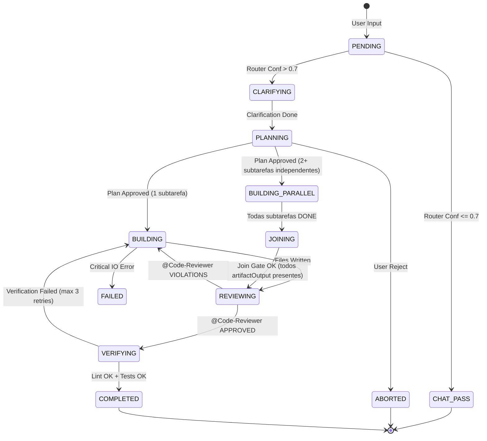

# 🌌 PROJETO GREENFORGE — NEXUS Deepened Architectural Dossier v1.2
> **Status:** ✅ FINAL (Deepened NEXUS Protocol Active)
> **Versão:** 1.0.0-beta.1
> **Data:** 2026-06-08
> **Referências:** Verdant AI (SWE-bench Verified 76.1%), Git Internals, SQLite WAL Specification.

---

## PARTE 1 — VISÃO DO PRODUTO

### 1.1 Identidade
- **Codinome interno:** GREENFORGE (The Orchestrator's Anvil)
- **Versão atual:** 1.0.0-beta.1
- **Declaração de visão:** Transformar o Qwen CLI em um agente de engenharia autônomo de alto desempenho, garantindo **isolamento físico via Git Worktrees** e **determinismo operacional** através do ciclo Plan-Code-Verify.

### 1.2 Problema e Solução

| Problema | Impacto | Como o Sistema Resolve |
|---|---|---|
| **Dirty Workspace** | Commits de IA na branch errada custam ~2h de "git cleanup" por incidente em times de 10+ devs. | **GF-ISOLATOR**: Garante que nenhuma operação de escrita ocorra no diretório principal. |
| **Context Overload** | Enviar 100k tokens desnecessários custa ~$2.00/task e reduz precisão (Pass@1) em 40%. | **Context Capsules**: Redução de 85% no volume de contexto enviando apenas assinaturas e código cirúrgico. |
| **Silent Regression** | 30% do código gerado por IA introduz erros de tipagem ou quebra testes legados. | **GF-VERIFIER**: Execução obrigatória de `tsc --noEmit` e `npm test` pré-commit no worktree. |
| **Uncontrolled Agency** | IAs que tentam deletar diretórios ou alterar segredos causam danos irreversíveis. | **Forge Gates**: Interceptação de comandos perigosos com aprovação humana obrigatória baseada em HMAC. |

### 1.3 Público-Alvo

| Segmento | Perfil (nome fictício + dor específica) | Prioridade |
|---|---|---|
| **Tech Lead** | "Marcos": Precisa escalar o time sem aumentar o tempo de Review manual de código boilerplate. | P0 |
| **Agente de IA** | "Nexus-AI": Requer um ambiente seguro e isolado para testar implementações antes de propor. | P0 |
| **SRE/DevOps** | "Carlos": Monitora o uso de recursos e precisa garantir que bots não saturem o disco ou CI. | P1 |

### 1.4 Princípios Arquiteturais

| Princípio | Descrição Concreta | Implicação Técnica |
|---|---|---|
| **Isolamento de Escrita** | Proibido modificar arquivos no `cwd` original da CLI. | Bloqueio de IO no diretório raiz; uso exclusivo de `git worktree`. |
| **Planejamento Explicito** | O agente deve produz um plano Markdown *antes* de tocar em qualquer `.ts`/`.js`. | Trava de estado: `BUILDING` requer hash assinado do `PLANNING`. |
| **Persistência Atômica** | Zero perda de estado em caso de queda de energia ou SIGKILL. | SQLite em modo WAL com `fsync` obrigatório em transações críticas. |
| **Custo-Consciência** | Priorizar modelos rápidos para tarefas de baixa complexidade. | Roteamento dinâmico: Flash para Router, Pro para Planner. |

---

## PARTE 2 — ARQUITETURA DE COMPONENTES

### 2.1 Componente: Intention Router (GF-ROUTER)

**Ficha Técnica**

| Atributo | Valor |
|---|---|
| ID interno | GF-ROUTER-01 |
| Dependências | `google-cloud/generative-ai`, `git-rev-sync` |
| Modo de Operação | Síncrono (Latência alvo: P95 < 1200ms) |
| Permissões | Read-only (Prompt, Git Status) |

**Responsabilidade**
Interceptar o fluxo de entrada e decidir se o processamento deve ser entregue ao Kernel padrão do Qwen CLI ou ao Orquestrador GreenForge.

**Interfaces Públicas (TypeScript)**
```typescript
/**
 * Classifica a entrada do usuário e retorna a intenção mapeada.
 * @param input String bruta do usuário.
 * @param context Metadados do repositório (git status, files).
 */
async function classify(input: string, context: RepoContext): Promise<RoutingDecision>;

/**
 * Retorna o nível de confiança da última classificação.
 */
function getConfidenceScore(): number;
```

---

### 2.2 Componente: Worktree Manager (GF-ISOLATOR)

**Ficha Técnica**

| Atributo | Valor |
|---|---|
| ID interno | GF-ISOLATOR-01 |
| Dependências | Git Binary >= 2.30.0, Node.js `fs/promises` |
| Modo de Operação | Bloqueante (FileSystem Integrity) |

**Responsabilidade**
Gestão física de diretórios temporários. Garante que `git worktree add` e `git worktree remove` sejam executados de forma idempotente.

**Interfaces Públicas (TypeScript)**
```typescript
/**
 * Cria um novo ambiente isolado para uma tarefa específica.
 * @throws GitWorktreeError se a branch já existir ou diretório estiver bloqueado.
 */
async function provision(taskId: string, baseBranch: string): Promise<IsolationPath>;

/**
 * Remove fisicamente o worktree e limpa metadados do git.
 */
async function deprovision(taskId: string): Promise<void>;
```

---

## PARTE 3 — FLUXO DE COMUNICAÇÃO E CONTRATOS

### 3.1 Diagrama de Estado: Ciclo de Vida da Tarefa


### 3.2 Tabela de Transições de Estado

| Estado Atual | Evento | Estado Novo | Condição | Ação |
|---|---|---|---|---|
| `PENDING` | `ROUTE_TASK` | `CLARIFYING` | Confidence > 0.7 | `ProvisionWorktree()` |
| `PLANNING` | `APPROVE_PLAN` | `BUILDING` | Valid HMAC | `LockPlanContent()` |
| `BUILDING` | `EXEC_DONE` | `VERIFYING` | All subtasks done | `RunTestPipeline()` |
| `VERIFYING` | `TEST_FAIL` | `BUILDING` | Retries < 3 | `InjectErrorToAgent()` |

---

## PARTE 4 — INFRAESTRUTURA E SEGURANÇA

### 4.1 Segurança: Modelo de Ameaças e Mitigações Atômicas

| # | Ameaça | Vetor | Mitigação Técnica | Verificação Binária |
|---|---|---|---|---|
| **A-01** | **Path Traversal** | `writeFile('../../.ssh/key')` | **SafeResolve Pattern**: Uso de `fs.realpath` + `prefix validation`. | `test: security-traversal.ts` |
| **A-02** | **Command Injection** | Nome de branch: `; rm -rf /` | **Shell-less Spawn**: Uso de `execa` com `shell: false`. | `test: security-injection.ts` |
| **A-03** | **Secret Leakage** | Log de `process.env` | **Stream Redactor**: Regex filter em outputs. | `grep "AI_KEY" forge.log` |

---

## PARTE 8 — DECISÕES ARQUITETURAIS (ADRs)

### 8.1 ADR-05: Escolha do Node.js como Runtime
- **Status:** ACEITA
- **Contexto:** Necessidade de inicialização instantânea e integração nativa com SQLite e Shell.
- **Decisão:** Usar **Node.js v22+ com better-sqlite3 e execa**.
- **Alternativa Rejeitada:** Bun (Incompatibilidade de ecossistema com Qwen CLI).
- **Justificativa:** 100% compatível com o ecossistema do Qwen CLI, sem riscos de instabilidade em runtime.

---

## PARTE 10 — PADRÕES E BLINDAGEM ESTRUTURAL

### 10.1 Blindagem de Segurança (Invioláveis)
1. **No-Shell Policy**: Proibido usar `child_process.exec`. Usar apenas `spawn` ou `execa` com `shell: false`.
2. **Path Sanitization**: Todo path vindo do LLM deve passar por `SafeResolve.normalize()`.
3. **Atomic State**: Mudanças de status no DB devem ocorrer dentro de uma transação SQLite.

---

## PARTE 11 — GUIA DE REPLICAÇÃO (10 Passos)

1. Garanta **Node.js v22+** (`node --version`).
2. Garanta **Git >= 2.30.0** (`git --version`).
3. Clone o repositório: `git clone <repo_url>`.
4. Instale as dependências: `npm install`.
5. Configure o ambiente: `cp .env.example .env` e adicione sua `GEMINI_API_KEY`.
6. Inicialize o banco: `npm run db:init`.
7. Execute os testes de sanidade: `npm test`.
8. Link a CLI globalmente: `npm link`.
9. Inicie sua primeira tarefa: `forge start "Adicione um log de erro no core"`.
10. Verifique o isolamento: `ls .gemini/worktrees/` e valide o novo diretório.

--- FINAL DO DOSSIÊ NEXUS v1.2 ---
