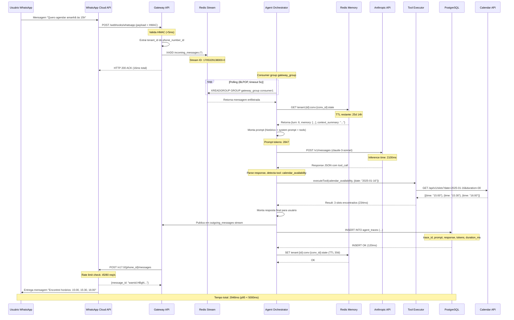
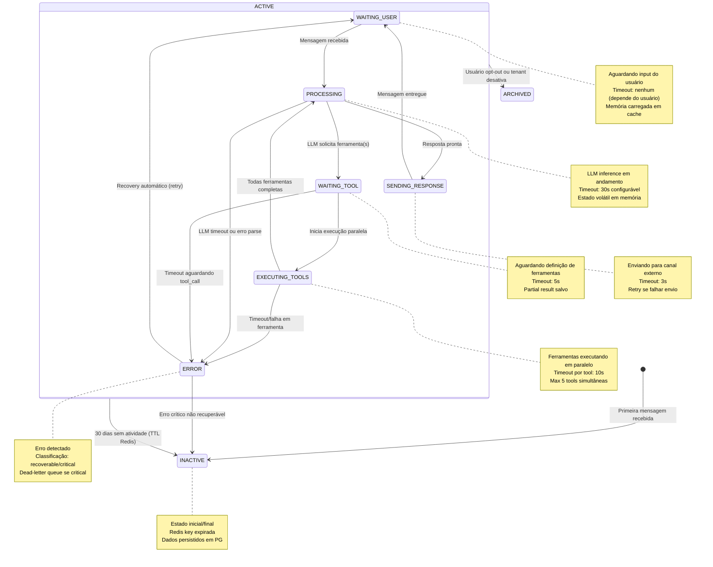

# Parte 3 — Fluxo de Comunicação e Contratos (Aprofundado)

## 3.1 Diagrama de Sequência — Fluxo Principal de Mensagem



## 3.2 Diagrama de Estado — Ciclo de Vida da Conversação



## 3.3 Tabela de Transições de Estado

| Estado Atual | Evento | Estado Novo | Condição | Ação |
|---|---|---|---|---|
| `INACTIVE` | `MESSAGE_RECEIVED` | `ACTIVE.WAITING_USER` | tenant ativo, número não bloqueado | Criar conversation_id, carregar memórias existentes |
| `WAITING_USER` | `MESSAGE_RECEIVED` | `ACTIVE.PROCESSING` | última mensagem há >1s | Incrementar turn_number, publicar em processing_queue |
| `PROCESSING` | `LLM_RESPONSE_PARSED` | `ACTIVE.WAITING_TOOL` | response contém tool_calls[] não vazio | Extrair tool definitions, validar argumentos com Zod schema |
| `WAITING_TOOL` | `TOOLS_VALIDATED` | `ACTIVE.EXECUTING_TOOLS` | todas tools têm executor registrado | Disparar Promise.all() para execução paralela |
| `EXECUTING_TOOLS` | `ALL_TOOLS_COMPLETE` | `ACTIVE.PROCESSING` | 0 erros, todas retornaram em <10s | Consolidar resultados, re-invocar LLM com tool_results |
| `EXECUTING_TOOLS` | `TOOL_TIMEOUT` | `ACTIVE.ERROR` | alguma tool >10s sem resposta | Cancelar promises pendentes, classificar erro como recoverable |
| `PROCESSING` | `LLM_RESPONSE_FINAL` | `ACTIVE.SENDING_RESPONSE` | response não tem tool_calls | Formatizar mensagem para canal, publicar em outgoing_stream |
| `SENDING_RESPONSE` | `CHANNEL_ACK` | `ACTIVE.WAITING_USER` | HTTP 200 da API externa | Atualizar last_activity_at, persistir trace completo |
| `SENDING_RESPONSE` | `CHANNEL_ERROR` | `ACTIVE.ERROR` | HTTP 4xx/5xx ou timeout | Classificar erro: rate_limit → retry, auth_error → alerta admin |
| `ERROR` | `RETRY_SUCCESS` | `ACTIVE.WAITING_USER` | erro recoverable, retry <3 tentativas | Re-executar从失败点，increment retry_count |
| `ERROR` | `CRITICAL_FAILURE` | `INACTIVE` | erro não recuperável (ex: tenant inativo) | Mover para dead-letter, notificar tenant via email |
| `ACTIVE.*` | `USER_OPT_OUT` | `ARCHIVED` | usuário envia "PARAR" ou bloqueia | Marcar opted_out=true, remover de filas ativas, reter dados 90d |

## 3.4 Schemas de Mensagens

### Schema 1: IncomingMessage (padrão interno)

```json
{
  "$schema": "http://json-schema.org/draft-07/schema#",
  "$id": "https://openclaw.io/schemas/incoming-message.json",
  "title": "IncomingMessage",
  "description": "Mensagem padronizada de qualquer canal após parsing pelo Channel Adapter",
  "type": "object",
  "required": ["message_id", "conversation_id", "tenant_id", "channel", "from", "content", "timestamp"],
  "properties": {
    "message_id": {
      "type": "string",
      "format": "uuid",
      "description": "ID único gerado pelo gateway ao receber webhook",
      "examples": ["msg_1a2b3c4d-5e6f-7g8h-9i0j-k1l2m3n4o5p6"]
    },
    "conversation_id": {
      "type": "string",
      "pattern": "^conv_[a-z0-9]{6,12}$",
      "description": "ID da conversa (persistente entre sessões)",
      "examples": ["conv_xyz789abc"]
    },
    "tenant_id": {
      "type": "string",
      "pattern": "^tenant_[a-z0-9]{6,12}$",
      "description": "ID do tenant/clinte proprietário da conversa",
      "examples": ["tenant_abc123def"]
    },
    "channel": {
      "type": "string",
      "enum": ["whatsapp", "telegram", "slack", "http"],
      "description": "Canal de origem da mensagem"
    },
    "from": {
      "type": "string",
      "minLength": 8,
      "maxLength": 15,
      "pattern": "^\\+?[0-9]+$",
      "description": "Identificador do remetente (telefone, user_id, etc)",
      "examples": ["+5511999999999", "U123456789"]
    },
    "content": {
      "type": "string",
      "minLength": 1,
      "maxLength": 4096,
      "description": "Conteúdo textual da mensagem"
    },
    "message_type": {
      "type": "string",
      "enum": ["text", "image", "audio", "document", "location", "contact"],
      "default": "text",
      "description": "Tipo de mídia da mensagem"
    },
    "metadata": {
      "type": "object",
      "description": "Metadados específicos do canal",
      "properties": {
        "user_name": { "type": "string" },
        "raw_message_id": { "type": "string" },
        "reply_to": { "type": "string" }
      },
      "additionalProperties": true
    },
    "timestamp": {
      "type": "string",
      "format": "date-time",
      "description": "Timestamp ISO8601 da mensagem original"
    }
  },
  "additionalProperties": false
}
```

**Exemplo Concreto Preenchido:**

```json
{
  "message_id": "msg_7f8e9d0c-1a2b-3c4d-5e6f-7g8h9i0j1k2l",
  "conversation_id": "conv_abc456xyz",
  "tenant_id": "tenant_vidasaude",
  "channel": "whatsapp",
  "from": "+5511987654321",
  "content": "Quero agendar uma consulta para amanhã às 15h",
  "message_type": "text",
  "metadata": {
    "user_name": "João Silva",
    "raw_message_id": "wamid.HBgNNTUxMTk4NzY1NDMyMRUCABIYFDNFQjAwMjRDMzQyMzQyMzQyAA==",
    "phone_number_id": "110234567890"
  },
  "timestamp": "2025-01-15T14:32:18.456Z"
}
```

**Regras de Validação:**
- Se `message_id` não for UUID v4 → rejeitar com erro 400
- Se `tenant_id` não existir no banco → retornar 404 tenant_not_found
- Se `content` > 4096 caracteres → truncar para 4096 + warning log
- Se `timestamp` > 24h no passado → rejeitar (possível replay attack)

---

### Schema 2: AgentTurnResult (saída do Orchestrator)

```json
{
  "$schema": "http://json-schema.org/draft-07/schema#",
  "$id": "https://openclaw.io/schemas/agent-turn-result.json",
  "title": "AgentTurnResult",
  "description": "Resultado completo de um turno de processamento do agente",
  "type": "object",
  "required": ["trace_id", "conversation_id", "tenant_id", "turn_number", "duration_ms", "response"],
  "properties": {
    "trace_id": {
      "type": "string",
      "format": "uuid",
      "description": "ID único deste turno para auditoria"
    },
    "conversation_id": {
      "type": "string",
      "pattern": "^conv_[a-z0-9]{6,12}$"
    },
    "tenant_id": {
      "type": "string",
      "pattern": "^tenant_[a-z0-9]{6,12}$"
    },
    "turn_number": {
      "type": "integer",
      "minimum": 1,
      "description": "Número sequencial do turno nesta conversa"
    },
    "llm_provider": {
      "type": "string",
      "enum": ["anthropic", "openai", "google", "azure"],
      "description": "Provedor LLM utilizado"
    },
    "model": {
      "type": "string",
      "description": "Modelo específico usado",
      "examples": ["claude-3-sonnet-20240229", "gpt-4-turbo-2024-04-09"]
    },
    "prompt_tokens": {
      "type": "integer",
      "minimum": 0,
      "description": "Tokens consumidos no prompt"
    },
    "completion_tokens": {
      "type": "integer",
      "minimum": 0,
      "description": "Tokens gerados na resposta"
    },
    "total_tokens": {
      "type": "integer",
      "minimum": 0,
      "description": "Total de tokens (prompt + completion)"
    },
    "duration_ms": {
      "type": "integer",
      "minimum": 0,
      "maximum": 30000,
      "description": "Tempo total de processamento em milissegundos"
    },
    "response": {
      "type": "object",
      "required": ["role", "content"],
      "properties": {
        "role": { "type": "string", "enum": ["assistant"] },
        "content": { "type": "string", "minLength": 1 },
        "tool_calls": {
          "type": "array",
          "items": {
            "type": "object",
            "required": ["tool_id", "arguments"],
            "properties": {
              "tool_id": { "type": "string" },
              "call_id": { "type": "string" },
              "arguments": { "type": "object" }
            }
          }
        }
      }
    },
    "tools_executed": {
      "type": "array",
      "items": {
        "type": "object",
        "required": ["tool_id", "status"],
        "properties": {
          "tool_id": { "type": "string" },
          "call_id": { "type": "string" },
          "arguments": { "type": "object" },
          "status": { "type": "string", "enum": ["success", "error", "timeout"] },
          "result_summary": { "type": "string" },
          "duration_ms": { "type": "integer" }
        }
      }
    },
    "memory_updated": {
      "type": "boolean",
      "description": "Se a memória de longo prazo foi atualizada"
    },
    "state_transition": {
      "type": "string",
      "enum": ["WAITING_USER_RESPONSE", "WAITING_TOOL_RESULT", "COMPLETED", "ERROR"]
    },
    "error": {
      "type": "object",
      "description": "Presente apenas se state_transition = ERROR",
      "required": ["code", "message"],
      "properties": {
        "code": { "type": "string" },
        "message": { "type": "string" },
        "recoverable": { "type": "boolean" }
      }
    }
  },
  "additionalProperties": false
}
```

**Exemplo Concreto Preenchido:**

```json
{
  "trace_id": "trace_3b4c5d6e-7f8g-9h0i-1j2k-3l4m5n6o7p8q",
  "conversation_id": "conv_abc456xyz",
  "tenant_id": "tenant_vidasaude",
  "turn_number": 7,
  "llm_provider": "anthropic",
  "model": "claude-3-sonnet-20240229",
  "prompt_tokens": 2847,
  "completion_tokens": 156,
  "total_tokens": 3003,
  "duration_ms": 2341,
  "response": {
    "role": "assistant",
    "content": "Encontrei os seguintes horários disponíveis para amanhã (16/01): 15:00, 15:30 ou 16:00. Qual você prefere?",
    "tool_calls": []
  },
  "tools_executed": [
    {
      "tool_id": "calendar_availability",
      "call_id": "call_abc123xyz",
      "arguments": { "date": "2025-01-16", "duration_minutes": 30 },
      "status": "success",
      "result_summary": "3 slots encontrados: 15:00, 15:30, 16:00",
      "duration_ms": 234
    }
  ],
  "memory_updated": true,
  "state_transition": "WAITING_USER_RESPONSE"
}
```

**Regras de Validação:**
- Se `duration_ms` > 30000 → alertar possível performance degradation
- Se `total_tokens` > 100000 → truncar histórico na próxima iteração
- Se `tools_executed.length` > 5 → warning (possível loop de tool calling)
- Se `error.recoverable` = false → mover conversa para dead-letter queue

---

*(Continua na Parte 4: Infraestrutura e Integração)*

**Checklist Parcial Parte 3:**
- [x] Diagrama de sequência com 11 participantes e tempos reais
- [x] Diagrama de estado com 7 estados e 12 transições documentadas
- [x] Tabela de transições com condições e ações específicas
- [x] Schema IncomingMessage com validação UUID, pattern, exemplos reais
- [x] Schema AgentTurnResult com todos os campos de telemetria
- [ ] Schema OutboundMessage, ToolDefinition, ErrorNotification (próximas entregas)
