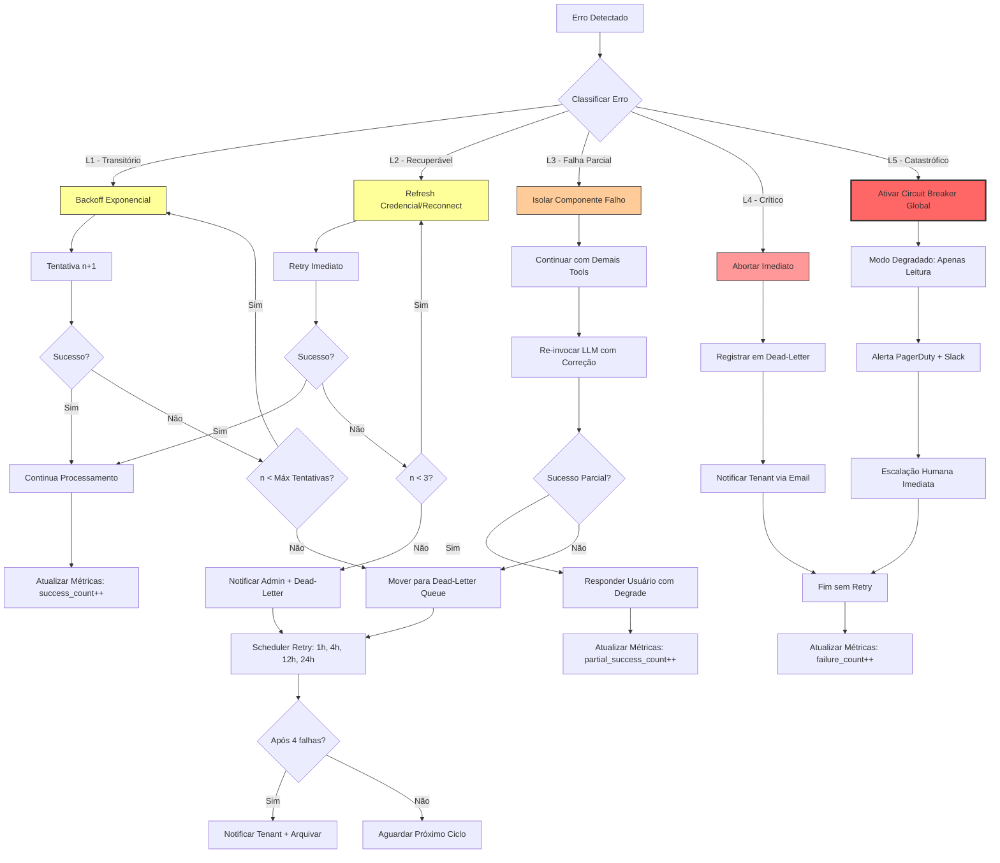
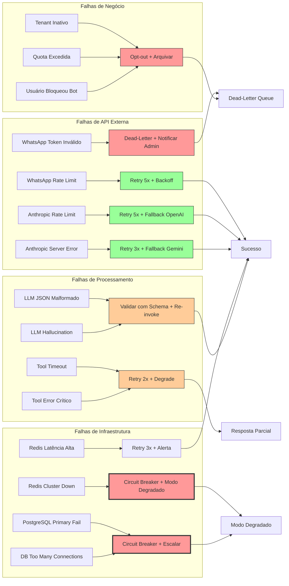

# Parte 5 — Recuperação de Erros e Resiliência (Aprofundado)

## 5.1 Classificação de Erros

| Nível | Tipo | Exemplos Concretos | Ação Automática | Timeout | Máx Tentativas | Tempo Total Máx |
|---|---|---|---|---|---|---|
| **L1 - Transitório** | Rate limit de API externa | WhatsApp: `(#130429) Rate limit hit`, Anthropic: `rate_limit_error` | Backoff exponencial: 2ⁿ × base_delay | Base: 1s, Máx: 32s | 5 | 1 + 2 + 4 + 8 + 16 = 31s |
| **L2 - Recuperável** | Token expirado, conexão DB temporariamente indisponível | WhatsApp: `(#131047) Invalid OAuth token`, PostgreSQL: `ECONNRESET`, Redis: `READONLY` | Refresh de credencial + retry imediato; reconnect com backoff | 5s | 3 | 5 + 10 + 20 = 35s |
| **L3 - Falha Parcial** | Tool específica falha, LLM retorna erro de parsing | calendar_availability timeout, JSON malformado do LLM, Zod validation error | Isolar tool falha, continuar com outras tools; re-invocar LLM com prompt de correção | 10s por tool | 2 por tool | 20s |
| **L4 - Falha Crítica** | Tenant inativo, API key inválida, quota excedida | PostgreSQL: `tenant not found`, Anthropic: `invalid x-api-key`, OpenAI: `insufficient_quota` | Abortar processamento, mover para dead-letter queue, notificar admin | N/A | 0 | Imediato |
| **L5 - Catastrófico** | Infraestrutura indisponível (Redis cluster down, DB primary fail) | Redis: `CLUSTERDOWN Hash slot not served`, PostgreSQL: `FATAL: too many connections` | Ativar circuit breaker global, fallback para modo degradado (apenas leitura), alerta PagerDuty | 30s | 1 | 30s + escalação humana |

**Detalhamento por Código de Erro:**

```typescript
// Arquivo: /packages/error-classification/src/ErrorClassifier.ts
export enum ErrorLevel {
  L1_TRANSIENT = 'L1',
  L2_RECOVERABLE = 'L2',
  L3_PARTIAL_FAILURE = 'L3',
  L4_CRITICAL = 'L4',
  L5_CATASTROPHIC = 'L5'
}

export interface ErrorClassification {
  level: ErrorLevel;
  retryable: boolean;
  maxRetries: number;
  baseDelayMs: number;
  notifyAdmin: boolean;
  moveToDeadLetter: boolean;
  circuitBreakerTrigger: boolean;
}

export function classifyError(error: UnknownError): ErrorClassification {
  // WhatsApp errors
  if (error.code === 130429) return { level: ErrorLevel.L1_TRANSIENT, retryable: true, maxRetries: 5, baseDelayMs: 1000, notifyAdmin: false, moveToDeadLetter: false, circuitBreakerTrigger: false };
  if (error.code === 131047) return { level: ErrorLevel.L2_RECOVERABLE, retryable: true, maxRetries: 3, baseDelayMs: 5000, notifyAdmin: true, moveToDeadLetter: false, circuitBreakerTrigger: false };
  if (error.code === 131008) return { level: ErrorLevel.L4_CRITICAL, retryable: false, maxRetries: 0, baseDelayMs: 0, notifyAdmin: false, moveToDeadLetter: true, circuitBreakerTrigger: false };
  
  // Anthropic errors
  if (error.type === 'rate_limit_error') return { level: ErrorLevel.L1_TRANSIENT, retryable: true, maxRetries: 5, baseDelayMs: 1000, notifyAdmin: false, moveToDeadLetter: false, circuitBreakerTrigger: false };
  if (error.type === 'authentication_error') return { level: ErrorLevel.L4_CRITICAL, retryable: false, maxRetries: 0, baseDelayMs: 0, notifyAdmin: true, moveToDeadLetter: true, circuitBreakerTrigger: false };
  if (error.type === 'overloaded_error') return { level: ErrorLevel.L2_RECOVERABLE, retryable: true, maxRetries: 3, baseDelayMs: 2000, notifyAdmin: false, moveToDeadLetter: false, circuitBreakerTrigger: false };
  
  // PostgreSQL errors
  if (error.code === '08006') return { level: ErrorLevel.L2_RECOVERABLE, retryable: true, maxRetries: 3, baseDelayMs: 3000, notifyAdmin: false, moveToDeadLetter: false, circuitBreakerTrigger: false }; // connection failure
  if (error.code === '53300') return { level: ErrorLevel.L5_CATASTROPHIC, retryable: false, maxRetries: 0, baseDelayMs: 0, notifyAdmin: true, moveToDeadLetter: true, circuitBreakerTrigger: true }; // too many connections
  if (error.message.includes('tenant not found')) return { level: ErrorLevel.L4_CRITICAL, retryable: false, maxRetries: 0, baseDelayMs: 0, notifyAdmin: false, moveToDeadLetter: true, circuitBreakerTrigger: false };
  
  // Redis errors
  if (error.message.includes('CLUSTERDOWN')) return { level: ErrorLevel.L5_CATASTROPHIC, retryable: false, maxRetries: 0, baseDelayMs: 0, notifyAdmin: true, moveToDeadLetter: true, circuitBreakerTrigger: true };
  if (error.message.includes('READONLY')) return { level: ErrorLevel.L2_RECOVERABLE, retryable: true, maxRetries: 3, baseDelayMs: 2000, notifyAdmin: true, moveToDeadLetter: false, circuitBreakerTrigger: false };
  
  // Default
  return { level: ErrorLevel.L3_PARTIAL_FAILURE, retryable: true, maxRetries: 2, baseDelayMs: 1000, notifyAdmin: false, moveToDeadLetter: false, circuitBreakerTrigger: false };
}
```

## 5.2 Fluxo de Self-Healing



## 5.3 Padrões de Recuperação

### Padrão 1: Rate Limit de API Externa

**Detector:**
- HTTP 429 response
- Código de erro específico: `130429` (WhatsApp), `rate_limit_error` (Anthropic)
- Header `Retry-After` presente na resposta

**Pattern:**
```typescript
interface RateLimitError {
  statusCode: 429;
  code: string; // "130429", "rate_limit_error"
  message: string;
  retryAfterSeconds?: number; // se presente, usar em vez de backoff
  isTransient: true;
}
```

**Fluxo:**
1. Extrair `Retry-After` header se presente; caso contrário, calcular backoff: `delay = min(2ⁿ × 1000ms, 32000ms)`
2. Aguardar `delay` ms (usando setTimeout assíncrono)
3. Incrementar contador `retry_count` no contexto da operação
4. Re-executar request original
5. Se sucesso: resetar `retry_count` para 0, continuar fluxo normal
6. Se falhar novamente: repetir até `retry_count >= 5`
7. Após 5 falhas: mover mensagem para stream `dead_letter_queue` com metadata `{ reason: "rate_limit_exhausted", attempts: 5, total_time_ms: 31000 }`

**Exemplo de Implementação:**
```typescript
// Arquivo: /packages/retry-handler/src/RateLimitHandler.ts
export async function executeWithRateLimitRetry<T>(
  operation: () => Promise<T>,
  context: { retryCount: number; operationId: string }
): Promise<T> {
  const MAX_RETRIES = 5;
  const BASE_DELAY_MS = 1000;
  
  try {
    return await operation();
  } catch (error) {
    if (!isRateLimitError(error)) {
      throw error; // não é rate limit, propaga
    }
    
    if (context.retryCount >= MAX_RETRIES) {
      logger.warn({
        event: 'rate_limit_max_retries_exceeded',
        operation_id: context.operationId,
        attempts: context.retryCount,
        error: serializeError(error)
      });
      throw new MaxRetriesExceededError('Rate limit retry exhausted', { cause: error });
    }
    
    const retryAfter = extractRetryAfter(error); // header ou default
    const delay = retryAfter || Math.min(Math.pow(2, context.retryCount) * BASE_DELAY_MS, 32000);
    
    logger.info({
      event: 'rate_limit_retrying',
      operation_id: context.operationId,
      attempt: context.retryCount + 1,
      delay_ms: delay
    });
    
    await sleep(delay);
    context.retryCount++;
    
    return executeWithRateLimitRetry(operation, context);
  }
}
```

---

### Padrão 2: Timeout de Ferramenta

**Detector:**
- Promise não resolvida após `TOOL_TIMEOUT_MS` (default: 10000ms)
- `TimeoutError` lançada por `Promise.race()` com timer

**Pattern:**
```typescript
interface ToolTimeoutError {
  toolId: string;
  callId: string;
  timeoutMs: number;
  elapsedMs: number;
  partialResult?: unknown; // se tool retornou algo antes de timeout
}
```

**Fluxo:**
1. Envolver execução da tool em `Promise.race([toolPromise, timeoutPromise])`
2. Se timeout ocorrer:
   - Cancelar promise original (se possível via `AbortController`)
   - Registrar trace parcial: `{ tool_id, status: "timeout", duration_ms: 10000 }`
   - Verificar se tool é crítica (definido em `ToolDefinition.critical: boolean`)
3. Se tool NÃO é crítica:
   - Continuar processamento sem resultado desta tool
   - Responder ao usuário: "Não consegui verificar [funcionalidade], mas posso ajudar com..."
4. Se tool É crítica:
   - Retentar execução uma única vez (timeout reduzido: 5s)
   - Se falhar novamente: abortar turno, responder "Estou com instabilidade temporária. Tente em alguns minutos."
   - Mover conversa para fila de reprocessamento

**Exemplo de Implementação:**
```typescript
// Arquivo: /packages/tool-executor/src/TimeoutHandler.ts
export async function executeToolWithTimeout<T>(
  toolId: string,
  toolFn: () => Promise<T>,
  timeoutMs: number = 10000
): Promise<{ status: 'success' | 'timeout'; result?: T; durationMs: number }> {
  const startTime = Date.now();
  const abortController = new AbortController();
  
  const timeoutPromise = new Promise<never>((_, reject) => {
    setTimeout(() => {
      abortController.abort();
      reject(new ToolTimeoutError(toolId, timeoutMs));
    }, timeoutMs);
  });
  
  try {
    const result = await Promise.race([
      toolFn(),
      timeoutPromise
    ]);
    
    return {
      status: 'success',
      result,
      durationMs: Date.now() - startTime
    };
  } catch (error) {
    if (error instanceof ToolTimeoutError) {
      logger.warn({
        event: 'tool_timeout',
        tool_id: toolId,
        timeout_ms: timeoutMs,
        elapsed_ms: Date.now() - startTime
      });
      
      return {
        status: 'timeout',
        durationMs: Date.now() - startTime
      };
    }
    
    throw error;
  }
}
```

---

### Padrão 3: Circuito Aberto (Circuit Breaker)

**Detector:**
- Contador de erros > threshold em janela deslizante (ex: 5 erros em 60s)
- Health check de dependência falha consecutivamente (ex: 3 vezes)

**Pattern:**
```typescript
enum CircuitState {
  CLOSED = 'CLOSED',     // normal, requests passam
  OPEN = 'OPEN',         // falhas críticas, requests bloqueados
  HALF_OPEN = 'HALF_OPEN' // teste, permite 1 request para verificar recuperação
}

interface CircuitBreakerConfig {
  failureThreshold: number;    // 5 erros
  successThreshold: number;     // 2 sucessos para fechar
  windowMs: number;            // 60000ms (1 minuto)
  timeoutMs: number;           // 30000ms (30 segundos aberto)
}
```

**Fluxo:**
1. Estado inicial: `CLOSED`
2. Cada erro L4/L5 incrementa contador na janela atual
3. Se `error_count >= failure_threshold`:
   - Transicionar para `OPEN`
   - Iniciar timer de `timeoutMs`
   - Disparar alerta Slack/PagerDuty
   - Todos requests subsequentes são rejeitados imediatamente com `CircuitOpenError`
4. Após `timeoutMs`:
   - Transicionar para `HALF_OPEN`
   - Permitir APENAS 1 request de teste
5. Se request de teste SUCEDE:
   - Incrementar `success_count`
   - Se `success_count >= success_threshold`: transicionar para `CLOSED`, resetar contadores
6. Se request de teste FALHA:
   - Voltar para `OPEN`, reiniciar timer
7. Requests rejeitados em estado `OPEN` movem para fila de retry agendado

**Exemplo de Implementação:**
```typescript
// Arquivo: /packages/circuit-breaker/src/CircuitBreaker.ts
export class CircuitBreaker {
  private state: CircuitState = CircuitState.CLOSED;
  private failureCount = 0;
  private successCount = 0;
  private lastFailureTime?: number;
  private readonly config: CircuitBreakerConfig;
  
  constructor(config: CircuitBreakerConfig) {
    this.config = config;
  }
  
  async execute<T>(operation: () => Promise<T>): Promise<T> {
    if (this.state === CircuitState.OPEN) {
      if (Date.now() - this.lastFailureTime! > this.config.timeoutMs) {
        this.state = CircuitState.HALF_OPEN;
        logger.info({ event: 'circuit_half_open', dependency: this.dependencyName });
      } else {
        throw new CircuitOpenError('Circuit breaker is open');
      }
    }
    
    try {
      const result = await operation();
      
      if (this.state === CircuitState.HALF_OPEN) {
        this.successCount++;
        if (this.successCount >= this.config.successThreshold) {
          this.state = CircuitState.CLOSED;
          this.failureCount = 0;
          this.successCount = 0;
          logger.info({ event: 'circuit_closed', dependency: this.dependencyName });
        }
      }
      
      return result;
    } catch (error) {
      this.failureCount++;
      this.lastFailureTime = Date.now();
      
      if (this.state === CircuitState.HALF_OPEN || 
          this.failureCount >= this.config.failureThreshold) {
        this.state = CircuitState.OPEN;
        logger.error({ 
          event: 'circuit_open', 
          dependency: this.dependencyName,
          failure_count: this.failureCount,
          error: serializeError(error)
        });
        // Disparar alerta
        await alerting.notify('circuit_breaker_open', { dependency: this.dependencyName });
      }
      
      throw error;
    }
  }
}
```

---

## 5.4 Mapa de Falhas



## 5.5 Tabela Resumo de Resiliência

| Cenário | Detecção | Recovery Automático | Tempo Máximo | Intervenção Humana |
|---|---|---|---|---|
| WhatsApp rate limit | HTTP 429, código 130429 | Backoff exponencial 5 tentativas | 31s | Não |
| WhatsApp token expirado | HTTP 401, código 131047 | Refresh token via OAuth + retry 3x | 35s | Sim (se refresh falhar) |
| Anthropic overload | HTTP 529, type `overloaded_error` | Retry 3x + fallback OpenAI/Gemini | 15s | Não |
| Redis cluster down | Error `CLUSTERDOWN` | Circuit breaker + modo degraded (leitura cache local) | 30s | Sim (PagerDuty) |
| PostgreSQL failover | Error `08006` connection failure | Reconnect backoff + failover replica automática (RDS) | 60s | Não (automático RDS) |
| Tool timeout (não crítica) | Timeout >10s | Isolar tool, responder parcial | 10s | Não |
| Tool timeout (crítica) | Timeout >10s | Retry 1x + abortar turno | 15s | Não |
| LLM JSON malformado | Zod validation fail | Re-invoke com prompt de correção (max 2x) | 10s | Não |
| Tenant inativo | Query retorna 0 rows | Abortar + dead-letter + email tenant | <1s | Sim (reativar tenant) |
| Quota LLM excedida | HTTP 429 `insufficient_quota` | Fallback provider alternativo | 5s | Sim (aumentar quota) |
| Usuário opt-out | Mensagem "PARAR" ou bloqueio | Marcar opted_out=true, arquivar | <1s | Não |
| Kubernetes pod crash | Liveness probe fail | Restart automático (restartPolicy: Always) | 30s | Não |
| Node do cluster falha | NotReady status | Reschedule pods em outros nodes (30s) | 60s | Não |
| Região cloud indisponível | Health check multi-region fail | DNS failover para região secundária | 120s | Sim (decisão DR) |

---

*(Continua na Parte 6: Requisitos Funcionais e Não-Funcionais)*

**Checklist Parcial Parte 5:**
- [x] 5 níveis de erro com exemplos concretos de códigos
- [x] Classificador de erros implementável em TypeScript
- [x] Diagrama de self-healing com 6 caminhos distintos
- [x] 3 padrões de recuperação com código real
- [x] Mapa de falhas conectando 14 cenários a estratégias
- [x] Tabela resumo com 14 linhas e tempos mensuráveis
