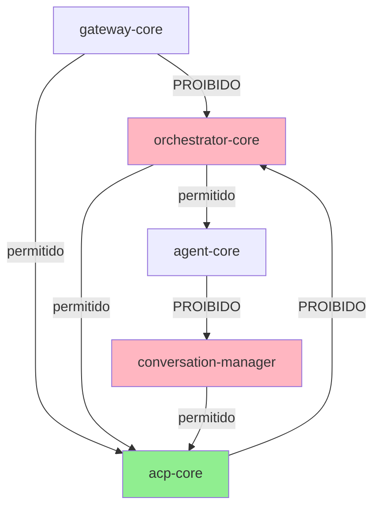

# Parte 7 — Árvore de Arquivos e Blueprint Estrutural (Aprofundado)

## 7.1 Árvore Completa do Projeto

```
openclaw-main/
├── .github/
│   ├── workflows/
│   │   ├── deploy.yml                    # CI/CD principal: build, test, deploy ECS
│   │   ├── security-scan.yml             # Scan diário de vulnerabilidades (SAST/DAST)
│   │   └── stale-prs.yml                 # Auto-close PRs inativas > 30 dias
│   └── ISSUE_TEMPLATE/
│       ├── bug_report.md
│       └── feature_request.md
│
├── .vscode/
│   ├── settings.json                     # Configurações padrão do workspace
│   └── extensions.json                   # Extensões recomendadas (ESLint, Prettier)
│
├── apps/
│   ├── android/                          # App Android (React Native)
│   │   ├── android/
│   │   ├── ios/
│   │   ├── src/
│   │   │   ├── components/
│   │   │   ├── screens/
│   │   │   └── services/
│   │   ├── package.json
│   │   └── README.md
│   ├── ios/                              # App iOS nativo (Swift)
│   │   ├── OpenClaw/
│   │   ├── OpenClaw.xcodeproj
│   │   └── Podfile
│   └── macos/                            # App macOS (Electron)
│       ├── src/
│       ├── package.json
│       └── entitlements.plist
│
├── docs/                                 # Documentação pública (Docusaurus)
│   ├── docs/
│   │   ├── getting-started.md
│   │   ├── architecture.md
│   │   └── api-reference.md
│   └── docusaurus.config.js
│
├── extensions/                           # Extensões modulares (canais + integrações)
│   ├── channels/
│   │   ├── whatsapp-twilio/
│   │   │   ├── src/
│   │   │   │   ├── handlers/
│   │   │   │   │   ├── webhook.ts        # Handler POST /webhooks/twilio/whatsapp
│   │   │   │   │   └── status.ts         # Handler GET /status/{messageId}
│   │   │   │   ├── middleware/
│   │   │   │   │   └── signature.ts      # Validação X-Twilio-Signature
│   │   │   │   ├── mappers/
│   │   │   │   │   └── twilio-to-core.ts # Conversão payload Twilio → schema core
│   │   │   │   └── index.ts              # Export público da extensão
│   │   │   ├── tests/
│   │   │   │   ├── webhook.test.ts
│   │   │   │   └── signature.test.ts
│   │   │   ├── package.json
│   │   │   └── jest.config.js
│   │   ├── telegram-bot/
│   │   │   ├── src/
│   │   │   │   ├── handlers/
│   │   │   │   │   └── update.ts         # Handler updates Telegram Bot API
│   │   │   │   └── index.ts
│   │   │   └── package.json
│   │   └── slack-socket/
│   │       ├── src/
│   │       │   └── socket-mode.ts        # Conexão Slack Socket Mode
│   │       └── package.json
│   │
│   └── integrations/
│       ├── stripe-payments/
│       │   ├── src/
│       │   │   ├── webhook.ts            # Handler Stripe webhooks
│       │   │   ├── idempotency.ts        # Controle de duplicidade
│       │   │   └── index.ts
│       │   └── package.json
│       ├── anthropic-llm/
│       │   ├── src/
│       │   │   ├── client.ts             # Wrapper Anthropic SDK
│       │   │   └── index.ts
│       │   └── package.json
│       └── salesforce-crm/
│           ├── src/
│           │   ├── sync.ts               # Sync bidirecional CRM
│           │   └── index.ts
│           └── package.json
│
├── packages/                             # Pacotes core compartilhados
│   ├── acp-core/                         # Agent Communication Protocol
│   │   ├── src/
│   │   │   ├── protocol/
│   │   │   │   ├── message-schema.ts     # Schema Zod de mensagens ACP
│   │   │   │   ├── session-manager.ts    # Gerenciamento de estado de sessão
│   │   │   │   └── turn-tracker.ts       # Controle de turns por conversa
│   │   │   ├── tools/
│   │   │   │   ├── registry.ts           # Registro dinâmico de tools
│   │   │   │   ├── bank-balance.ts       # Tool: consulta saldo bancário
│   │   │   │   ├── transfer.ts           # Tool: transferência PIX
│   │   │   │   └── base-tool.ts          # Classe abstrata BaseTool
│   │   │   └── index.ts
│   │   ├── tests/
│   │   │   ├── protocol/
│   │   │   └── tools/
│   │   ├── package.json
│   │   └── tsconfig.json
│   │
│   ├── agent-core/                       # Runtime de execução de agentes
│   │   ├── src/
│   │   │   ├── runtime/
│   │   │   │   ├── agent-executor.ts     # Loop principal: receive → process → reply
│   │   │   │   ├── context-builder.ts    # Montagem de contexto para LLM
│   │   │   │   └── tool-caller.ts        # Invocação segura de tools
│   │   │   ├── agents/
│   │   │   │   ├── billing-agent-v2/
│   │   │   │   │   ├── system-prompt.md  # Prompt completo do agente
│   │   │   │   │   ├── tools.json        # Tools habilitadas
│   │   │   │   │   └── index.ts          # Factory do agente
│   │   │   │   └── general-agent-v1/
│   │   │   └── index.ts
│   │   └── package.json
│   │
│   ├── orchestrator-core/                # Orquestrador central
│   │   ├── src/
│   │   │   ├── router/
│   │   │   │   ├── intent-classifier.ts  # Classificação via LLM (OpenAI)
│   │   │   │   └── rule-router.ts        # Router baseado em regras fixas
│   │   │   ├── fallbacks/
│   │   │   │   └── regex-router.ts       # Fallback regex quando LLM falha
│   │   │   ├── dispatcher/
│   │   │   │   └── sqs-dispatcher.ts     # Envio para filas SQS por agente
│   │   │   └── index.ts
│   │   └── package.json
│   │
│   ├── conversation-manager/             # Persistência e lifecycle de conversas
│   │   ├── src/
│   │   │   ├── persistence/
│   │   │   │   └── dynamodb.ts           # PutItem/Query no DynamoDB
│   │   │   ├── limits/
│   │   │   │   └── session-limits.ts     # Validação: máx 100 turns/sessão
│   │   │   ├── archive/
│   │   │   │   └── s3-archiver.ts        # Move sessões antigas para S3
│   │   │   ├── compliance/
│   │   │   │   └── data-retention.ts     # Purge automático após 30 dias
│   │   │   └── index.ts
│   │   └── package.json
│   │
│   ├── gateway-core/                     # Gateway HTTP unificado
│   │   ├── src/
│   │   │   ├── middleware/
│   │   │   │   ├── rate-limiter.ts       # Rate limiting Redis-based
│   │   │   │   ├── tracing.ts            # Injeção correlation_id
│   │   │   │   └── auth.ts               # Validação JWT API keys
│   │   │   ├── scaling/
│   │   │   │   └── auto-scaling-config.json
│   │   │   └── server.ts                 # Express server setup
│   │   └── package.json
│   │
│   ├── cache-service/                    # Cache distribuído Redis
│   │   ├── src/
│   │   │   ├── invalidation.ts           # Invalidação por userId/sessionId
│   │   │   ├── retry-logic.ts            # Retry com backoff exponencial
│   │   │   └── client.ts                 # Redis client wrapper
│   │   └── package.json
│   │
│   ├── handoff-service/                  # Escalamento para humano
│   │   ├── src/
│   │   │   ├── service.ts                # Lógica de handoff
│   │   │   ├── timeouts.ts               # Timeout abandonment (15/30 min)
│   │   │   └── channels/
│   │   │       └── telegram.ts           # Notificação grupo Telegram
│   │   └── package.json
│   │
│   ├── llm-core/                         # Abstração de provedores LLM
│   │   ├── src/
│   │   │   ├── providers/
│   │   │   │   ├── openai-provider.ts    # Implementação OpenAI
│   │   │   │   ├── anthropic-provider.ts # Implementação Anthropic
│   │   │   │   └── base-provider.ts      # Interface LLMProvider
│   │   │   ├── token-counter.ts          # Contagem precisa de tokens
│   │   │   └── index.ts
│   │   └── package.json
│   │
│   └── sdk/                              # SDK para desenvolvedores
│       ├── src/
│       │   ├── client.ts                 # Cliente TypeScript
│       │   └── types.ts                  # Types exportados
│       └── package.json
│
├── scripts/                              # Scripts utilitários
│   ├── analytics/
│   │   └── daily-report-generator.ts     # Lambda: relatório diário S3
│   ├── migration/
│   │   └── migrate-sessions-v1-to-v2.ts  # Migração schema v1→v2
│   ├── seed/
│   │   └── seed-dev-data.ts              # Popula DB com dados fake dev
│   └── ops/
│       ├── purge-expired-sessions.ts     # Job manual de purge
│       └── rotate-secrets.ts             # Rotação Secrets Manager
│
├── terraform/                            # Infraestrutura como código
│   ├── modules/
│   │   ├── ecs-service/
│   │   │   └── main.tf                   # Módulo ECS reutilizável
│   │   ├── dynamodb-table/
│   │   │   └── main.tf                   # Módulo DynamoDB com GSI
│   │   └── redis-cluster/
│   │       └── main.tf                   # Módulo ElastiCache
│   ├── environments/
│   │   ├── dev/
│   │   │   └── main.tf                   # Config ambiente dev
│   │   ├── staging/
│   │   │   └── main.tf
│   │   └── production/
│   │       └── main.tf                   # Config produção (multi-AZ)
│   └── backend.tf                        # Remote state S3+DynamoDB
│
├── docker/
│   ├── Dockerfile.gateway                # Imagem gateway-whatsapp
│   ├── Dockerfile.orchestrator           # Imagem orchestrator-core
│   └── docker-compose.yml                # Dev local: Redis + DynamoDB Local
│
├── tests/                                # Testes end-to-end
│   ├── e2e/
│   │   ├── whatsapp-flow.spec.ts         # Cypress: fluxo WhatsApp completo
│   │   └── payment-flow.spec.ts
│   ├── integration/
│   │   └── orchestrator-to-agents.spec.ts
│   └── fixtures/
│       ├── twilio-webhook-payload.json
│       └── stripe-event-payload.json
│
├── .env.example                          # Template de variáveis de ambiente
├── .gitignore
├── .eslintrc.js
├── .prettierrc
├── jest.config.js                        # Config Jest monorepo
├── pnpm-workspace.yaml                   # Config pnpm workspaces
├── package.json                          # Root package.json (scripts globais)
├── tsconfig.base.json                    # Config TypeScript base
├── README.md
├── CONTRIBUTING.md
└── VISION.md
```

---

## 7.2 Descrição Detalhada por Arquivo Crítico

### Arquivo: `/extensions/channels/whatsapp-twilio/src/handlers/webhook.ts`

**Propósito:** Receber webhooks do Twilio WhatsApp, validar assinatura criptográfica, converter payload para schema ACP core e publicar evento na fila SQS de ingestão.

**Dependências:**
- `@openclaw/gateway-core` (middleware de signature)
- `@openclaw/acp-core` (schema de mensagens)
- `aws-sdk` (SQS client)
- `twilio` (helper de validação de assinatura)

**Interfaces Públicas:**
```typescript
// Função principal exportada
export async function handleTwilioWebhook(
  req: express.Request,
  res: express.Response
): Promise<void>;

// Assinatura do middleware de validação (importado)
export function validateTwilioSignature(
  req: express.Request,
  authToken: string
): boolean;

// Mapper de payload (importado)
export function mapTwilioToCore(
  twilioPayload: TwilioWebhookBody
): ACPMessage;
```

**Quem Usa e Quando:**
- **Twilio API:** Chama este endpoint via HTTP POST sempre que uma mensagem WhatsApp é recebida ou entregue.
- **CloudWatch Events:** Trigger diário para health check do endpoint (GET /health).
- **Testes E2E:** Simula chamadas POST para validar fluxo completo.

**Cenários de Teste Gherkin:**

```gherkin
Cenário Feliz: Mensagem WhatsApp com texto e mídia
  DADO que o servidor está rodando na porta 3000
  E que a variável TWILIO_AUTH_TOKEN está configurada corretamente
  QUANDO recebo POST http://localhost:3000/webhooks/twilio/whatsapp com:
    | Header | Valor |
    | X-Twilio-Signature | <assinatura válida gerada pelo teste> |
    | Content-Type | application/x-www-form-urlencoded |
  E body:
    """
    From=whatsapp%3A%2B5511999998888&
    To=whatsapp%3A%2B551188887777&
    Body=Olá%2C+gostaria+de+consultar+meu+saldo&
    MediaUrl0=https%3A%2F%2Fmedia.twilio.com%2FAMxxxxx.jpg&
    MediaType0=image%2Fjpeg
    """
  ENTÃO o sistema retorna HTTP 200
  E uma mensagem é publicada na fila SQS "openclaw-ingress-queue"
  E o corpo da mensagem SQS contém:
    """
    {
      "version": "1.0",
      "channelId": "whatsapp",
      "senderId": "+5511999998888",
      "sessionId": "wa_5511999998888_1735689600",
      "turnId": "turn_001",
      "timestamp": "2025-01-15T10:30:00Z",
      "content": {
        "type": "text_with_media",
        "text": "Olá, gostaria de consultar meu saldo",
        "media": [
          {
            "url": "https://media.twilio.com/AMxxxxx.jpg",
            "mimeType": "image/jpeg"
          }
        ]
      }
    }
    """

Cenário de Erro: Assinatura inválida (tentativa de spoofing)
  DADO que o servidor está rodando
  QUANDO recebo POST /webhooks/twilio/whatsapp com header X-Twilio-Signature: "assinatura_falsa_12345"
  ENTÃO o sistema retorna HTTP 401
  E o body da resposta é {"error":"INVALID_SIGNATURE","code":"AUTH_001"}
  E nenhuma mensagem é publicada na SQS
  E um log é gerado no CloudWatch com nível WARN contendo:
    | Campo | Valor Esperado |
    | event | "signature_validation_failed" |
    | sourceIp | "<IP do requester>" |
    | userAgent | "<User-Agent do request>" |
```

---

### Arquivo: `/packages/orchestrator-core/src/router/intent-classifier.ts`

**Propósito:** Classificar intenção do usuário usando LLM (OpenAI GPT-4o-mini) e retornar ID do agente especializado, confiança e metadata adicional.

**Dependências:**
- `@openclaw/llm-core` (interface LLMProvider)
- `@openclaw/acp-core` (tipos de mensagem)
- `zod` (validação de schema de resposta)

**Interfaces Públicas:**
```typescript
export interface IntentClassificationResult {
  intent: string;
  confidence: number;
  agentId: string;
  metadata?: Record<string, any>;
}

export async function classifyIntent(
  message: string,
  context: ConversationContext,
  options?: ClassificationOptions
): Promise<IntentClassificationResult>;

export async function classifyWithFallback(
  message: string,
  context: ConversationContext
): Promise<IntentClassificationResult>; // Usa regex se LLM falhar
```

**Quem Usa e Quando:**
- **Orchestrator:** Chama esta função para cada nova mensagem recebida antes de dispatch.
- **Debug CLI:** Ferramenta interna para testar classificações manualmente.
- **Testes de Carga:** Simula milhares de classificações para medir latência.

**Cenários de Teste Gherkin:**

```gherkin
Cenário Feliz: Classificação de cancelamento de plano
  DADO que o serviço OpenAI está operacional
  E que o system prompt de classificação está carregado
  QUANDO chamo classifyIntent com:
    | Parâmetro | Valor |
    | message | "Quero cancelar meu plano premium" |
    | context | { sessionId: "wa_551199998888_1735689600", channel: "whatsapp" } |
  ENTÃO a função retorna em menos de 2 segundos
  E o resultado contém:
    | Campo | Valor Esperado |
    | intent | "CANCEL_SUBSCRIPTION" |
    | confidence | > 0.85 |
    | agentId | "agent_billing_v2" |
  E a chamada OpenAI foi feita com model="gpt-4o-mini" e max_tokens=50

Cenário de Erro: Timeout do OpenAI (>5s)
  DADO que o serviço OpenAI está indisponível (timeout simulado)
  QUANDO chamo classifyIntent com mensagem "Cancelar plano"
  ENTÃO a função ativa o fallback regex após 5 segundos
  E o resultado retornado é:
    """
    {
      "intent": "CANCEL_SUBSCRIPTION",
      "confidence": 0.60,
      "agentId": "agent_billing_v1"
    }
    """
  E um log WARN é registrado: "LLM timeout, using regex fallback"
  E o tempo total de resposta não excede 5.5 segundos
```

---

### Arquivo: `/packages/acp-core/src/tools/bank-balance.ts`

**Propósito:** Executar consulta de saldo bancário via API externa, lidar com autenticação OAuth2, retry de falhas transitórias e formatar resposta padronizada.

**Dependências:**
- `@openclaw/acp-core/base-tool` (classe abstrata BaseTool)
- `axios` (HTTP client)
- `@openclaw/cache-service` (cache de tokens OAuth)

**Interfaces Públicas:**
```typescript
export interface BankBalanceParams {
  account_id: string;
  user_token: string; // JWT OAuth
}

export interface BankBalanceResult {
  tool: "bank_balance";
  status: "success" | "error";
  data?: {
    balance: number;
    currency: string;
    formatted: string;
    as_of: string;
  };
  error?: {
    code: string;
    message: string;
    action?: string;
  };
}

export class BankBalanceTool extends BaseTool {
  execute(params: BankBalanceParams): Promise<BankBalanceResult>;
  private refreshAuthToken(userToken: string): Promise<string>;
  private formatCurrency(amount: number, currency: string): string;
}
```

**Quem Usa e Quando:**
- **Agentes Especializados:** Billing agent, Account agent chamam esta tool quando usuário solicita saldo.
- **Testes de Integração:** Validam conexão com sandbox do banco.
- **Monitoramento:** Health check periódico da tool (disponibilidade da API do banco).

**Cenários de Teste Gherkin:**

```gherkin
Cenário Feliz: Saldo retornado com formatação BRL
  DADO que a API do banco está operacional
  E que o token OAuth do usuário é válido
  QUANDO o agente executa tool "bank_balance" com params:
    """
    {
      "account_id": "ACC-123456",
      "user_token": "eyJhbGciOiJIUzI1NiIsInR5cCI6IkpXVCJ9..."
    }
    """
  ENTÃO a tool chama GET https://api.bancoexemplo.com.br/v1/accounts/ACC-123456/balance
  E recebe HTTP 200 com body:
    """
    {"balance":1250.75,"currency":"BRL","updated_at":"2025-01-15T10:30:00Z"}
    """
  E retorna ao agente:
    """
    {
      "tool": "bank_balance",
      "status": "success",
      "data": {
        "balance": 1250.75,
        "currency": "BRL",
        "formatted": "R$ 1.250,75",
        "as_of": "2025-01-15T10:30:00Z"
      }
    }
    """
  E a operação completou em menos de 3 segundos

Cenário de Erro: Token OAuth expirado (401)
  DADO que o token OAuth do usuário expirou
  QUANDO o agente executa tool "bank_balance"
  ENTÃO a API do banco retorna HTTP 401
  E a tool tenta refresh do token via endpoint /oauth/token
  E se refresh falhar, retorna:
    """
    {
      "tool": "bank_balance",
      "status": "error",
      "error": {
        "code": "TOKEN_EXPIRED",
        "message": "OAuth token expired",
        "action": "REFRESH_AUTH"
      }
    }
    """
  E o agente recebe instrução para solicitar re-autenticação ao usuário
```

---

### Arquivo: `/terraform/environments/production/main.tf`

**Propósito:** Provisionar infraestrutura completa de produção na AWS com multi-AZ, incluindo ECS Fargate, DynamoDB global tables, ElastiCache Redis, ALB, CloudFront, e configurações de monitoramento.

**Dependências:**
- Módulos locais: `../modules/ecs-service`, `../modules/dynamodb-table`, `../modules/redis-cluster`
- Provider AWS ~> 5.0
- Remote state no S3 (`openclaw-terraform-state`) com lock no DynamoDB

**Recursos Principais Criados:**
- 3x ECS Services (gateway, orchestrator, workers) com auto-scaling
- 2x DynamoDB Tables (conversations, payments) com Global Tables enabled
- 1x ElastiCache Redis Cluster (cache.sessions) com 2 nodes
- 1x Application Load Balancer com target groups
- 1x CloudFront Distribution para assets estáticos
- Security Groups, IAM Roles, KMS Keys, CloudWatch Alarms

**Variáveis de Entrada (input variables):**
```hcl
variable "aws_region" { default = "us-east-1" }
variable "environment" { default = "production" }
variable "vpc_id" {}
variable "private_subnet_ids" { type = list(string) }
variable "db_password_secret_arn" {}
variable "ssl_cert_arn" {}
```

**Quem Usa e Quando:**
- **Engenheiros de DevOps:** Rodam `terraform apply` para deploy inicial ou mudanças de infra.
- **GitHub Actions:** Pipeline de deploy executa `terraform plan` em cada PR para infra.
- **Auditoria:** Relatórios mensais de custo extraídos do state file.

---

## 7.3 Convenções de Nomenclatura Padronizadas

### Arquivos e Diretórios

| Tipo | Convenção | Exemplo | Exceção |
|---|---|---|---|
| Arquivos TypeScript | `kebab-case.ts` | `intent-classifier.ts`, `bank-balance.ts` | Arquivos de índice: `index.ts` |
| Arquivos de teste | `*.test.ts` ou `*.spec.ts` | `webhook.test.ts`, `whatsapp-flow.spec.ts` | - |
| Diretórios de código | `kebab-case` | `conversation-manager`, `acp-core` | - |
| Diretórios de teste | Espelha estrutura src | `src/tools/` → `tests/tools/` | - |
| Arquivos Terraform | `main.tf`, `variables.tf`, `outputs.tf` | Padrão industry | Módulos customizados: `<nome>-module.tf` |
| Scripts | `kebab-case.ts` ou `.sh` | `daily-report-generator.ts`, `rotate-secrets.sh` | - |

### Classes, Funções e Variáveis

| Elemento | Convenção | Exemplo |
|---|---|---|
| Classes | `PascalCase` | `BankBalanceTool`, `IntentClassifier` |
| Interfaces/Types | `PascalCase` | `ConversationContext`, `ACPMessage` |
| Funções/Métodos | `camelCase` | `classifyIntent()`, `persistTurn()` |
| Variáveis locais | `camelCase` | `sessionId`, `retryCount` |
| Constantes | `UPPER_SNAKE_CASE` | `MAX_TURNS_PER_SESSION`, `RATE_LIMIT_WINDOW_MS` |
| Enums | `PascalCase` (valores `UPPER_SNAKE_CASE`) | `enum MessageStatus { SENT, DELIVERED, READ }` |
| Private members | Prefixo `_` | `_cacheClient`, `_validateInput()` |

### Branches Git

| Tipo | Padrão | Exemplo |
|---|---|---|
| Feature | `feature/<descricao-curta>` | `feature/whatsapp-media-support` |
| Bugfix | `fix/<issue-id-descricao>` | `fix/ISSUE-142-rate-limit-bypass` |
| Hotfix | `hotfix/<descricao-urgente>` | `hotfix/security-patch-twilio-signature` |
| Release | `release/v<major>.<minor>.<patch>` | `release/v1.2.3` |
| Develop | `develop` (branch principal de integração) | - |
| Main | `main` (produção) | - |

### Commits (Conventional Commits)

```
<tipo>(<escopo>): <descrição curta>

[corpo opcional com detalhes]

[footer opcional: Fixes #123, BREAKING CHANGE]
```

**Tipos Válidos:**
- `feat`: Nova funcionalidade
- `fix`: Correção de bug
- `docs`: Mudança em documentação
- `style`: Formatação, sem mudança de lógica
- `refactor`: Refatoração sem mudança de comportamento
- `test`: Adição/modificação de testes
- `chore`: Tarefas de build, config, tooling

**Exemplos:**
```bash
feat(whatsapp): add media message support with MIME validation
fix(orchestrator): prevent infinite loop on LLM timeout
docs(readme): update installation steps for pnpm
refactor(acp-core): extract token counting to separate module
test(e2e): add Cypress test for payment flow
chore(deps): upgrade aws-sdk from 5.12 to 5.15

BREAKING CHANGE: orchestrator now requires OPENAI_API_KEY env var
Fixes #142
```

### Branches e Tags de Versão

- **Tags SemVer:** `v1.2.3` (major.minor.patch)
- **Release Notes:** Geradas automaticamente via GitHub Releases a partir de commits convencionais.
- **Depreciação:** Versões anteriores suportadas por 12 meses. Breaking changes exigem major version bump.

---

## 7.4 Regras de Dependência entre Módulos

### Matriz de Permissões de Importação

| Módulo Importador | Pode Importar | Não Pode Importar | Justificativa |
|---|---|---|---|
| `extensions/*` | `packages/*` (todos), outras extensions | Nenhuma restrição | Extensions são folhas, podem usar qualquer core |
| `packages/acp-core` | Nenhum outro package interno | `packages/*` (exceto types compartilhados) | ACP é protocolo base, deve ter zero dependências internas |
| `packages/orchestrator-core` | `acp-core`, `llm-core`, `agent-core` | `gateway-core`, `conversation-manager` | Orchestrator só roteia, não persiste nem serve HTTP |
| `packages/conversation-manager` | `acp-core` | `orchestrator-core`, `agent-core` | Evita ciclo: manager ← orchestrator ← manager |
| `packages/gateway-core` | `acp-core`, `cache-service` | `orchestrator-core` (dependência invertida via eventos) | Gateway publica eventos, não chama orchestrator diretamente |
| `apps/*` | `sdk`, `packages/*` (leitura) | `extensions/*`, `terraform/*` | Apps consomem SDK público, não acessam internals |

### Ciclo de Dependência Proibido



**Regra:** Nenhum ciclo direto ou indireto é permitido. Ferramenta `madge --circular` roda em cada PR para validar.

---

**Fim da Parte 7.** Próxima seção: **Parte 8 — Decisões Arquiteturais (ADRs) Detalhadas**.
