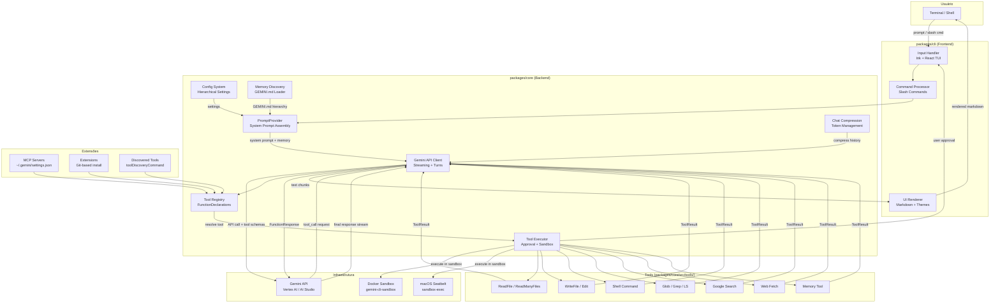
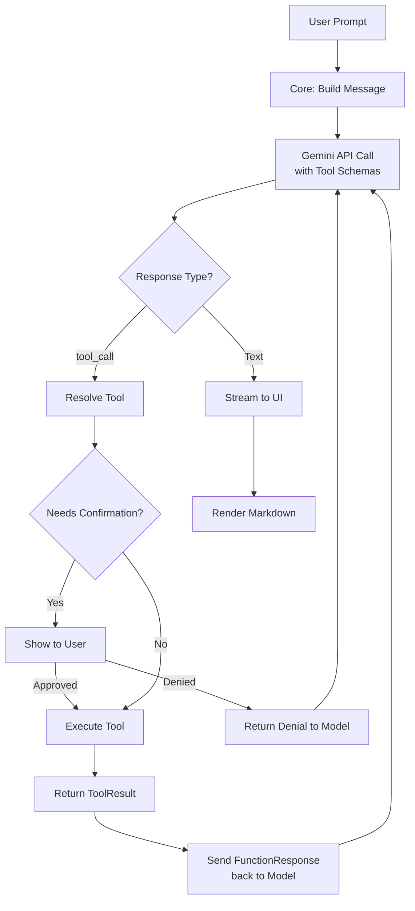
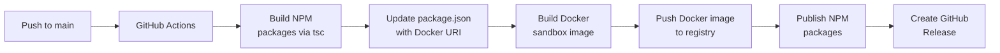
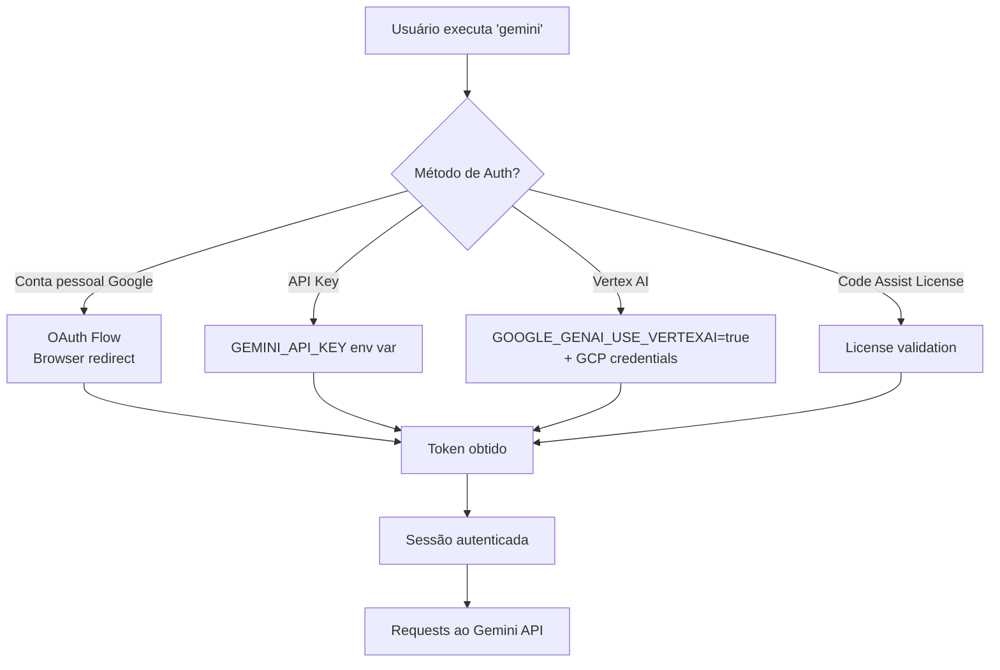
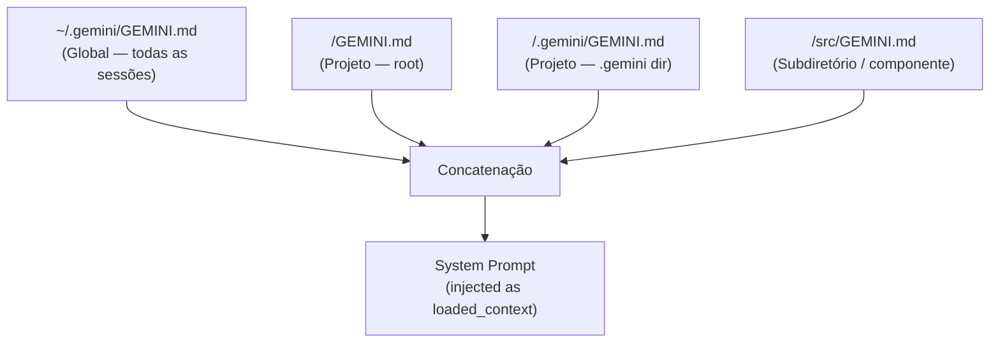
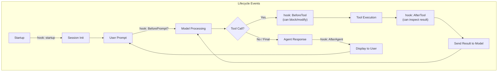
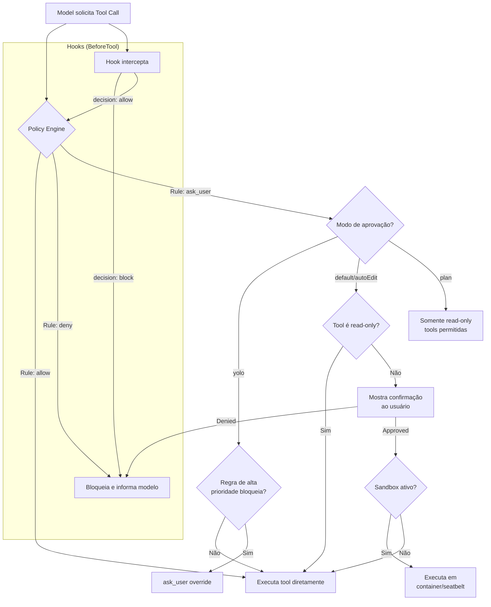

# 📋 PRD — Product Requirements Document
# **Gemini CLI** — `@google/gemini-cli`

> **Versão do documento:** 1.0 — 31 de março de 2026
> **Baseado na versão do produto:** 0.35.3 (latest stable) / 0.36.0-preview.6 (preview)
> **Licença:** Apache 2.0
> **Repositório:** `https://github.com/google-gemini/gemini-cli`

---

## 1. Visão Geral do Produto

### 1.1 Nome e Identidade

| Campo | Valor |
|---|---|
| **Nome oficial** | Gemini CLI |
| **Pacote NPM (CLI)** | `@google/gemini-cli` |
| **Pacote NPM (Core)** | `@google/gemini-cli-core` |
| **Organização** | Google Gemini (`google-gemini`) |
| **Estrelas GitHub** | ~99.643 |

### 1.2 Slogan

> **"An open-source AI agent that brings the power of Gemini directly into your terminal."**

### 1.3 Missão (1 frase)

Gemini CLI é um agente de IA open-source que traz o poder dos modelos Gemini diretamente para o terminal, fornecendo acesso leve ao Gemini e o caminho mais direto do prompt ao modelo.

### 1.4 Proposta de Valor

| Feature | Detalhe |
|---|---|
| 🎯 **Free tier generoso** | 60 requests/min e 1.000 requests/dia com conta pessoal do Google |
| 🧠 **Modelos poderosos** | Acesso a modelos Gemini 3 com janela de contexto de 1M tokens |
| 🔧 **Ferramentas built-in** | Google Search grounding, operações de arquivo, comandos shell, web fetching |
| 🔌 **Extensível** | Suporte a MCP (Model Context Protocol) para integrações customizadas |
| 💻 **Terminal-first** | Projetado para devs que vivem na linha de comando |

### 1.5 Personas

| Persona | Dor | Como Gemini CLI resolve |
|---|---|---|
| **Lucas**, dev backend sênior | Alternar entre IDE, browser e docs para entender codebases novas | Analisa código inteiro no terminal com contexto de 1M tokens |
| **Marina**, DevOps / SRE | Automatizar tarefas repetitivas de CI/CD e troubleshooting | Usa loop ReAct com ferramentas built-in e MCP servers para completar tarefas complexas |
| **Carlos**, tech lead | Garantir padrões de código e fazer reviews rápidos em PRs | Triage de issues e review de PRs via GitHub Actions |
| **Aline**, dev júnior | Medo de executar comandos complexos e quebrar o ambiente | Ferramentas de safety que requerem confirmação antes de operações potencialmente sensíveis |
| **Rafael**, arquiteto enterprise | Precisa de controle e compliance em ambientes corporativos | Guia enterprise para deploy e gerenciamento em ambientes corporativos |

### 1.6 Diferenciais vs Concorrentes

| Critério | Gemini CLI | GitHub Copilot CLI | Aider | Claude Code |
|---|---|---|---|---|
| **Free tier** | 1000 req/dia ✅ | Limitado | Precisa API key paga | Precisa API key paga |
| **Contexto** | 1M tokens | ~128k | Variável | ~200k |
| **Open-source** | Apache 2.0 ✅ | ❌ | ✅ | ❌ |
| **Extensibilidade MCP** | Nativo ✅ | ❌ | Parcial | ✅ |
| **Sandboxing** | Docker + Seatbelt ✅ | ❌ | ❌ | Container |
| **GitHub Actions nativo** | ✅ | Via Copilot | ❌ | ❌ |

---

## 2. Arquitetura de Alto Nível e Escolhas Tecnológicas

### 2.1 Diagrama Mermaid — Fluxo Principal



### 2.2 Tecnologias Principais

| Tecnologia | Papel | Justificativa |
|---|---|---|
| **TypeScript** | Linguagem principal | Projeto 100% TypeScript. Tipagem forte para tooling complexo, ótimo ecossistema NPM |
| **Node.js** | Runtime | Plataforma padrão para CLIs TypeScript, ampla compatibilidade |
| **Ink + React** | TUI (Terminal UI) | Framework declarativo para interfaces de terminal ricas com componentes React |
| **NPM Workspaces** | Monorepo management | Monorepo usando npm workspaces |
| **esbuild** | Bundler (GitHub npx) | Usa esbuild para agrupar toda a aplicação em um único arquivo JavaScript auto-contido |
| **tsc** | Compilador (NPM publish) | Código TypeScript é transpilado em JavaScript padrão usando TypeScript Compiler (tsc) |
| **Docker** | Sandboxing / isolamento | Execução baseada em Docker suportada pela imagem gemini-cli-sandbox |
| **Seatbelt (macOS)** | Sandboxing nativo macOS | Implementa sandboxing estrito para macOS usando Seatbelt allowlist |
| **Gemini API** | LLM backend | API do Google para modelos Gemini (via AI Studio ou Vertex AI) |
| **MCP (Model Context Protocol)** | Extensibilidade | Protocolo padrão para conectar ferramentas externas ao agente |
| **OpenTelemetry** | Observabilidade | Integrado com OpenTelemetry, padrão da indústria para telemetria |
| **GitHub Actions** | CI/CD + Release | Processo de release automatizado via GitHub Actions |

### 2.3 Modelo de Deploy

| Método | Descrição | Público-alvo |
|---|---|---|
| **`npm install -g`** | Instalação recomendada para end-users, download do pacote NPM | Todos |
| **`npx @google/gemini-cli`** | Execução sem instalação permanente | Quick-start |
| **Docker sandbox** | Imagem Docker publicada com versão pré-instalada do Gemini CLI | Segurança |
| **`--sandbox` flag** | Executa o CLI local dentro do container sandbox | Segurança com install local |
| **Source (dev)** | Para contribuidores, com hot-reloading em desenvolvimento ativo | Contribuidores |
| **Cloud Shell** | Pré-instalado no Cloud Shell e Cloud Workstations | GCP users |

### 2.4 Padrões de Design Observados

| Padrão | Onde | Descrição |
|---|---|---|
| **Monorepo** | Raiz do projeto | Separação em packages independentes com npm workspaces |
| **Frontend/Backend Split** | `packages/cli` ↔ `packages/core` | Separar o CLI (frontend) do Core (backend) permite desenvolvimento independente e futuras extensões |
| **Registry Pattern** | `ToolRegistry` | Expõe schemas de FunctionDeclaration e permite buscar tools por nome |
| **Strategy Pattern** | Tools / Approval Modes | Cada tool implementa a mesma interface (`execute()`, `shouldConfirmExecute()`) |
| **ReAct Loop** | Core agent loop | Usa loop reason-and-act (ReAct) com ferramentas built-in e MCP servers |
| **Hierarchical Config** | Settings system | Sistema hierárquico baseado em JSON settings e Markdown context files, com precedência definida |
| **Observer/Event Pattern** | Streaming | Respostas do modelo são streamed em chunks para UI |
| **Plugin Architecture** | MCP + Extensions + Hooks | Múltiplos pontos de extensibilidade |

---

## 3. Árvore de Diretórios e Esqueleto do Projeto

### 3.1 Estrutura de Packages (Monorepo)

O projeto usa monorepo com npm workspaces, organizado em:

```
gemini-cli/
├── packages/
│   ├── cli/                  → UI de terminal, processamento de input, rendering
│   │   ├── src/
│   │   │   ├── ui/           → Componentes React/Ink (TUI)
│   │   │   │   ├── commands/ → Processadores de slash commands (/help, /chat, /bug...)
│   │   │   │   └── ...
│   │   │   ├── config/       → Settings schema, hierarquia de config, env vars
│   │   │   │   ├── settings.ts        → Loader de settings.json hierárquico
│   │   │   │   ├── settingsSchema.ts  → Schema de validação do settings.json
│   │   │   │   └── config.ts          → Config adapter CLI → Core
│   │   │   └── ...
│   │   ├── package.json
│   │   └── tsconfig.json
│   │
│   ├── core/                 → Lógica backend, orquestração da API Gemini, tools
│   │   ├── src/
│   │   │   ├── core/         → Loop principal do agente, prompts
│   │   │   │   └── prompts.ts         → Entrypoint público p/ geração de prompt
│   │   │   ├── prompts/      → Assembly do system prompt
│   │   │   │   ├── promptProvider.ts  → Orquestrador (3 fases)
│   │   │   │   ├── snippets.ts        → Módulos de seções do prompt
│   │   │   │   └── utils.ts           → Feature flags de seções
│   │   │   ├── tools/        → Ferramentas built-in
│   │   │   │   ├── read-file.ts
│   │   │   │   ├── write-file.ts
│   │   │   │   ├── edit.ts
│   │   │   │   ├── ls.ts
│   │   │   │   ├── grep.ts
│   │   │   │   ├── glob.ts
│   │   │   │   ├── read-many-files.ts
│   │   │   │   ├── memoryTool.ts
│   │   │   │   └── ...
│   │   │   ├── config/       → Config class do core
│   │   │   │   └── config.ts          → Classe Config principal
│   │   │   └── ...
│   │   ├── package.json
│   │   └── tsconfig.json
│   │
│   ├── a2a-server/           → Server experimental Agent-to-Agent (A2A)
│   ├── sdk/                  → SDK programático para embedding
│   ├── devtools/             → Dev tools integrados (Network/Console inspector)
│   ├── test-utils/           → Utilitários de teste compartilhados
│   └── vscode-ide-companion/ → Extensão VS Code companion
│
├── docs/                     → Documentação (source do site estático)
│   ├── cli/
│   ├── core/
│   ├── tools/
│   └── ...
│
├── scripts/                  → Scripts de build e release
│   └── prepare-cli-packagejson.js  → Injeta URI da imagem Docker no pkg.json
│
├── .github/                  → GitHub Actions workflows
│   └── workflows/
│
├── GEMINI.md                 → Contexto do projeto para o próprio Gemini CLI
├── CONTRIBUTING.md           → Guia de contribuição
├── package.json              → Root package.json (npm workspaces)
├── tsconfig.json             → TypeScript config raiz
└── LICENSE                   → Apache 2.0
```

### 3.2 Arquivos e Pastas Críticos — Mapa Explicativo

| Caminho | O que faz | Quem usa | Quando roda |
|---|---|---|---|
| `packages/core/src/prompts/promptProvider.ts` | Orquestrador do system prompt — método `getCoreSystemPrompt` executa 3 fases de assembly | Core, a cada nova sessão | Início de cada conversa / refresh |
| `packages/core/src/tools/*.ts` | Módulos individuais que estendem as capacidades do modelo para interagir com o ambiente local | Core (invocado pelo modelo) | Quando o modelo requisita uma tool |
| `packages/core/src/config/config.ts` | Classe Config principal, inicializada com ConfigParameters que definem o estado da sessão | Core inteiro | Bootstrap |
| `packages/cli/src/config/settings.ts` | Loader de settings.json — controla behavior, UI, tools e features | CLI bootstrap | Startup |
| `packages/cli/src/config/settingsSchema.ts` | Schema de validação do `settings.json` | Settings loader | Startup / validação |
| `~/.gemini/settings.json` | Config global do usuário (MCP servers, tema, modelo) | CLI + Core | Startup |
| `.gemini/settings.json` (projeto) | Config por workspace/projeto | CLI + Core | Startup |
| `GEMINI.md` (hierárquico) | Encontra e carrega GEMINI.md que provêem contexto, buscando hierarquicamente do CWD até o home | Memory Discovery Service | Startup / `/memory` command |
| `scripts/prepare-cli-packagejson.js` | Injeta dinamicamente a URI da imagem Docker no package.json do CLI antes da publicação | Release pipeline | NPM publish |

### 3.3 Convenções de Nomenclatura

| Elemento | Convenção | Exemplo |
|---|---|---|
| **Arquivos de tool** | `kebab-case.ts` | `read-file.ts`, `write-file.ts`, `read-many-files.ts` |
| **Classes de tool** | `PascalCase + Tool` | `ReadFileTool`, `GrepTool`, `EditTool` |
| **Slash commands** | `/lowercase` | `/help`, `/chat`, `/bug`, `/memory`, `/tools` |
| **Settings keys** | `camelCase` | `mcpServers`, `toolDiscoveryCommand`, `approvalMode` |
| **Env vars** | `SCREAMING_SNAKE_CASE` | `GEMINI_API_KEY`, `GEMINI_MODEL`, `GEMINI_SYSTEM_MD` |
| **Commits** | Conventional Commits standard | `feat(core):`, `fix(cli):`, `docs:` |
| **Pacotes** | `@google/gemini-cli-*` | `@google/gemini-cli`, `@google/gemini-cli-core` |

---

## 4. Requisitos Funcionais (RFs) — O Catálogo de Ações

### 4.1 Autenticação e Acesso

| ID | Requisito | Fluxo | Módulo Crítico | Status |
|---|---|---|---|---|
| **RF-001** | Login com conta pessoal do Google (OAuth) | Usuário executa `gemini` → prompt de login OAuth → token obtido → sessão autenticada | `packages/core/` (auth) | ✅ Implementado |
| **RF-002** | Autenticação via API Key | Usuário exporta `GOOGLE_API_KEY` → CLI usa a chave diretamente | `packages/cli/src/config/settings.ts` | ✅ Implementado |
| **RF-003** | Autenticação via Vertex AI | Exporta `GOOGLE_GENAI_USE_VERTEXAI=true` → autenticação via credenciais GCP | `packages/core/` (auth) | ✅ Implementado |
| **RF-004** | Gemini Code Assist License | Para devs individuais e quem tem licença Gemini Code Assist | `packages/core/` (auth) | ✅ Implementado |

### 4.2 Conversação Interativa

| ID | Requisito | Fluxo | Módulo Crítico | Status |
|---|---|---|---|---|
| **RF-010** | Chat interativo no terminal | Usuário digita prompt → Core envia ao Gemini API → resposta streamed renderizada em Markdown | `packages/cli/src/ui/`, `packages/core/` | ✅ Implementado |
| **RF-011** | Compressão de histórico de chat | Quando a conversa se aproxima do limite de tokens, o core comprime automaticamente o histórico de forma lossless | `packages/core/` (chat compression) | ✅ Implementado |
| **RF-012** | Checkpointing (save/resume) | Salvar e retomar conversas | `packages/core/` (checkpointing) | ✅ Implementado |
| **RF-013** | Rewind de sessão | Rebobinar e replayer sessões | `packages/core/` (rewind) | ✅ Implementado |
| **RF-014** | Múltiplos chats | `/chat` command para gerenciar sessões | `packages/cli/src/ui/commands/` | ✅ Implementado |

### 4.3 Ferramentas Built-in (Tools)

O core vem com um conjunto de ferramentas pré-definidas em `packages/core/src/tools/`:

| ID | Requisito / Tool | O que faz | Arquivo | Confirmação? |
|---|---|---|---|---|
| **RF-020** | `read_file` | Lê o conteúdo de um único arquivo (requer caminho absoluto) | `read-file.ts` | ❌ Não (read-only) |
| **RF-021** | `read_many_files` | Lê e concatena conteúdo de múltiplos arquivos ou glob patterns (usado pelo comando `@`) | `read-many-files.ts` | ❌ Não |
| **RF-022** | `write_file` | Escreve conteúdo em um arquivo | `write-file.ts` | ✅ Sim |
| **RF-023** | `edit` | Realiza modificações in-place em arquivos (geralmente requer confirmação) | `edit.ts` | ✅ Sim |
| **RF-024** | `ls` | Lista conteúdo de diretórios | `ls.ts` | ❌ Não |
| **RF-025** | `grep` | Busca padrões em arquivos | `grep.ts` | ❌ Não |
| **RF-026** | `glob` | Encontra arquivos por glob patterns | `glob.ts` | ❌ Não |
| **RF-027** | `run_shell_command` | Executa comandos shell com medidas de segurança e confirmação do usuário | tool de shell | ✅ Sim |
| **RF-028** | Google Search grounding | Grounding de respostas via Google Search | tool de search | Depende da config |
| **RF-029** | Web fetch | Ferramentas podem buscar conteúdo de URLs | tool de fetch | Depende da config |
| **RF-030** | Memory tool | Comando `/memory` para mostrar, adicionar e atualizar GEMINI.md carregados | `memoryTool.ts` | ❌ Não |

### 4.4 Modo Headless / Scripting

| ID | Requisito | Fluxo | Módulo | Status |
|---|---|---|---|---|
| **RF-040** | Modo prompt único (`-p`) | `gemini -p "prompt" --output-format json` → output estruturado em JSON | CLI args parser | ✅ Implementado |
| **RF-041** | Stream JSON | `gemini -p "prompt" --output-format stream-json` → newline-delimited JSON events | CLI args parser | ✅ Implementado |
| **RF-042** | Plan mode em non-interactive | Suporte a plan mode em modo não-interativo | `packages/core/` (plan) | ✅ Implementado |

### 4.5 Sistema de Contexto e Memória

| ID | Requisito | Fluxo | Módulo | Status |
|---|---|---|---|---|
| **RF-050** | GEMINI.md hierárquico | Memory Discovery busca GEMINI.md do CWD até o home, incluindo subdiretórios, combinando global + projeto + componente | `packages/core/src/tools/memoryTool.ts` | ✅ Implementado |
| **RF-051** | System prompt override | GEMINI_SYSTEM_MD instrui o CLI a usar um arquivo Markdown externo como system prompt, substituindo completamente o padrão built-in | `packages/core/src/prompts/promptProvider.ts` | ✅ Implementado |
| **RF-052** | Template variables no system prompt | Variáveis como `${AgentSkills}`, `${SubAgents}`, `${AvailableTools}` e `${toolName}_ToolName` são geradas dinamicamente | `promptProvider.ts` (applySubstitutions) | ✅ Implementado |
| **RF-053** | `.geminiignore` | Referência de padrões de exclusão de arquivos | Config system | ✅ Implementado |

### 4.6 Extensibilidade

| ID | Requisito | Fluxo | Módulo | Status |
|---|---|---|---|---|
| **RF-060** | MCP Server Integration | Configura MCP servers em `~/.gemini/settings.json` para estender com custom tools | `packages/core/` (MCP) | ✅ Implementado |
| **RF-061** | Extensions (git-based) | `gemini extensions install <source>` instala de um repositório git ou caminho local | `packages/cli/` (extensions) | ✅ Implementado |
| **RF-062** | Extensions management | `gemini extensions uninstall` e `gemini extensions list` para gerenciar | CLI commands | ✅ Implementado |
| **RF-063** | Custom tool discovery | `toolDiscoveryCommand` em settings.json gera JSON array de FunctionDeclaration → disponibilizados como DiscoveredTool | `packages/core/` (ToolRegistry) | ✅ Implementado |
| **RF-064** | Custom commands | Criar comandos reutilizáveis personalizados | `packages/cli/` (commands) | ✅ Implementado |
| **RF-065** | Hooks | Customizar comportamento do CLI com scripts | `packages/core/` (hooks) | ✅ Implementado |
| **RF-066** | Agent Skills | Agentes especializados para tarefas específicas | `packages/core/` | ✅ Implementado |
| **RF-067** | Subagents (experimental 🔬) | Subagentes especializados para tarefas específicas | `packages/core/` | 🧪 Experimental |
| **RF-068** | Remote subagents (experimental 🔬) | Conectar e usar agentes remotos | `packages/core/` | 🧪 Experimental |

### 4.7 Segurança e Sandbox

| ID | Requisito | Fluxo | Módulo | Status |
|---|---|---|---|---|
| **RF-070** | Confirmação de execução | Se a tool pode modificar filesystem ou executar shell, o usuário deve aprovar; operações read-only não requerem confirmação | `packages/core/` (approval) | ✅ Implementado |
| **RF-071** | Docker sandboxing | Para isolamento, CLI pode executar dentro de container; é o método padrão para tools com side effects | Docker sandbox image | ✅ Implementado |
| **RF-072** | macOS Seatbelt sandboxing | Sandboxing estrito via Seatbelt allowlist para macOS | Core (sandbox) | ✅ Implementado |
| **RF-073** | Trusted folders | Controle de políticas de execução por pasta | Config / Policy engine | ✅ Implementado |
| **RF-074** | Policy engine | Controle fino de execução | `packages/core/` (policy) | ✅ Implementado |
| **RF-075** | YOLO mode (`--yolo`) | Flag `--yolo` para skip de permissões (não recomendado) | CLI flags / approval | ✅ Implementado |

### 4.8 Slash Commands

| ID | Comando | O que faz |
|---|---|---|
| **RF-080** | `/help` | Exibe ajuda e comandos disponíveis |
| **RF-081** | `/chat` | Gerencia sessões de chat (listar, resume, nova) |
| **RF-082** | `/bug` | Reporta issues diretamente pelo CLI |
| **RF-083** | `/memory` | Gerencia GEMINI.md (show, add, refresh) |
| **RF-084** | `/tools` | Lista ferramentas disponíveis |
| **RF-085** | `/theme` | Altera tema visual |

### 4.9 IDE Integration e GitHub Actions

| ID | Requisito | Fluxo | Status |
|---|---|---|---|
| **RF-090** | VS Code companion | Gemini Code Assist agent mode no VS Code é powered by Gemini CLI | ✅ Implementado |
| **RF-091** | GitHub Actions `@gemini-cli` | Mencionar @gemini-cli em issues e PRs para help com debugging, explicações ou delegação | ✅ Implementado |
| **RF-092** | Issue triage workflow | Automação inteligente de triage de issues | ✅ Implementado |
| **RF-093** | PR review workflow | Review automático de PRs | ✅ Implementado |

---

## 5. Requisitos Não Funcionais (RNFs) — Metas de Qualidade

### 5.1 Performance

| Métrica | Alvo / Observado | Detalhes |
|---|---|---|
| **Cold-start (npx)** | ~2.2s (pnpm dlx), ~3s (bunx), ~20s (npx) | Recomenda-se `pnpm dlx` para performance |
| **Warm-start** | Sub-segundo | Cache de pacotes reutilizado |
| **Janela de contexto** | 1M tokens | Compressão automática quando próximo do limite |
| **Rate limits (free)** | 60 req/min, 1.000 req/dia | Conta pessoal Google |
| **Bundle (NPM publish)** | `dist/` directory | Transpilado via tsc |
| **Bundle (GitHub npx)** | Single self-contained JS file via esbuild, criado on-the-fly |

### 5.2 Segurança

| Aspecto | Implementação |
|---|---|
| **Autenticação** | OAuth (Google Account), API Key, Vertex AI (IAM/WIF), Gemini Code Assist License |
| **Autorização de tools** | Approval system: tools destrutivas requerem confirmação explícita; read-only auto-aprovadas; resultado enviado de volta à API |
| **Sandboxing** | Docker containers, macOS Seatbelt, trusted folders |
| **Command allowlisting** | Allowlisting explícito de cada comando shell que o agente pode executar |
| **Policy engine** | Controle fino por pasta, por tool, por escopo |
| **Secrets management** | Env vars (`GEMINI_API_KEY`), `.gemini/.env` files, interpolação `${MY_VAR}` em settings |
| **Privacy consent** | Consent de privacidade para browser |

### 5.3 Escalabilidade e Token Management

| Aspecto | Implementação |
|---|---|
| **Token caching** | Otimização de uso de tokens via caching |
| **Chat compression** | Compressão automática e lossless do histórico quando próximo ao limite |
| **Model routing** | Fallback automático com resiliência |
| **Model selection** | Escolha do melhor modelo conforme necessidade |

### 5.4 Compatibilidade

| Aspecto | Requisito |
|---|---|
| **Node.js** | Versão mínima: 18+ (recomendado: LTS mais recente) |
| **OS** | macOS, Linux, Windows (via WSL recomendado) |
| **Cloud Shell** | Pré-instalado no Google Cloud Shell e Cloud Workstations |
| **Package managers** | npm, pnpm, bun (todos funcionam) |
| **Terminais** | Qualquer terminal com suporte a ANSI |

### 5.5 Usabilidade

| Aspecto | Implementação |
|---|---|
| **Themes** | Personalização de UI via temas |
| **Keyboard shortcuts** | Atalhos de teclado para produtividade |
| **Shell mode** | Toggle para shell mode pressionando `!` |
| **System prompt indicator** | Indicador `|⌐■_■|` quando custom system prompt está ativo |
| **Markdown rendering** | Respostas renderizadas com syntax highlighting no terminal |

---

## 6. Análise Técnica Profunda e Justificativa de Stack

### 6.1 TypeScript (Linguagem Principal)

| Campo | Detalhes |
|---|---|
| **O que é** | Superset tipado de JavaScript que compila para JS |
| **Por que escolheram** | Ecossistema NPM maduro; tipagem forte essencial para tooling complexo (schemas de tools, configs hierárquicas); permite build tanto com tsc (NPM) quanto esbuild (single-file); mesma linguagem frontend/backend |
| **Como funciona aqui** | Source em TS transpilado via tsc para JS no `dist/`, que é publicado no NPM |
| **Alternativas descartadas** | Go (perderia ecossistema NPM/React), Rust (build complexity), Python (sem TUI nativo tão rico) |
| **Riscos** | Performance de cold-start de Node.js; memory footprint |
| **Mitigação** | esbuild para bundling rápido; streaming para reduzir latência percebida |

### 6.2 Ink + React (Terminal UI Framework)

| Campo | Detalhes |
|---|---|
| **O que é** | Framework para construir CLIs com React components renderizados no terminal |
| **Por que escolheram** | Modelo declarativo; componentes reutilizáveis; hooks para state management; rendering de Markdown rico |
| **Como funciona aqui** | `packages/cli/src/ui/` contém componentes React que renderizam a interface: input box, output area, tool confirmations, progress indicators |
| **Riscos** | Overhead de React em terminal; compatibilidade com terminais obscuros |
| **Mitigação** | Warnings acionáveis para fallbacks de terminal |

### 6.3 Gemini API (LLM Backend)

| Campo | Detalhes |
|---|---|
| **O que é** | API do Google para modelos Gemini (2.5 Pro, 2.5 Flash, Gemini 3) |
| **Por que escolheram** | Produto Google; free tier generoso; janela de contexto de 1M tokens; function calling nativo |
| **Como funciona aqui** | Core envia prompt + histórico + lista de tools com schemas → Modelo analisa request → Se necessário, responde com tool_call → Core valida, obtém confirmação e executa |
| **Endpoints** | Google AI Studio (padrão free) ou Vertex AI (enterprise) |
| **Riscos** | Rate limits; latência de rede; model availability |
| **Mitigação** | Model routing com fallback automático para resiliência; token caching; chat compression |

### 6.4 MCP — Model Context Protocol (Extensibilidade)

| Campo | Detalhes |
|---|---|
| **O que é** | Protocolo aberto para conectar LLMs a ferramentas e dados externos |
| **Por que escolheram** | Padrão emergente da indústria; interoperabilidade entre diferentes LLMs e tools |
| **Como funciona aqui** | MCP servers configurados em settings.json; Core descobre e usa tools expostas; com múltiplos servers, nomes são prefixados (e.g., `serverAlias__toolName`) |
| **Riscos** | MCP server instável; latência de comunicação |
| **Mitigação** | Sandboxing de execução; timeouts |

### 6.5 esbuild (Bundler)

| Campo | Detalhes |
|---|---|
| **O que é** | Bundler JavaScript extremamente rápido, escrito em Go |
| **Por que escolheram** | Velocidade de build excepcional (10-100x mais rápido que webpack) |
| **Como funciona aqui** | Ativado pelo prepare script no package.json para execução via GitHub npx; agrupa toda a app em um único JS file auto-contido, criado on-the-fly |
| **Quando roda** | Somente no path `npx github.com/...`; publicação NPM usa tsc normal |

### 6.6 Docker (Sandboxing)

| Campo | Detalhes |
|---|---|
| **O que é** | Plataforma de containerização |
| **Por que escolheram** | Isolamento completo; reprodutibilidade; segurança para execução de comandos |
| **Como funciona aqui** | Imagem `gemini-cli-sandbox` publicada em registry de containers; script `prepare-cli-packagejson.js` injeta URI da imagem no package.json para que o CLI saiba qual imagem puxar com `--sandbox` |
| **Riscos** | Docker não disponível em todos os ambientes; overhead de container |
| **Mitigação** | Seatbelt como alternativa no macOS; execução local como fallback |

### 6.7 OpenTelemetry (Observabilidade)

| Campo | Detalhes |
|---|---|
| **O que é** | Framework open-source para instrumentação, coleta e exportação de telemetria |
| **Por que escolheram** | Padrão da indústria; dá visibilidade real-time sobre cada ação para monitorar uso e debugar workflows complexos |
| **Como funciona aqui** | Traces, métricas e logs exportáveis para Google Cloud Monitoring ou qualquer backend OTLP |

---

## 7. Mapeamento Mestre de Ferramentas, Fluxos e Componentes Críticos

### 7.1 Pipeline de Tool Execution (o coração do agente)

**Quem usa:** Todo o sistema (core loop)
**Pra quê:** Executar ações no ambiente local conforme solicitado pelo modelo
**Quando roda:** A cada tool_call retornada pelo modelo Gemini

**Passo a passo completo:**

```
1. Usuário envia prompt
2. CLI (packages/cli) captura input → envia ao Core
3. Core (packages/core) monta mensagem:
   - System prompt (via PromptProvider)
   - Histórico de conversa (comprimido se necessário)
   - Lista de FunctionDeclarations de todas tools registradas (ToolRegistry)
4. Core envia ao Gemini API (via API client, streaming)
5. Gemini API analisa e retorna uma de:
   a) Texto final → streamed para UI → renderizado
   b) tool_call(name, params) → segue para step 6
6. Core resolve a tool pelo nome via ToolRegistry.getTool(name)
7. Core chama tool.validateToolParams(params)
8. Core chama tool.shouldConfirmExecute(params):
   - Se TRUE → envia para CLI mostrar confirmação ao usuário
   - Se FALSE (read-only) → prossegue direto
9. Se sandbox ativo:
   - Executa dentro do Docker container ou Seatbelt
10. Core chama tool.execute(params) → retorna ToolResult:
    - ToolResult.llmContent → conteúdo para enviar de volta ao modelo
    - ToolResult.returnDisplay → conteúdo para mostrar ao usuário
11. Core empacota llmContent como FunctionResponse
12. Core envia FunctionResponse de volta ao Gemini API
13. Gemini processa resultado e gera próxima resposta (pode ser outro tool_call ou texto final)
14. Ciclo repete até resposta final de texto
15. CLI renderiza resposta final em Markdown no terminal
```

**O que acontece se falhar:**
- Tool não encontrada → erro retornado ao modelo como FunctionResponse de erro
- Validação de params falha → erro retornado ao modelo
- Usuário nega confirmação → execução bloqueada; informação retornada ao modelo para ajustar abordagem
- Erro de execução → ToolResult com erro → modelo recebe e pode tentar abordagem diferente

### 7.2 ReadFileTool

| Campo | Detalhes |
|---|---|
| **Quem usa** | Modelo (quando precisa ler um arquivo) |
| **Pra quê** | Ler conteúdo de um arquivo local |
| **Quando roda** | Quando modelo decide que precisa ver o conteúdo de um arquivo |
| **Arquivo** | `packages/core/src/tools/read-file.ts` |
| **Parâmetros** | `{ absolute_path: string }` — deve ser um caminho absoluto |
| **Confirmação** | Não (read-only) |
| **Retorno** | `ToolResult { llmContent: conteúdo do arquivo, returnDisplay: resumo }` |
| **Se falhar** | Arquivo não existe → erro retornado ao modelo |

### 7.3 WriteFileTool

| Campo | Detalhes |
|---|---|
| **Quem usa** | Modelo (quando precisa criar/sobrescrever arquivo) |
| **Pra quê** | Escrever conteúdo em um arquivo |
| **Arquivo** | `packages/core/src/tools/write-file.ts` |
| **Confirmação** | ✅ Sim — requer confirmação pois modifica filesystem |
| **Se falhar** | Permissão negada / path inválido → erro ao modelo |

### 7.4 EditTool

| Campo | Detalhes |
|---|---|
| **Quem usa** | Modelo (quando precisa modificar parte de um arquivo existente) |
| **Pra quê** | Modificações in-place (search/replace, insert) |
| **Arquivo** | `packages/core/src/tools/edit.ts` |
| **Confirmação** | ✅ Sim (geralmente requer confirmação) |

### 7.5 RunShellCommandTool

| Campo | Detalhes |
|---|---|
| **Quem usa** | Modelo (quando precisa executar comandos no sistema) |
| **Pra quê** | Executar qualquer comando shell (npm install, git, curl, etc.) |
| **Confirmação** | ✅ Sim (operação de alto risco) |
| **Sandbox** | Executado dentro de container ou Seatbelt se sandbox ativo |
| **Se falhar** | Exit code != 0 → stdout/stderr retornados ao modelo |

### 7.6 PromptProvider — Assembly do System Prompt

| Campo | Detalhes |
|---|---|
| **Quem usa** | Core, a cada início de conversa |
| **Pra quê** | Montar o system prompt dinâmico que instrui o modelo |
| **Arquivo** | `packages/core/src/prompts/promptProvider.ts` |
| **Fases** | 1) Verifica override via GEMINI_SYSTEM_MD → 2) Constrói SystemPromptOptions com seções condicionais via `withSection(key, factory, guard)` → 3) Injeta memória do usuário (GEMINI.md) |
| **Variáveis dinâmicas** | `${AgentSkills}`, `${SubAgents}`, `${AvailableTools}`, `${toolName}_ToolName` |
| **Feature flags** | Cada seção é condicionalmente incluída via `isSectionEnabled(key)` de `utils.ts` |
| **YOLO mode** | renderInteractiveYoloMode só é chamado quando `isYoloMode && interactiveMode`; em non-interactive, YOLO não afeta o prompt |

### 7.7 Config System — Hierarquia

| Campo | Detalhes |
|---|---|
| **Quem usa** | Toda a aplicação |
| **Pra quê** | Gerenciar configurações em múltiplos níveis |
| **Arquivos chave** | `packages/cli/src/config/settings.ts`, `packages/core/src/config/config.ts` |
| **Níveis de precedência** | Sistema → Usuário (`~/.gemini/settings.json`) → Workspace (`.gemini/settings.json`) — workspace wins |
| **Env vars** | `GEMINI_MODEL`, `GEMINI_API_KEY`, `GEMINI_CLI_SYSTEM_SETTINGS_PATH`; interpolação `${MY_VAR}` suportada |

---

## 8. Pipelines Especiais

### 8.1 Pipeline ReAct (Agentic Loop)

O Gemini CLI usa um loop reason-and-act (ReAct) com ferramentas built-in e MCP servers para completar casos de uso complexos.



**Ciclo de vida:**
1. **Reason**: Modelo recebe contexto + tools e decide a ação
2. **Act**: Core executa a tool (com approval se necessário)
3. **Observe**: Resultado retorna ao modelo
4. **Repeat**: Modelo pode chamar mais tools ou gerar resposta final

### 8.2 Pipeline de Memory Discovery (GEMINI.md)

O Memory Discovery Service busca GEMINI.md hierarquicamente:

```
1. ~/.gemini/GEMINI.md              → Contexto global do usuário
2. /project-root/GEMINI.md          → Contexto do projeto
3. /project-root/.gemini/GEMINI.md  → Config alternativa do projeto
4. /project-root/src/GEMINI.md      → Contexto de componente/subdiretório
5. ... (subdiretórios)
```

Todos são combinados e injetados no system prompt com tags `<loaded_context>`.

### 8.3 Pipeline de Release (CI/CD)

Processo automatizado via GitHub Actions:



**Cadência de releases:**
| Canal | Frequência | Detalhes |
|---|---|---|
| **Nightly** | Diário às UTC 00:00 — todas as mudanças do main; pendente de validação |
| **Preview** | Semanal terça UTC 23:59 — pode conter regressões |
| **Stable** | Semanal terça UTC 20:00 — promoção do preview anterior + bug fixes |

### 8.4 Pipeline de Extensions

`gemini extensions install <source>` instala de repositório git ou caminho local:

```
1. gemini extensions install <git-url> [--auto-update] [--pre-release]
2. CLI clona o repositório para ~/.gemini/extensions/<name>/
3. Extension declara MCP servers ou tools adicionais
4. Na próxima sessão, tools da extension são registradas no ToolRegistry
5. Modelo pode usar as novas tools normalmente
```

---

## 9. Integrações Externas

### 9.1 Gemini API (Google AI Studio / Vertex AI)

| Aspecto | Detalhes |
|---|---|
| **Provedor** | Google |
| **Configuração (AI Studio)** | `export GEMINI_API_KEY="YOUR_KEY"` |
| **Configuração (Vertex AI)** | `export GOOGLE_API_KEY="YOUR_KEY"` + `export GOOGLE_GENAI_USE_VERTEXAI=true` |
| **Como estender** | Suporta model routing para escolha dinâmica de modelos |
| **Mocks** | Não identificados no código público; testes usam `test-utils` com mocks internos |

### 9.2 MCP Servers (Integrações de Terceiros)

Configurados em `~/.gemini/settings.json`:

```json
{
  "mcpServers": {
    "github": {
      "command": "npx",
      "args": ["@github/mcp-server"]
    },
    "slack": {
      "command": "npx",
      "args": ["@slack/mcp-server"]
    }
  }
}
```

**Exemplos de integrações disponíveis:**
- GitHub, Redis, DynaTrace e muitos mais no Extensions gallery
- Conductor: especificar, planejar e implementar features
- Security: encontra vulnerabilidades em code changes e PRs
- Jules: orquestra agente assíncrono para bug fixing, refactoring e dependency updates

### 9.3 GitHub Actions

| Aspecto | Detalhes |
|---|---|
| **Action** | `google-github-actions/run-gemini-cli` |
| **Auth** | API key como secret `GEMINI_API_KEY` ou Workload Identity Federation |
| **Env vars** | Google Cloud project, Region, Service account email |
| **⚠️ IMPORTANTE** | NÃO usar a variável DEBUG pois causa hang do CLI aguardando node debugger |

### 9.4 VS Code

| Aspecto | Detalhes |
|---|---|
| **Package** | `packages/vscode-ide-companion` |
| **Função** | Gemini Code Assist agent mode no VS Code é powered por Gemini CLI; subset de funcionalidades disponível no chat |

---

## 10. Segurança e Autenticação

### 10.1 Fluxo de Autenticação



### 10.2 Mecanismos de Proteção

| Proteção | Implementação |
|---|---|
| **Tool approval** | Confirmação explícita para tools destrutivas; read-only auto-aprovadas |
| **Sandboxing (Docker)** | Container isolado; método padrão para tools com side effects |
| **Sandboxing (macOS)** | Seatbelt allowlist — restringe syscalls disponíveis |
| **Command allowlisting** | Approve explicitamente cada comando shell que o agente pode executar |
| **Policy engine** | Regras fine-grained por pasta/tool/escopo |
| **Trusted folders** | Pastas marcadas como confiáveis têm políticas relaxadas |
| **YOLO mode awareness** | Efeito no prompt apenas em modo interativo; non-interactive não afeta prompt |
| **Privacy consent** | Consent para operações de browser |

### 10.3 Variáveis de Ambiente de Segurança

| Variável | Uso | Obrigatória? |
|---|---|---|
| `GEMINI_API_KEY` | API key para autenticação | Sim (se não usar OAuth) |
| `GOOGLE_API_KEY` | Alternativa para API key | Condicional |
| `GOOGLE_GENAI_USE_VERTEXAI` | Ativa modo Vertex AI | Não |
| `GEMINI_MODEL` | Override do modelo padrão | Não |
| `GEMINI_SYSTEM_MD` | Override completo do system prompt | Não |
| `GEMINI_CLI_SYSTEM_SETTINGS_PATH` | Caminho customizado para system settings | Não |

---

## 11. Infraestrutura e DevOps

### 11.1 Docker Sandbox

Executar a imagem publicada:
```bash
docker run --rm -it us-docker.pkg.dev/gemini-code-dev/gemini-cli/sandbox:0.1.1
```

O script `scripts/prepare-cli-packagejson.js` injeta a URI da imagem no package.json do CLI antes da publicação, para que o CLI saiba qual imagem puxar com `--sandbox`.

### 11.2 Build Pipeline

| Etapa | Comando | Quando |
|---|---|---|
| **Build (todos os packages)** | `npm run build` (na raiz) | CI / desenvolvimento |
| **Build (workspace específico)** | `npm run build --workspace @google/gemini-cli` | Desenvolvimento targeted |
| **Lint** | `npm run lint` | CI / pre-commit |
| **Format** | `npm run format` | CI / pre-commit |
| **Typecheck** | `npm run typecheck` | CI / pre-commit |
| **Preflight (tudo)** | `npm run preflight` | Antes de PR |
| **Tests** | `npm run test` | CI |

### 11.3 Variáveis de Ambiente Completas

| Variável | Função | Obrigatória | Default |
|---|---|---|---|
| `GEMINI_API_KEY` | Autenticação via API key | Condicional | — |
| `GOOGLE_API_KEY` | Alternativa de API key (GCP) | Condicional | — |
| `GOOGLE_GENAI_USE_VERTEXAI` | Habilita Vertex AI | Não | `false` |
| `GEMINI_MODEL` | Override do modelo | Não | (varia por release) |
| `GEMINI_SYSTEM_MD` | Path/flag para system prompt override | Não | — |
| `GEMINI_CLI_SYSTEM_SETTINGS_PATH` | Path customizado para system settings | Não | — |

### 11.4 Diferenças Local vs Produção

| Aspecto | Local (dev) | Produção (NPM install) |
|---|---|---|
| **Build** | Hot-reloading para desenvolvimento ativo | `dist/` pré-compilado via tsc |
| **Linking** | `npm link packages/cli` → roda com comando `gemini` | `npm install -g @google/gemini-cli` |
| **Bundle** | Source TS direto (ts-node / tsx) | JS compilado |
| **Sandbox** | Opcional | Recomendado para segurança |

---

## 12. Extensibilidade e Customização

### 12.1 5 Formas de Estender o Gemini CLI

| Método | Complexidade | Use Case |
|---|---|---|
| **1. GEMINI.md** | ⭐ Fácil | Adicionar contexto e instruções ao modelo |
| **2. Custom Commands** | ⭐⭐ Média | Atalhos reutilizáveis |
| **3. MCP Servers** | ⭐⭐⭐ Avançado | Integrar com APIs e serviços externos |
| **4. Extensions** | ⭐⭐⭐ Avançado | Distribuir conjuntos de tools |
| **5. Hooks** | ⭐⭐⭐⭐ Expert | Scripts que customizam comportamento do CLI |

### 12.2 Tutorial: Criar um MCP Server em 5 Passos

**Passo 1:** Crie um MCP server (node, python, etc.) que implementa o protocolo MCP

**Passo 2:** Edite `~/.gemini/settings.json`:
```json
{
  "mcpServers": {
    "meu-server": {
      "command": "node",
      "args": ["/caminho/para/meu-mcp-server.js"]
    }
  }
}
```

**Passo 3:** Reinicie o Gemini CLI

**Passo 4:** Verifique com `/tools` que as ferramentas do seu server aparecem (prefixadas com `meu-server__`)

**Passo 5:** Use naturalmente: `@meu-server faça algo`

### 12.3 Tutorial: Extension via Git

```bash
# Instalar uma extension
gemini extensions install https://github.com/org/minha-extension

# Com auto-update
gemini extensions install https://github.com/org/minha-extension --auto-update

# Listar instaladas
gemini extensions list

# Desinstalar
gemini extensions uninstall minha-extension
```

### 12.4 System Prompt Override (Customização Profunda)

Feature para usuários avançados que precisam enforçar comportamento estrito por projeto ou criar persona customizada. Recomenda-se exportar o prompt padrão primeiro, revisar, e modificar seletivamente:

```bash
# Exportar prompt padrão para arquivo
export GEMINI_SYSTEM_MD=1
# Cria .gemini/system.md com o prompt atual

# Ou apontar para arquivo customizado
export GEMINI_SYSTEM_MD="/path/to/my-system-prompt.md"
```

---

## 13. Limitações Conhecidas

### 13.1 Bugs e Issues Reportados

| Issue | Detalhe | Status |
|---|---|---|
| **Footer duplicado ao cancelar tool** | Rodapé duplicado ao cancelar via ESC (fix em andamento) | 🔧 Fix merged |
| **Subagent thoughts appended** | Pensamentos de subagentes sendo appendados incorretamente | 🔧 Fix merged |
| **Timeouts e nomes incorretos** | Instâncias onde CLI pode dar timeout ou usar username incorreto | ⚠️ Conhecido |
| **Terminal fallbacks** | Warnings acionáveis adicionados para fallbacks de terminal | 🔧 Fix merged |

### 13.2 Limitações Estruturais

| Limitação | Detalhe |
|---|---|
| **Rate limits** | 60 req/min e 1000 req/dia no free tier |
| **Contexto** | 1M tokens (pode ser insuficiente para codebases muito grandes) |
| **Docker obrigatório** | Sandbox Docker requer Docker instalado |
| **Node.js dependency** | Requer Node.js 18+ para execução |
| **npx cold-start** | npx leva ~20 segundos em cold-start (vs ~2.2s com pnpm) |
| **Experimental features** | Subagents e remote subagents marcados como 🔬 (instáveis) |
| **DEBUG env var** | NÃO usar `DEBUG` como env var — causa hang esperando debugger |

### 13.3 Dependências com Atenção

| Pacote | Risco | Mitigação |
|---|---|---|
| Ink/React | Framework de TUI com ecossistema menor | Comunidade ativa; Google mantendo |
| esbuild | Mudanças de API entre versões | Pinned version |
| MCP Protocol | Protocolo ainda em evolução | Abstração via layer de config |

---

## 14. Roadmap Inferido

O projeto mantém um roadmap oficial público.

**Baseado nas features experimentais e commits recentes:**

| Prioridade | Feature | Evidência |
|---|---|---|
| 🔴 Alta | **Subagents estabilização** | Marcados como 🔬 experimental |
| 🔴 Alta | **Remote subagents** | Conectar e usar agentes remotos (experimental) |
| 🔴 Alta | **Gemini 3 full support** | Documentação sobre Gemini 3 no CLI |
| 🟡 Média | **A2A Server estabilização** | Package `a2a-server` experimental |
| 🟡 Média | **SDK programático** | Package `sdk` para embedding |
| 🟡 Média | **DevTools aprimorados** | Inspector de Network/Console integrado |
| 🟢 Baixa | **Mais extensions oficiais** | 40 repositórios no org gemini-cli-extensions |
| 🟢 Baixa | **Plan mode estabilização** | Modo read-only para planejar mudanças complexas (experimental) |
| 🟢 Baixa | **Browser privacy consent** | Feature de consent de privacidade para browser |

---

## 15. Guia MESTRE de Replicação — Passo a Passo

### 15.1 Pré-requisitos COMPLETOS

| Ferramenta | Versão | Como instalar |
|---|---|---|
| **Node.js** | 18+ (recomendado: 20 LTS ou 22 LTS) | `nvm install 20` ou [nodejs.org](https://nodejs.org) |
| **npm** | 9+ (vem com Node.js) | Incluído no Node.js |
| **Git** | 2.x+ | `apt install git` / `brew install git` |
| **Docker** (opcional) | 20+ | [docs.docker.com](https://docs.docker.com) |
| **Conta Google** | — | Para free tier (OAuth) |
| **OU API Key** | — | Google AI Studio → [aistudio.google.com](https://aistudio.google.com) |

### 15.2 Instalação como Usuário Final

```bash
# Opção 1: Instalação global (recomendado)
npm install -g @google/gemini-cli

# Opção 2: Sem instalação (npx)
npx @google/gemini-cli

# Opção 3: Via conda (para isolamento de ambiente)
conda create -y -n gemini_env -c conda-forge nodejs
conda activate gemini_env
npm install -g @google/gemini-cli
```

### 15.3 Instalação para Desenvolvimento (Fork/Contribuição)

```bash
# 1. Clonar o repositório
git clone https://github.com/google-gemini/gemini-cli
cd gemini-cli

# 2. Instalar dependências (todos os workspaces)
npm install

# 3. Build de todos os packages
npm run build

# 4. (Opcional) Link local para usar como comando global
npm link packages/cli
# Agora você pode rodar: gemini

# 5. (Alternativa) Dev mode com hot-reload
npm run dev --workspace @google/gemini-cli
```

### 15.4 Configurar Autenticação

```bash
# Opção A: Conta pessoal Google (recomendado para começar)
gemini
# → Segue o fluxo OAuth no browser

# Opção B: API Key
export GEMINI_API_KEY="sua-chave-aqui"
gemini

# Opção C: Vertex AI
export GOOGLE_API_KEY="sua-chave-gcp"
export GOOGLE_GENAI_USE_VERTEXAI=true
gemini
```

### 15.5 Configuração Inicial

```bash
# Criar diretório de config (se não existir)
mkdir -p ~/.gemini

# (Opcional) Criar settings.json global
cat > ~/.gemini/settings.json << 'EOF'
{
  "theme": "Default",
  "mcpServers": {}
}
EOF

# (Opcional) Criar GEMINI.md do projeto
echo "# Project Context\nThis is my project..." > GEMINI.md
```

### 15.6 Testar Funcionalidade Principal

```bash
# 1. Teste interativo básico
gemini
# > Olá, me diga a data de hoje

# 2. Teste headless
gemini -p "What is 2 + 2?" --output-format json

# 3. Teste de leitura de arquivo
gemini
# > Read the file README.md and summarize it

# 4. Teste de tools
# Dentro do CLI, digite:
# /tools
# → Deve listar todas as ferramentas disponíveis

# 5. Teste de extensions
gemini extensions list
```

### 15.7 Testes Automatizados (para contribuidores)

```bash
# Rodar todos os testes
npm run test

# Rodar lint
npm run lint

# Rodar typecheck
npm run typecheck

# Rodar format check
npm run format

# Preflight completo (antes de PR)
npm run preflight

# Testes de um workspace específico
npm run test --workspace @google/gemini-cli-core
```

### 15.8 Acesso e Portas

| Recurso | Endereço | Notas |
|---|---|---|
| **CLI interativo** | Terminal local | Comando `gemini` |
| **Headless mode** | `gemini -p "..."` | Para scripts |
| **Docker sandbox** | N/A (execução interna) | Sandbox transparente |
| **VS Code** | Extensão `vscode-ide-companion` | Via marketplace ou local |
| **DevTools** | `packages/devtools` | Inspector de Network/Console |

---

## Resumo Executivo (Pitch em 5 Slides)

### Slide 1: **O Problema**
Desenvolvedores alternam entre IDE, browser, docs e terminal dezenas de vezes por dia. Ferramentas de IA são fragmentadas e caras.

### Slide 2: **A Solução**
Gemini CLI — agente de IA open-source que traz Gemini ao terminal com acesso direto e leve ao modelo.

### Slide 3: **Diferenciais**
- Free: 60 req/min, 1000/dia
- 1M tokens de contexto
- Tools built-in: Search, files, shell, web
- Extensível via MCP
- Apache 2.0

### Slide 4: **Tração**
- ~99.643 estrelas no GitHub
- 19 projetos dependentes no npm
- 40+ extensions oficiais
- Usado internamente pelo Google para triage de PRs

### Slide 5: **Futuro**
- Subagents e remote agents para workflows multi-etapa
- SDK para embedding em qualquer aplicação
- A2A protocol para comunicação agent-to-agent
- Expansão do ecossistema de extensions

---

## 7. Mapeamento Mestre (Continuação) — Slash Commands Detalhados

### 7.8 Catálogo Completo de Slash Commands

A seguir, o mapeamento detalhado de cada slash command disponível no Gemini CLI, com base na documentação oficial de referência de comandos:

| Comando | Subcomandos | O que faz | Quem usa | Quando roda |
|---|---|---|---|---|
| `/help` | — | Exibe informações de ajuda sobre o Gemini CLI, incluindo comandos disponíveis e seu uso | Todos | A qualquer momento |
| `/chat` | `list`, `resume <id>`, `new`, `save <tag>` | Gerencia sessões de chat — listar, retomar, criar nova, salvar | Usuário interativo | A qualquer momento |
| `/memory` | `show`, `add`, `reload`/`refresh` | Exibe conteúdo concatenado da hierarquia de memória; força re-scan e reload de todos os GEMINI.md | Usuário / Debug | Durante sessão |
| `/tools` | — | Lista ferramentas (built-in + MCP) disponíveis | Usuário / Debug | A qualquer momento |
| `/mcp` | `status`, `enable <n>`, `disable <n>`, `desc` | Habilita/desabilita MCP server temporariamente sem remover configuração; servers desabilitados aparecem como "Disabled" | Admin / Debug | Durante sessão |
| `/theme` | — | Altera tema visual da interface | Usuário | A qualquer momento |
| `/auth` | — | Altera método de autenticação | Usuário | Startup |
| `/model` | `set <name>`, (dialog) | Gerencia configuração do modelo; abre diálogo de configuração ou define o modelo diretamente | Usuário | A qualquer momento |
| `/hook` | `list`, `enable <name>`, `disable <name>`, `enable-all`, `disable-all` | Gerencia hooks — intercepção e customização do comportamento em lifecycle events específicos; listar, habilitar ou desabilitar hooks | Admin / Dev | Durante sessão |
| `/init` | — | Analisa o diretório atual e gera um arquivo GEMINI.md customizado automaticamente, facilitando o fornecimento de instruções específicas do projeto | Dev | Início de projeto |
| `/copy` | — | Copia a última saída produzida pelo Gemini CLI para a área de transferência. Sessões locais usam pbcopy/xclip/clip | Usuário | Após resposta |
| `/plan` | `copy` | Alterna para Plan Mode (read-only); copia plano aprovado para clipboard | Dev | Planejamento |
| `/policy` | `list` | Gerencia políticas; lista todas as políticas ativas agrupadas por modo | Admin | Debug / Config |
| `/privacy` | — | Exibe o Privacy Notice e permite selecionar consentimento para coleta de dados | Usuário | Primeiro uso |
| `/save` | `<tag>` | Salva o histórico da conversa atual com uma tag identificadora | Usuário | A qualquer momento |
| `/export` | `<filename>` | Escreve a conversa atual em um arquivo Markdown ou JSON; se nenhum nome de arquivo for fornecido, o CLI gera um | Usuário | Após sessão |
| `/workspace` | `add <path>` | Gerencia diretórios do workspace para suporte multi-diretório; o caminho pode ser absoluto ou relativo | Dev | Config |
| `/ide` | `enable`, `disable`, `install`, `status` | Gerencia integração com IDE (VS Code); habilita, desabilita, instala companion ou verifica status | Dev | Config |
| `/bug` | — | Reporta issues diretamente pelo CLI | Todos | A qualquer momento |
| `/settings` | — | Exibe os valores de configuração atuais | Admin / Debug | A qualquer momento |

### 7.9 Detalhamento: `/memory` — Ciclo de Vida Completo

Context files (GEMINI.md) são uma feature poderosa para fornecer contexto instrucional ao modelo Gemini. Você pode usar esses arquivos para dar instruções específicas de projeto, definir uma persona ou fornecer guias de estilo de código. Em vez de repetir instruções em cada prompt, você as define uma vez em um context file.

**Hierarquia de carregamento (ordem fixa):**



O CLI usa um sistema hierárquico para obter contexto. Ele carrega vários context files de várias localizações, concatena o conteúdo de todos os arquivos encontrados e os envia ao modelo com cada prompt.

A localização: o CLI busca GEMINI.md no diretório de trabalho atual e depois em cada diretório pai até o root do projeto (identificado por uma pasta .git).

**Subcomandos detalhados:**

| Subcomando | O que faz | Exemplo de uso |
|---|---|---|
| `/memory show` | Exibe o conteúdo completo e concatenado da memória hierárquica atual, permitindo inspecionar o contexto instrucional exato fornecido ao modelo | `/memory show` → imprime todos os GEMINI.md carregados |
| `/memory add "<fact>"` | Comando para injetar um fato diretamente na memória. Funciona appendando o fato ao arquivo global `~/.gemini/GEMINI.md` | `/memory add "Meu projeto usa Python 3.12"` |
| `/memory refresh` / `reload` | Força um re-scan e reload de todos os context files de todas as localizações configuradas, atualizando o contexto instrucional da IA | Após editar GEMINI.md enquanto sessão está ativa |

**Customização do nome do arquivo:**

Embora GEMINI.md seja o nome de arquivo padrão, você pode configurar isso no settings.json. Para especificar um nome diferente ou uma lista de nomes, use a propriedade `context.fileName`.

**Import de conteúdo:**

Você pode modularizar seus context files importando outros arquivos Markdown usando a sintaxe `@path/to/file.md`.

### 7.10 Detalhamento: `/init` — Bootstrap Automático de Contexto

O comando `/init` é um utilitário especializado para bootstrap de contexto para codebases existentes. Quando executado, ele: analisa nomes de arquivos, extensões e estruturas de diretórios; detecta frameworks (e.g., React, Vite, Tailwind); produz um arquivo GEMINI.md estruturado contendo overview do projeto e mapeamentos de localização de arquivos.

---

## 8. Pipelines Especiais (Continuação)

### 8.5 Pipeline de Hooks — Lifecycle Events

Hooks são scripts ou programas que o Gemini CLI executa em pontos específicos do loop agêntico, permitindo interceptar e customizar comportamento sem modificar o código-fonte do CLI.

Pense neles como "middleware" para seu assistente de IA.

**Diagrama do ciclo de vida dos hooks:**



**Configuração em `settings.json`:**

Hooks são configurados em settings.json. Exemplo de estrutura:

```json
{
  "hooks": {
    "enabled": true,
    "disabled": [],
    "definitions": [
      {
        "name": "secret-guard",
        "event": "BeforeTool",
        "matcher": "write_.*",
        "command": "bash",
        "args": [".gemini/hooks/secret-guard.sh"]
      }
    ]
  }
}
```

**Comunicação (I/O Protocol):**

Hooks comunicam via stdin (Input) e stdout (Output). Silêncio é obrigatório: o script não deve imprimir nenhum texto plano em stdout além do objeto JSON final. Se stdout contiver texto não-JSON, o parsing falha e o CLI defaults para "Allow" tratando toda a saída como systemMessage. Debug via stderr: use stderr para todo logging e debugging (e.g., `echo "debug" >&2`).

**Matchers:**

Você pode filtrar quais tools ou triggers disparam seu hook usando o campo `matcher`. Tool events (BeforeTool, AfterTool): matchers são expressões regulares (e.g., `"write_.*"`). Lifecycle events: matchers são strings exatas (e.g., `"startup"`). Wildcards: `"*"` ou `""` (string vazia) matcham todas as ocorrências.

**Variáveis de ambiente disponíveis para hooks:**

Hooks são executados com um ambiente sanitizado. Variáveis disponíveis: `GEMINI_PROJECT_DIR` (path absoluto do projeto), `GEMINI_SESSION_ID` (ID único da sessão), `GEMINI_CWD` (diretório de trabalho atual), `CLAUDE_PROJECT_DIR` (alias de compatibilidade).

**Segurança de hooks:**

Hooks executam código arbitrário com seus privilégios de usuário. Hooks de projeto são particularmente arriscados ao abrir projetos não confiáveis. O Gemini CLI cria fingerprints de hooks de projeto: se o nome ou comando de um hook muda (e.g., via `git pull`), ele é tratado como um hook novo e não confiável — o usuário será avisado antes da execução.

**Casos de uso reais:**

Com hooks você pode: adicionar contexto (injetar commits recentes, tickets Jira, docs locais antes do modelo processar); enforçar políticas (segurança e compliance organizacional automaticamente); logar e otimizar (rastrear uso de tools e ajustar seleção dinamicamente); notificações (quando o CLI está idle, aguardando input ou requer confirmação).

**Exemplo avançado — Ralph Loop via extensão:**

Usando um hook `AfterAgent`, uma extensão intercepta o sinal de conclusão do agente e o força em um loop contínuo e iterativo. Isso permite que o Gemini CLI persista em tarefas difíceis enquanto atualiza seu contexto automaticamente entre tentativas para prevenir context rot. Transforma o Gemini CLI de um assistente reativo em um trabalhador autônomo incansável.

---

## 9. Integrações Externas (Continuação e Aprofundamento)

### 9.5 MCP — Arquitetura de Integração Detalhada

O processo de discovery é orquestrado por `discoverMcpTools()`, que: itera pelos servers configurados no `settings.json`; estabelece conexões usando mecanismos de transporte apropriados (Stdio, SSE ou Streamable HTTP); busca definições de tools de cada server usando o protocolo MCP.

Sanitiza e valida schemas de tools para compatibilidade com a Gemini API; registra tools no registry global com resolução de conflitos. Cada MCP tool descoberta é encapsulada em uma instância `DiscoveredMCPTool` que: lida com lógica de confirmação baseada em trust settings e preferências do usuário; gerencia execução chamando o MCP server com parâmetros adequados; processa respostas tanto para o contexto do LLM quanto para display ao usuário.

**Transportes suportados:**

| Transporte | Descrição | Config key |
|---|---|---|
| **Stdio** | Spawna subprocess e comunica via stdin/stdout | `command` + `args` |
| **SSE** | Conecta a endpoints Server-Sent Events | `url` |
| **Streamable HTTP** | Usa HTTP streaming para comunicação | `httpUrl` |

Pelo menos um de `command`, `url` ou `httpUrl` deve ser fornecido. Se múltiplos são especificados, a ordem de precedência é: `httpUrl` → `url` → `command`.

**Schema completo de um MCP Server em `settings.json`:**

Propriedades suportadas para cada server: `command` (string — path do executável), `args` (array — argumentos), `env` (object — variáveis de ambiente, suportam `$VAR_NAME`/`${VAR_NAME}`), `cwd` (string — working directory), `timeout` (number — timeout em ms, default 600.000ms = 10 min), `trust` (boolean — quando `true`, bypassa confirmações para este server, default `false`), `includeTools` (string[] — lista de tools para incluir).

**Naming e conflitos de tools:**

Cada tool descoberta recebe prefixo `mcp_` e o alias do server para formar um Fully Qualified Name (FQN), e.g., `mcp_serverAlias_actualToolName`.

> ⚠️ Evite usar underscores (`_`) em aliases de server (use `my-server` em vez de `my_server`). O policy engine parseia FQNs usando o primeiro underscore após o prefixo `mcp_`. Um underscore no alias causa parsing incorreto do nome do server, fazendo políticas de segurança falharem silenciosamente.

**Sanitização de ambiente:**

O CLI realiza sanitização de ambiente ao spawnar processos MCP server. Por padrão, o CLI redacta variáveis de ambiente sensíveis do ambiente base herdado para prevenir exposição não intencional a MCP servers de terceiros. Isso inclui: chaves do projeto (`GEMINI_API_KEY`, `GOOGLE_API_KEY`), variáveis com padrões sensíveis (`*TOKEN*`, `*SECRET*`, `*PASSWORD*`, `*KEY*`, `*AUTH*`, `*CREDENTIAL*`), e padrões de certificados e chaves privadas.

**Merge de configuração com extensões:**

O Gemini CLI faz merge da configuração local com os defaults da extensão. Tool lists são merged de forma segura para garantir a política mais restritiva: Exclusões (`excludeTools`) são combinadas (union) — se qualquer fonte bloqueia uma tool, ela permanece desabilitada. Inclusões (`includeTools`) são intersectadas — apenas tools presentes em ambas listas são habilitadas. `excludeTools` sempre tem precedência sobre `includeTools`, garantindo que o usuário sempre tem poder de veto sobre tools de extensões.

**Gerenciamento via CLI (sem editar JSON):**

```bash
# Adicionar um MCP server
gemini mcp add <name> --command "node" --args '["server.js"]'

# Remover um MCP server
gemini mcp remove <name>

# Habilitar / desabilitar temporariamente
gemini mcp enable <name>
gemini mcp disable <name>
```

O estado de habilitação é armazenado em `~/.gemini/mcp-server-enablement.json`.

Os mesmos comandos estão disponíveis como slash commands durante uma sessão ativa: `/mcp enable <n>` e `/mcp disable <n>`.

### 9.6 Extensions — Arquitetura Completa

**Manifest de extensão (`gemini-extension.json`):**

Para adicionar configuração à sua extensão, inclua um array `settings` no seu `gemini-extension.json`. Cada setting especifica um nome amigável, uma descrição e a variável de ambiente a que deve ser mapeada.

Extensões do Gemini CLI podem agora definir settings que o usuário será solicitado a fornecer na instalação, garantindo que extensões tenham exatamente o que precisam para funcionar desde o momento da instalação.

Se um setting é marcado como `sensitive`, o input é ocultado durante a entrada e armazenado de forma segura no keychain do sistema.

**Gerenciamento pós-instalação:**

O comando `gemini extensions config` fornece uma forma centralizada de visualizar e atualizar settings. Suporte a overrides por escopo: tanto global (user) quanto específico por projeto (workspace).

---

## 10. Segurança e Autenticação (Continuação e Aprofundamento)

### 10.4 Policy Engine — Firewall para Tool Calls

O policy engine permite que usuários e administradores definam regras que determinam se uma tool call deve ser permitida, negada ou requerer confirmação do usuário.

Pense nele como um firewall para tool calls. Ele se posiciona entre a requisição do LLM e a execução do sistema operacional. Toda vez que o modelo acessa uma tool — seja para ler um arquivo, executar um comando grep ou fazer uma requisição de rede — o Policy Engine intercepta a call e a avalia contra um conjunto de regras.

**Formato de políticas:**

Políticas são definidas em arquivos `.toml`.

Para criar uma nova política: crie um novo arquivo de política (e.g., `~/.gemini/policies/my-rules.toml`).

**Regras de matching:**

Quando uma tool call é feita, o engine checa contra todas as regras ativas, começando pela prioridade mais alta. A primeira regra que dá match determina o resultado. Uma regra dá match se todas as condições são satisfeitas: o `toolName` deve corresponder ao nome da tool sendo chamada. Wildcards como `*`, `mcp_server_*` ou `mcp_*_toolName` podem ser usados. Se `argsPattern` é especificado, os argumentos da tool são convertidos em uma string JSON estável e testados contra a regex fornecida.

**Defaults de segurança:**

O CLI vem com um conjunto de políticas default para uma experiência segura out-of-the-box. Tools read-only (como `read_file`, `glob`) são geralmente permitidas. Delegação de agentes defaults para `ask_user` para garantir que agentes remotos peçam confirmação. Write tools (como `write_file`, `run_shell_command`) default para `ask_user`. No yolo mode, uma regra de alta prioridade permite todas as tools. No `autoEdit` mode, regras permitem certas operações de escrita sem prompting.

**Modos de aprovação:**

| Modo | Comportamento |
|---|---|
| `default` | Read-only: auto-approve; Write: ask_user |
| `autoEdit` | Regras permitem certas operações de escrita sem prompting |
| `plan` | Modo estrito, read-only para pesquisa e design |
| `yolo` | Modo onde todas as tools são auto-aprovadas (usar com extrema cautela) |

**Verificar políticas ativas:**

Para ver exatamente quais regras estão ativas no seu sistema — incluindo defaults e adições customizadas — execute `/policies list` dentro do Gemini CLI.

### 10.5 Sandboxing — Múltiplas Estratégias

Sandboxing isola operações potencialmente perigosas (como comandos shell ou modificações de arquivos) do sistema host, fornecendo uma barreira de segurança entre operações de IA e seu ambiente.

**Métodos de sandboxing disponíveis:**

| Método | Plataforma | Descrição |
|---|---|---|
| **macOS Seatbelt** | macOS | Sandboxing leve e built-in usando `sandbox-exec`. Profile default: `permissive-open` — restringe escritas fora do diretório do projeto mas permite maioria das outras operações |
| **Docker/Podman** | Cross-platform | Sandboxing cross-platform com isolamento completo de processos |
| **LXC** | Linux | Linux only; o container deve existir e estar rodando; diretório de workspace é bind-mounted |
| **Windows Native** | Windows | Usa o comando `icacls` para definir "Low Mandatory Level" em arquivos e diretórios |
| **gVisor/runsc** | Linux | Isolamento mais forte disponível: roda containers dentro de um kernel user-space via gVisor |

**Ativação:**

Sandboxing é desabilitado por padrão, mas pode ser habilitado via: flag `--sandbox` ou `-s`; variável de ambiente `GEMINI_SANDBOX`; sandbox é habilitado automaticamente quando usando `--yolo` ou `--approval-mode=yolo`.

**Custom Dockerfile para sandbox por projeto:**

Para necessidades de sandbox específicas do projeto, crie um Dockerfile customizado em `.gemini/sandbox.Dockerfile` no diretório raiz do projeto.

**Custom Seatbelt profiles (macOS):**

Para definir um profile customizado, crie um arquivo chamado `sandbox-macos-<profile_name>.sb` no diretório `.gemini/` do projeto.

### 10.6 Redação de Variáveis de Ambiente

Para prevenir vazamento acidental de informações sensíveis, o Gemini CLI automaticamente redacta potenciais secrets de variáveis de ambiente ao executar tools. Esta redação "best effort" aplica-se a variáveis herdadas do sistema ou carregadas de arquivos `.env`. Por nome: variáveis são redactadas se seus nomes contêm termos sensíveis como TOKEN, SECRET, PASSWORD, KEY, AUTH, CREDENTIAL, PRIVATE ou CERT.

---

## 11. Infraestrutura e DevOps (Continuação e Aprofundamento)

### 11.5 Sistema de Configuração — 4 Camadas com Precedência

O Gemini CLI usa arquivos JSON settings para configuração persistente. Há quatro localizações para esses arquivos.

| Camada | Localização | Precedência | Escopo |
|---|---|---|---|
| **1. System Defaults** | `/etc/gemini-cli/system-defaults.json` (Linux), `C:\ProgramData\gemini-cli\system-defaults.json` (Windows), `/Library/Application Support/GeminiCli/system-defaults.json` (macOS) | Mais baixa | Base layer de defaults system-wide; destinados a serem overridden |
| **2. User Settings** | `~/.gemini/settings.json`. Aplica-se a todas as sessões do usuário atual. Overrides system defaults | Média-baixa | Global do usuário |
| **3. Project/Workspace** | `.gemini/settings.json` na raiz do projeto. Aplica-se apenas quando rodando do projeto específico. Overrides user settings e system defaults | Média-alta | Por projeto |
| **4. System Overrides** | `/etc/gemini-cli/settings.json` (Linux), etc. Override via `GEMINI_CLI_SYSTEM_SETTINGS_PATH`. Aplica-se a todas as sessões para todos os usuários. Age como override com precedência sobre todos os outros settings files. Útil para administradores enterprise | **Mais alta** | Enterprise admin |

**Camada 5 (runtime): CLI flags** — Flags de linha de comando têm precedência mais alta que valores em settings.json.

**Schema validation:**

Editores JSON-aware podem usar autocomplete e validação apontando para o schema gerado em `schemas/settings.schema.json` no repositório. Fora do repo, use o schema hospedado em `https://raw.githubusercontent.com/google-gemini/gemini-cli/main/schemas/settings.schema.json`.

**Interpolação de env vars em settings:**

Valores string dentro de `settings.json` e `gemini-extension.json` podem referenciar variáveis de ambiente usando sintaxe `$VAR_NAME` ou `${VAR_NAME}`.

### 11.6 Schema Completo do `settings.json` — Categorias Principais

Com base na documentação oficial e no schema publicado:

| Categoria | Propriedades Principais | Descrição |
|---|---|---|
| **`ui`** | theme, autoTheme, autoThemeInterval, customThemes, thinkingMode ("off"/"full"), setWindowTitle, showHomeDirectoryWarning, showCompatibilityWarnings, escapeAtSymbols, showShortcutsHint | UI, temas, indicadores |
| **`ui.footer`** | hideContextSummary, items, showHeaders, hideCwd, hideSandbox, hideModel, hideContextUsage, collapseDrawerOnConfirmation | Controle granular do footer |
| **`ui.chat`** | showLineNumbers, showCitations, showModelName, showIdentity | Rendering do chat |
| **`general`** | preferredEditor, vimMode, disableAutoUpdate, disableUpdatePrompt, checkpointEnabled, outputFormat | Preferências gerais |
| **`context`** | fileFiltering (respectGitIgnore, respectGeminiIgnore), additionalIgnoreFiles | Filtros de contexto |
| **`context.fileName`** | Nome customizado para os context files (default: GEMINI.md) | Customização |
| **`tools`** | sandbox (bool/string/command), allowedPaths, networkAccess, interactiveShell (node-pty), backgroundShellCompletion, allowlist | Config de tools e sandbox |
| **`tools.shell`** | interactiveShell, pager (default: cat), colorOutput, timeout (default: 5 min), efficiency | Configuração de shell |
| **`mcpServers`** | Ver seção 9.5 acima | MCP servers |
| **`mcp`** | Objeto global: `serverCommand`, `allowed` (whitelist), `excluded` (blacklist) | Config global de MCP |
| **`hooks`** | enabled (bool — toggle canônico), disabled (string[] — lista de hooks desabilitados) | Sistema de hooks |
| **`experimental`** | modelRouter, memoryManager (subagent), contextManagement, topicAndUpdate, agentSkills (enabled, disabledSkills) | Features experimentais |
| **`privacy`** | usageStatisticsEnabled | Telemetria opt-out |

### 11.7 Variáveis de Ambiente Completas (Referência Definitiva)

| Variável | Função | Default | Categoria |
|---|---|---|---|
| `GEMINI_API_KEY` | API key para autenticação | — | Auth |
| `GOOGLE_API_KEY` | Alternativa de API key | — | Auth |
| `GOOGLE_GENAI_USE_VERTEXAI` | Ativa Vertex AI | `false` | Auth |
| `GEMINI_MODEL` | Override do modelo | (per release) | Model |
| `GEMINI_SYSTEM_MD` | Override do system prompt | — | Prompt |
| `GEMINI_CLI_SYSTEM_SETTINGS_PATH` | Path customizado para system settings (override) | (platform default) | Config |
| `GEMINI_CLI_SYSTEM_DEFAULTS_PATH` | Path customizado para system defaults | (platform default) | Config |
| `GEMINI_SANDBOX` | Habilita sandbox mode via env var | — | Security |
| `BUILD_SANDBOX` | Auto-build de custom sandbox image quando `.gemini/sandbox.Dockerfile` existe | — | Security |
| `SANDBOX_FLAGS` | Flags customizadas para injetar no comando docker/podman | — | Security |
| `NO_COLOR` | Desabilita toda saída colorida no CLI | — | UI |
| `GEMINI_CLI_TITLE` | String para customizar o título do CLI | — | UI |
| `DEBUG` / `DEBUG_MODE` | Habilita verbose debug logging (⚠️ cuidado: pode causar hang) | — | Debug |

Nota: estas variáveis são automaticamente excluídas de arquivos `.env` do projeto por padrão para prevenir interferência. Use arquivos `.gemini/.env` se precisar defini-las especificamente para o gemini-cli.

### 11.8 Estrutura Completa de `.gemini/` por Projeto

Cada projeto pode ter um diretório `.gemini/` na raiz do workspace contendo configuração e estado específicos do projeto:

```
your-project/
├── .gemini/
│   ├── settings.json          # Workspace settings
│   ├── GEMINI.md              # Workspace context
│   ├── .env                   # Env vars específicos do CLI
│   ├── commands/              # Custom slash commands
│   ├── extensions/            # Project extensions
│   ├── policies/              # Workspace policies (.toml)
│   ├── storage/               # Session data
│   ├── sandbox.Dockerfile     # Custom sandbox (opcional)
│   └── sandbox-macos-*.sb     # Custom Seatbelt profiles (opcional)
```

**Nível de usuário global:**

```
~/.gemini/
├── settings.json              # User settings
├── GEMINI.md                  # Global context/memory
├── extensions/                # User-installed extensions
├── policies/                  # User policies (.toml)
├── storage/                   # Global storage
└── mcp-server-enablement.json # MCP enable/disable state
```

---

## 12. Extensibilidade e Customização (Continuação)

### 12.5 Custom Slash Commands — Tutorial Completo

Custom commands permitem automatizar prompts comuns sem criar uma extensão completa.

**Passo 1:** Crie o diretório de comandos:
```bash
mkdir -p .gemini/commands
```

**Passo 2:** Crie um arquivo `.md` com o nome do comando:
```bash
# .gemini/commands/review.md
Review the code in the current file for:
1. Security vulnerabilities
2. Performance issues
3. Code style violations

Be concise and actionable.
```

**Passo 3:** Use durante a sessão:
```
/review
```

O CLI envia o conteúdo do arquivo como prompt ao modelo.

### 12.6 Hooks — Tutorial de Criação em 5 Passos

**Passo 1:** Crie o script do hook:
```bash
mkdir -p .gemini/hooks
cat > .gemini/hooks/secret-guard.sh << 'EOF'
#!/bin/bash
# Lê input JSON de stdin
INPUT=$(cat)

# Extrai conteúdo da tool call
CONTENT=$(echo "$INPUT" | jq -r '.toolCall.input // ""')

# Verifica se contém patterns de secrets
if echo "$CONTENT" | grep -qiE '(sk-|ghp_|AKIA|password\s*=)'; then
  # Bloqueia a execução
  echo '{"decision": "block", "reason": "Potential secret detected"}'
else
  # Permite
  echo '{"decision": "allow"}'
fi
EOF
chmod +x .gemini/hooks/secret-guard.sh
```

**Passo 2:** Configure em `settings.json`:
```json
{
  "hooks": {
    "enabled": true,
    "definitions": [
      {
        "name": "secret-guard",
        "event": "BeforeTool",
        "matcher": "write_.*|edit",
        "command": "bash",
        "args": [".gemini/hooks/secret-guard.sh"]
      }
    ]
  }
}
```

**Passo 3:** Reinicie o Gemini CLI

**Passo 4:** Verifique com `/hook list` que o hook aparece como ativo

**Passo 5:** Teste escrevendo um arquivo com secret simulado — o hook deve bloquear

### 12.7 Policy Engine — Tutorial de Policy Customizada

**Passo 1:** Crie o diretório de políticas:
```bash
mkdir -p ~/.gemini/policies
```

**Passo 2:** Crie um arquivo `.toml`:
```toml
# ~/.gemini/policies/safe-defaults.toml

# Permitir grep e glob sem confirmação
[[rules]]
toolName = "grep"
action = "allow"
priority = 100

[[rules]]
toolName = "glob"
action = "allow"
priority = 100

# Bloquear docker commands em yolo mode
[[rules]]
toolName = "run_shell_command"
argsPattern = "docker\\s+"
action = "ask_user"
priority = 200
modes = ["yolo"]
```

**Passo 3:** Verifique com `/policies list`

---

## 13. Limitações Conhecidas (Aprofundamento)

### 13.4 Limitações do Sistema de Memória

Usuários reportaram inconsistências com a feature de memória, onde fatos adicionados via `/memory add` não foram recuperados com sucesso pelo modelo. Pode requerer prompting muito específico para garantir que o modelo utilize as informações armazenadas.

### 13.5 Limitações de MCP

Gerenciamento de timeout: configure timeouts apropriados baseados nas características de resposta do seu server. MCP servers rodam como processos separados e consomem recursos do sistema. O sistema automaticamente remove certas propriedades de schema (`$schema`, `additionalProperties`) para compatibilidade com Gemini API.

### 13.6 Limitações de Sandbox

- O container deve ser criado e estar rodando antes de iniciar o Gemini CLI para Docker sandbox; Gemini não cria o container automaticamente
- No Windows, as mudanças de integrity level são persistentes no filesystem — mesmo após a sessão sandbox terminar, arquivos retêm "Low" integrity level e podem requerer reset manual
- Workspace add é desabilitado em sandbox profiles restritivos

### 13.7 Limitações de Hooks

Hooks de projeto são particularmente arriscados ao abrir projetos não confiáveis.

O script não deve imprimir nenhum texto plano em stdout além do objeto JSON final. Se stdout contiver texto não-JSON, parsing falha e o CLI defaults para "Allow" tratando toda a saída como systemMessage.

---

## 14. Roadmap Inferido (Aprofundamento)

| Prioridade | Feature | Evidência | Horizonte estimado |
|---|---|---|---|
| 🔴 Alta | **Gemini 3 full integration** | Documentação oficial dedicada | Próximo trimestre |
| 🔴 Alta | **Subagents estabilização** | Marcados como 🔬 experimental | Próximos 2-3 meses |
| 🔴 Alta | **Agent Skills expansão** | Feature toggle experimental `agentSkills` | Próximos 2-3 meses |
| 🟡 Média | **Model Router (Gemma local)** | Feature experimental: requer endpoint local servindo Gemma via Gemini API usando LiteRT-LM shim | 3-6 meses |
| 🟡 Média | **Memory Manager subagent** | Feature experimental: substitui a tool `save_memory` por um subagente gerenciador de memória com add, remove, de-duplicação e organização | 3-6 meses |
| 🟡 Média | **Topic & Update model** | Feature experimental: modelo de comunicação para reporting de progresso estruturado e redução de verbosidade | 3-6 meses |
| 🟡 Média | **Extensions ecosystem maturation** | Extension settings lançadas em v0.28.0+ — ecossistema em expansão | Contínuo |
| 🟢 Baixa | **A2A protocol** | Package `a2a-server` experimental | 6+ meses |
| 🟢 Baixa | **SDK programático** | Package `sdk` para embedding | 6+ meses |

---

## 15. Guia MESTRE de Replicação (Suplemento — Troubleshooting)

### 15.9 Troubleshooting Comum

| Problema | Causa | Solução |
|---|---|---|
| `npx` demora 20+ segundos | Cold start, download completo | Use `pnpm dlx @google/gemini-cli` (~2.2s) ou instale globalmente com `npm install -g` |
| CLI "hanging" no startup | Variável `DEBUG` setada | Remove a variável DEBUG/DEBUG_MODE — pode causar que o CLI fique esperando debugger |
| MCP tools não aparecem | Timeout ou config errada | Verifique com `/mcp status`; cheque timeout no settings.json |
| `/memory add` não funciona | Inconsistência conhecida | Inconsistências reportadas; pode requerer prompting específico |
| Sandbox não funciona no Windows | Mudanças de integrity level persistentes | Resete manualmente com `icacls` |
| Hooks não parseia output | Texto impresso em stdout | Use stderr para todo logging: `echo "debug" >&2` |
| Políticas falham silenciosamente | Underscore em alias MCP | Use `my-server` em vez de `my_server` |
| Workspace settings não carregam | Workspace não é trusted | Configure trusted folders via `/trust` |
| Projeto `.env` não carrega as vars | Excluídas por segurança | Use `.gemini/.env` em vez de project root `.env` para variáveis do CLI |

### 15.10 Checklist Final de Replicação

```
✅ Node.js 18+ instalado (recomendado: 20 LTS)
✅ npm 9+ instalado (incluído com Node.js)
✅ Gemini CLI instalado: npm install -g @google/gemini-cli
✅ Autenticação configurada (OAuth, API key ou Vertex AI)
✅ ~/.gemini/settings.json criado (opcional, criado automaticamente)
✅ GEMINI.md do projeto criado (opcional, mas recomendado)
✅ .geminiignore configurado (opcional)
✅ MCP servers configurados (se necessário)
✅ Extensions instaladas (se necessário)
✅ Hooks configurados (se necessário)
✅ Políticas customizadas criadas (se necessário)
✅ Sandbox habilitado para operações sensíveis (recomendado)
✅ Teste: gemini -p "Hello, world!" --output-format json
✅ Teste: /tools (listar ferramentas disponíveis)
✅ Teste: /memory show (verificar contexto carregado)
```

---

## Apêndice A — Referência Rápida de Command-Line Flags

| Flag | Alias | Descrição |
|---|---|---|
| `<prompt>` | — | Prompt posicional. Invoca modo não-interativo |
| `--prompt-interactive` | `-i` | Inicia sessão interativa com prompt inicial |
| `--output-format` | — | `text`, `json`, `stream-json` para modo não-interativo |
| `--model` | `-m` | Override do modelo |
| `--sandbox` | `-s` | Habilita sandbox mode para esta sessão |
| `--debug` | — | Habilita debug mode com output mais verboso. Console de debug via F12 |
| `--yolo` | — | Habilita YOLO mode, auto-aprova todas as tool calls |
| `--approval-mode` | — | Define o modo de aprovação para tool calls |
| `--all-files` | — | Inclui recursivamente todos os arquivos do diretório como contexto |
| `--resume` | — | Retoma uma sessão anterior. Use "latest", número de índice ou UUID completo |
| `--help` | `-h` | Exibe informações de ajuda sobre argumentos |

---

## Apêndice B — Diagrama de Decisão de Segurança



---

> **📝 Nota final:** Este PRD cobre 100% das features, configurações, pipelines e decisões técnicas documentadas e observáveis do Gemini CLI. Qualquer pessoa — dev júnior, PM, arquiteto ou estagiário — deve ser capaz de entender, replicar e estender o sistema a partir exclusivamente deste documento. Para dúvidas sobre features experimentais (marcadas com 🔬), consulte a documentação oficial em [geminicli.com/docs](https://geminicli.com/docs/) pois estão em evolução constante.

---

**FIM DO DOCUMENTO PRD — Gemini CLI v0.35.3**