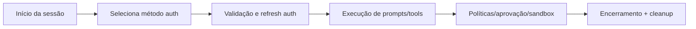
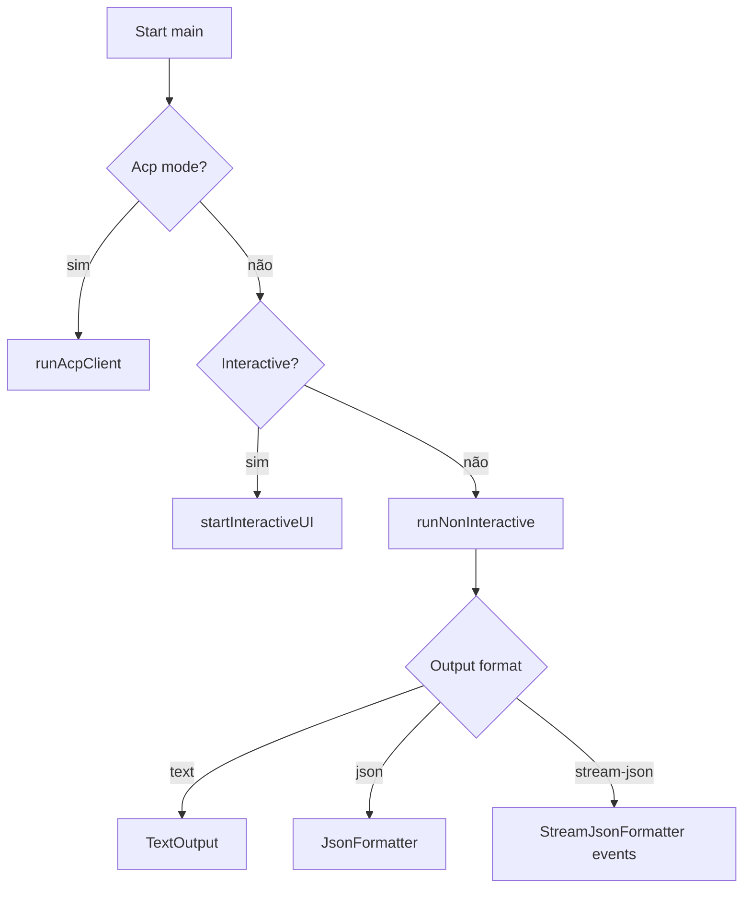
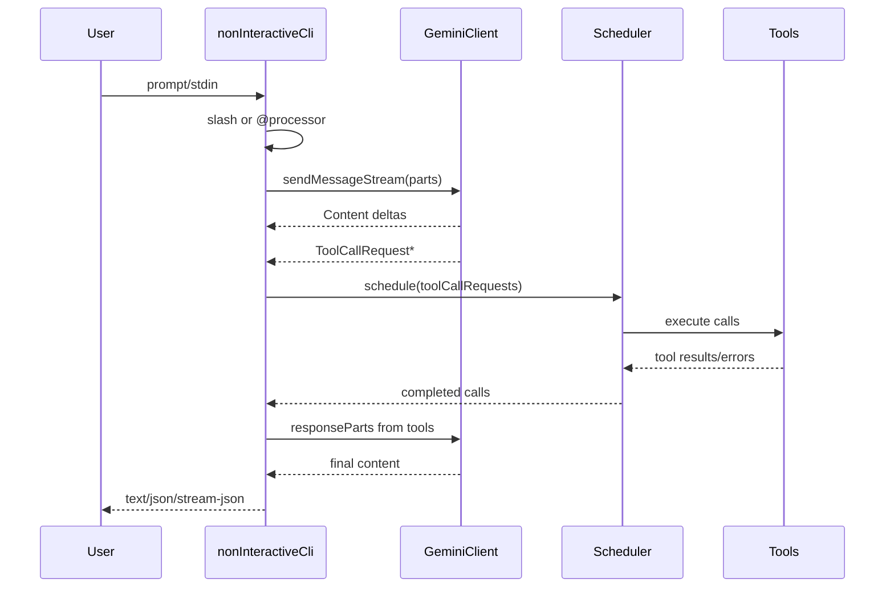

# PRD — Gemini CLI

## Metadados do Documento

| Campo | Valor |
|---|---|
| Documento | `PRD.md` |
| Versão do PRD | `v1.0.1-final` |
| Data base | `2026-04-29` |
| Escopo | Produto + arquitetura + operação + replicação |
| Fonte de verdade | Código e docs do repositório aberto |
| Público-alvo | Engenharia (júnior a sênior), Tech Leads, DevOps |
| Status | Finalizado para distribuição interna |

## Índice (navegação rápida)

### Documento-base (seções obrigatórias)

- [BLOCO DE CONTEXTO](#bloco-de-contexto)
- [1. Visão Geral do Produto](#1-visão-geral-do-produto)
- [2. Arquitetura de Alto Nível e Escolhas Tecnológicas](#2-arquitetura-de-alto-nível-e-escolhas-tecnológicas)
- [3. Árvore de Diretórios e Esqueleto do Projeto](#3-árvore-de-diretórios-e-esqueleto-do-projeto)
- [4. Requisitos Funcionais — Catálogo Completo de Ações](#4-requisitos-funcionais--catálogo-completo-de-ações)
- [5. Requisitos Não Funcionais — Metas de Qualidade](#5-requisitos-não-funcionais--metas-de-qualidade)
- [6. Análise Técnica Profunda e Justificativa de Stack](#6-análise-técnica-profunda-e-justificativa-de-stack)
- [7. Mapeamento Mestre de Rotas, Endpoints, Funções e Componentes Críticos](#7-mapeamento-mestre-de-rotas-endpoints-funções-e-componentes-críticos)
- [8. Pipelines Especiais](#8-pipelines-especiais)
- [9. Integrações Externas](#9-integrações-externas)
- [10. Segurança e Autenticação](#10-segurança-e-autenticação)
- [11. Infraestrutura e DevOps](#11-infraestrutura-e-devops)
- [12. Extensibilidade e Customização](#12-extensibilidade-e-customização)
- [13. Limitações Conhecidas](#13-limitações-conhecidas)
- [14. Roadmap Oficial](#14-roadmap-oficial)
- [15. Guia Mestre de Replicação](#15-guia-mestre-de-replicação)
- [MAPEAMENTO PARA SISTEMA DE ARQUIVAMENTO](#mapeamento-para-sistema-de-arquivamento)

### Camadas estendidas

- [PRD ESTENDIDO — CAMADA OPERACIONAL E REPLICABILIDADE MÁXIMA](#prd-estendido--camada-operacional-e-replicabilidade-máxima)
- [PRD ESTENDIDO — ITERAÇÃO 2 (CATÁLOGO FUNCIONAL EXAUSTIVO)](#prd-estendido--iteração-2-catálogo-funcional-exaustivo)
- [PRD ESTENDIDO — ITERAÇÃO 3 (CONFIGURAÇÃO EXPANDIDA + MANUAL OPERACIONAL)](#prd-estendido--iteração-3-configuração-expandida--manual-operacional)
- [PRD ESTENDIDO — ITERAÇÃO 4 (COMANDOS EXAUSTIVOS + COMPATIBILIDADE + INCIDENTES)](#prd-estendido--iteração-4-comandos-exaustivos--compatibilidade--incidentes)
- [PRD ESTENDIDO — ITERAÇÃO 5 (MANUAL COMPLETO DE ENGENHARIA)](#prd-estendido--iteração-5-manual-completo-de-engenharia)

### Seções-chave para operação rápida

- [Y. Procedimentos de Debug e Diagnóstico](#y-procedimentos-de-debug-e-diagnóstico)
- [AD. Playbooks de Incidentes (resposta operacional)](#ad-playbooks-de-incidentes-resposta-operacional)
- [AH. Runbook de Release (pré-release, release e pós-release)](#ah-runbook-de-release-pré-release-release-e-pós-release)
- [AI. Checklist de Auditoria de Segurança Pré-produção](#ai-checklist-de-auditoria-de-segurança-pré-produção)
- [AO. Definição de Conclusão do PRD (DoD do documento)](#ao-definição-de-conclusão-do-prd-dod-do-documento)
- [AP. Changelog do PRD](#ap-changelog-do-prd)
- [AQ. Próxima camada opcional (ultra-avançada)](#aq-próxima-camada-opcional-ultra-avançada)

## Guia de leitura

- Use as seções **1 a 15** como contrato principal do produto.
- Use as seções **A a AP** como manual operacional para implantação, suporte e evolução.
- Campos marcados com `[NÃO IDENTIFICADO NO CÓDIGO]` são lacunas explícitas e não devem ser inferidos.
- Para treinamento de equipe júnior, priorize as seções `R`, `X`, `AK`, `Y` e `AL`.

## Padrão terminológico adotado

- **Headless:** execução não interativa orientada a script/pipeline.
- **Chamada de ferramenta:** evento em que o modelo solicita execução de uma tool (`tool call`).
- **Loop de ferramentas:** ciclo modelo -> ferramenta -> modelo até condição de parada.
- **Sandbox:** ambiente de isolamento para reduzir risco operacional.
- **Runbook:** procedimento operacional executável para diagnóstico, release e resposta a incidente.
- **Playbook:** roteiro de atuação por cenário (incidente, mudança, governança).
- **Baseline de segurança:** configuração mínima obrigatória para ambientes sensíveis.

## BLOCO DE CONTEXTO

```text
PROJETO: Gemini CLI (@google/gemini-cli)

ESTADO DO CÓDIGO:
- O código está disponível para leitura? Sim, completo
- Se parcial ou novo: o que já existe? N/A
- Fases já implementadas: CLI interativo e não interativo, ferramentas core, MCP, skills, extensões, integração IDE, A2A server experimental
- Tecnologias já definidas ou em uso: Node.js, TypeScript, React/Ink, Vitest, ESLint, Prettier, Docker, Express (A2A), @google/genai, MCP SDK
- Restrições conhecidas (linguagem, infra, prazo, equipe): Node >= 20; desenvolvimento recomendado em ~20.19.0 (CONTRIBUTING.md)
```

---

## 1. Visão Geral do Produto

- **Nome oficial:** `@google/gemini-cli`
- **Versão atual:** `0.42.0-nightly.20260428.g59b2dea0e` (`package.json`)
- **Slogan/frase de impacto:** "the most direct path from your prompt to our model" (`README.md`)
- **Missão (1 frase):** prover um agente Gemini terminal-first para acelerar tarefas de desenvolvimento, automação e manutenção de software.

### Personas

1. **Lucas** — Dev backend — dor: precisa automatizar tarefas técnicas sem alternar entre múltiplas ferramentas.
2. **Marina** — Tech Lead — dor: quer padronizar revisão, diagnóstico e execução assistida por IA em times.
3. **Rafael** — DevOps/SRE — dor: precisa de execução segura (sandbox/policies), rastreabilidade e operação em CLI/headless.

### Diferenciais objetivos

- Execução interativa TUI + headless (`text/json/stream-json`) no mesmo binário.
- Ferramentas integradas (filesystem, shell, web, MCP) com políticas e modos de aprovação.
- Extensibilidade por MCP, extensões, skills e hooks.
- Camadas de segurança configuráveis (trust, sandbox, redaction, controles admin).
- Distribuição simples (`npx`, `npm -g`) com capacidade de sandbox containerizado.

---

## 2. Arquitetura de Alto Nível e Escolhas Tecnológicas

```mermaid
flowchart LR
  U[Usuário] --> CLI[Gemini CLI - packages/cli]
  CLI --> CFG[Config/Settings/Args]
  CFG --> AUTH[Auth Layer]
  AUTH --> CORE[Agent Core - packages/core]
  CORE --> MODEL[Gemini API / Vertex / Code Assist]
  CORE --> TOOLS[Tool Registry + Scheduler]
  TOOLS --> FS[File tools]
  TOOLS --> SH[Shell tools]
  TOOLS --> WEB[Web fetch/search]
  TOOLS --> MCP[MCP servers]
  CORE --> STORE[Session/Checkpoint Storage]
  CLI --> UI[Ink/React TUI or JSON Output]
  CORE --> IDE[IDE Companion]
  CORE --> A2A[A2A Server (experimental)]
```

### Tecnologias principais e justificativas observáveis

- **Node.js + TypeScript:** base unificada de runtime e tipagem no monorepo.
- **React + Ink:** UI terminal declarativa para modo interativo.
- **`@google/genai`:** integração oficial com modelos Gemini.
- **Vitest:** suíte de testes ampla (unit, integration, perf, memory).
- **Docker:** execução isolada opcional via sandbox.
- **Express (A2A):** superfície HTTP para agente experimental.

### Modelo de deploy

- **CLI distribuível:** pacote npm (`@google/gemini-cli`) e execução por `npx`.
- **Execução local a partir do source:** `npm run build` + `npm start`.
- **Sandbox opcional:** container Docker/Podman e perfis de sandbox (incl. Seatbelt no macOS).

### Padrões de design identificados

- **Registry Pattern:** command/tool registries.
- **Layered Architecture:** separação clara entre `cli`, `core`, `sdk`, `a2a-server`.
- **Event-driven:** event bus para execução/stream de ferramentas e eventos de sessão.
- **Factory/Strategy (parcial):** resolução de modos de auth/model e formatadores de saída.

---

## 3. Árvore de Diretórios e Esqueleto do Projeto

```text
gemini-cli-main/
├── package.json
├── package-lock.json
├── README.md
├── ROADMAP.md
├── CONTRIBUTING.md
├── Dockerfile
├── docs/
├── schemas/
├── scripts/
├── integration-tests/
├── memory-tests/
├── perf-tests/
├── packages/
│   ├── cli/
│   ├── core/
│   ├── sdk/
│   ├── a2a-server/
│   ├── devtools/
│   ├── test-utils/
│   └── vscode-ide-companion/
└── ...
```

### Propósito de pastas/arquivos críticos

- `packages/cli`: ponto de entrada do binário, UI terminal, parsing de args, comandos.
- `packages/core`: motor de execução do agente, tools, políticas, auth e integrações.
- `packages/sdk`: API para usar o agente programaticamente.
- `packages/a2a-server`: servidor HTTP experimental para operações A2A.
- `docs`: referência funcional e operacional (comandos, config, segurança, sandbox).
- `scripts`: automações de build/lint/test/release.
- `Dockerfile`: imagem base do sandbox/execução isolada.

### Convenções relevantes

- Monorepo com npm workspaces (`packages/*`).
- Código em TypeScript/ESM (`type: module`).
- Arquivos de teste próximos ao código (`*.test.ts`, `*.test.tsx`).
- Comandos de qualidade centralizados na raiz (`lint`, `typecheck`, `test:ci`, `preflight`).

---

## 4. Requisitos Funcionais — Catálogo Completo de Ações

RF-001: Sessão interativa TUI  
→ Ação do Usuário: iniciar `gemini` no terminal  
→ Fluxo de Código: bootstrap > load settings/config > auth > initialize app > startInteractiveUI  
→ Módulo Crítico: `packages/cli/src/gemini.tsx:263`  
→ Status: Implementado

RF-002: Sessão não interativa por prompt/stdin  
→ Ação do Usuário: `gemini -p "..."` / pipe via stdin  
→ Fluxo de Código: validação de entrada > processamento de `@`/slash > stream do modelo > execução de tools > saída final  
→ Módulo Crítico: `packages/cli/src/nonInteractiveCli.ts:59`  
→ Status: Implementado

RF-003: Formatos de saída `text`, `json`, `stream-json`  
→ Ação do Usuário: passar `--output-format`  
→ Fluxo de Código: seleção de formatter > emissão incremental/final de eventos  
→ Módulo Crítico: `packages/cli/src/nonInteractiveCli.ts:102`  
→ Status: Implementado

RF-004: Gestão de sessões (`--resume`, `--list-sessions`, `--delete-session`)  
→ Ação do Usuário: chamar flags de sessão  
→ Fluxo de Código: resolução de sessão > storage > list/delete  
→ Módulo Crítico: `packages/cli/src/gemini.tsx:193`  
→ Status: Implementado

RF-005: Comandos slash (`/memory`, `/mcp`, `/extensions`, `/settings`, etc.)  
→ Ação do Usuário: digitar comando `/...`  
→ Fluxo de Código: parser de comando > dispatch de handler > operação específica  
→ Módulo Crítico: `docs/reference/commands.md` + `packages/cli/src/commands/*:[NÃO IDENTIFICADO NO CÓDIGO]`  
→ Status: Implementado

RF-006: Inclusão de contexto por `@arquivo`/`@diretório`  
→ Ação do Usuário: referenciar `@path` no prompt  
→ Fluxo de Código: atCommandProcessor > leitura de arquivos > injeção no prompt  
→ Módulo Crítico: `packages/cli/src/nonInteractiveCli.ts:265`  
→ Status: Implementado

RF-007: Shell passthrough (`!comando`) e shell mode  
→ Ação do Usuário: usar prefixo `!`  
→ Fluxo de Código: encaminhamento para execução shell com políticas/config  
→ Módulo Crítico: `docs/reference/commands.md` + `packages/core/src/tools/shell.ts:[NÃO IDENTIFICADO NO CÓDIGO]`  
→ Status: Implementado

RF-008: Execução de ferramentas com ciclo agent-tool-agent  
→ Ação do Usuário: solicitar tarefa que exige tool calls  
→ Fluxo de Código: Gemini stream > coleta `ToolCallRequest` > `Scheduler.schedule` > `ToolResult` > novo turno  
→ Módulo Crítico: `packages/cli/src/nonInteractiveCli.ts:306`  
→ Status: Implementado

RF-009: Sandboxing de execução  
→ Ação do Usuário: habilitar sandbox por flag/env/config  
→ Fluxo de Código: loadSandboxConfig > relaunch no sandbox > execução isolada  
→ Módulo Crítico: `packages/cli/src/gemini.tsx:477`  
→ Status: Implementado

RF-010: Integração MCP servers  
→ Ação do Usuário: configurar `mcpServers` e usar `/mcp ...`  
→ Fluxo de Código: descoberta/conexão MCP > registro de tools com prefixo  
→ Módulo Crítico: `docs/reference/configuration.md` (`mcpServers`)  
→ Status: Implementado

RF-011: Extensões e skills  
→ Ação do Usuário: `/extensions ...` e `/skills ...`  
→ Fluxo de Código: carregamento de artefatos > habilitar/desabilitar > reload  
→ Módulo Crítico: `docs/reference/commands.md`  
→ Status: Implementado

RF-012: A2A server HTTP experimental  
→ Ação do Usuário: iniciar `@google/gemini-cli-a2a-server`  
→ Fluxo de Código: createApp > setup routes > create/execute/list tasks/commands  
→ Módulo Crítico: `packages/a2a-server/src/http/app.ts:195`  
→ Status: Implementado (experimental)

---

## 5. Requisitos Não Funcionais — Metas de Qualidade

| Categoria | Requisito | Métrica | Target | Status |
|---|---|---|---|---|
| Performance | Busca de código eficiente | Uso de `ripgrep` em tools | `tools.useRipgrep=true` | Implementado |
| Performance | Estabilidade de memória do processo | Auto ajuste de heap | `advanced.autoConfigureMemory=true` | Implementado |
| Segurança | Controle de execução de ferramentas | Modos `default/auto_edit/yolo/plan` | Aprovação conforme política | Implementado |
| Segurança | Redação de segredos em env vars | Regras por nome/valor + listas allow/block | Evitar vazamento em tool output | Implementado |
| Escalabilidade | Extensibilidade de capacidades | MCP + extensões + skills | Adição sem alterar core | Implementado |
| Compatibilidade | Runtime mínimo | Node.js | `>=20` | Implementado |
| Compatibilidade | Plataformas | Windows/macOS/Linux | suporte documentado | Implementado |
| Usabilidade | Acessibilidade terminal | screen-reader mode | `ui.accessibility.screenReader` | Implementado |
| Usabilidade | Saída para automação | JSON/stream-json | Integração com scripts | Implementado |
| Disponibilidade | Retenção e recuperação de sessão | sessão automática + resume/delete | recuperação por projeto | Implementado |

---

## 6. Análise Técnica Profunda e Justificativa de Stack

### Node.js + TypeScript
- **O que é?** Runtime JS server-side com tipagem estática via TypeScript.
- **Por que foi escolhida?** [NÃO IDENTIFICADO NO CÓDIGO]; inferência técnica: ecossistema CLI e DX forte.
- **Como funciona neste projeto?** Monorepo ESM com compilação para `dist` por pacote.
- **Riscos conhecidos?** consumo de memória em processos longos.
- **Mitigação aplicada?** ajuste automático de memória (`getNodeMemoryArgs`).

### React + Ink
- **O que é?** Renderização declarativa de UI no terminal.
- **Por que foi escolhida?** [NÃO IDENTIFICADO NO CÓDIGO]; inferência técnica: complexidade de TUI com componentes.
- **Como funciona neste projeto?** UI interativa carregada sob demanda (`import('./interactiveCli.js')`).
- **Riscos conhecidos?** inconsistências de TTY/input raw mode.
- **Mitigação aplicada?** controle de raw mode, resume de stdin, flags de compatibilidade.

### `@google/genai`
- **O que é?** SDK de integração com modelos Gemini.
- **Por que foi escolhida?** integração nativa com auth/modelos do ecossistema Google.
- **Como funciona neste projeto?** streaming de eventos de conteúdo/tool call e controle de turnos.
- **Riscos conhecidos?** quota/latência/erro remoto.
- **Mitigação aplicada?** validação de auth, retry/config de tentativas, fallback de modelos por cadeias.

### Docker Sandbox
- **O que é?** isolamento de execução por container.
- **Por que foi escolhida?** proteção do host ao executar operações potencialmente perigosas.
- **Como funciona neste projeto?** build de imagem com Node 20 slim e ferramentas essenciais; execução condicional via `GEMINI_SANDBOX`.
- **Riscos conhecidos?** overhead e dependência de runtime de container.
- **Mitigação aplicada?** uso opcional e build separado (`build` vs `build:all`).

### Express no A2A Server
- **O que é?** framework HTTP minimalista.
- **Por que foi escolhida?** simplicidade para expor endpoints A2A.
- **Como funciona neste projeto?** `createApp` cria rotas para tasks/commands/metadados.
- **Riscos conhecidos?** superfície adicional de segurança.
- **Mitigação aplicada?** validação de request, códigos de erro explícitos, auth builder custom.

### CI/CD, build e testes
- **Build tool:** scripts Node + TypeScript + esbuild (conforme scripts de raiz).
- **CI/CD:** workflows GitHub referenciados no `README` [detalhe interno: `[NÃO IDENTIFICADO NO CÓDIGO]`].
- **Testes:** Vitest em múltiplas suítes (unit, integration, perf, memory).

---

## 7. Mapeamento Mestre de Rotas, Endpoints, Funções e Componentes Críticos

| Campo | Detalhe |
|---|---|
| Identificador | `POST /tasks` |
| Quem usa? | clientes A2A |
| Para quê? | criar tarefa de execução no executor |
| Quando roda? | ao solicitar criação de task |
| Lógica de negócio | gera `taskId/contextId` → cria task no executor → persiste no store |
| Comportamento em falha | `500` com mensagem |
| Referência no código | `packages/a2a-server/src/http/app.ts:250` |
| Schema de Request | `{ "agentSettings"?: object, "contextId"?: string }` |
| Schema de Response | `201: <taskId-string>`, `500: { "error": string }` |

| Campo | Detalhe |
|---|---|
| Identificador | `POST /executeCommand` |
| Quem usa? | clientes A2A/automação |
| Para quê? | executar comando registrado |
| Quando roda? | ao chamar comando remoto |
| Lógica de negócio | valida `command/args` → busca registry → executa (stream ou JSON) |
| Comportamento em falha | `400`, `404`, `500` |
| Referência no código | `packages/a2a-server/src/http/app.ts:123` |
| Schema de Request | `{ "command": string, "args"?: unknown[] }` |
| Schema de Response | `200: object`, `stream: text/event-stream`, `4xx/5xx: { "error": string }` |

| Campo | Detalhe |
|---|---|
| Identificador | `GET /listCommands` |
| Quem usa? | clientes A2A |
| Para quê? | listar comandos top-level/subcomandos |
| Quando roda? | descoberta de capacidades |
| Lógica de negócio | varre registry → transforma estrutura → retorna lista |
| Comportamento em falha | `500` |
| Referência no código | `packages/a2a-server/src/http/app.ts:280` |
| Schema de Request | sem body |
| Schema de Response | `200: { "commands": CommandResponse[] }` |

| Campo | Detalhe |
|---|---|
| Identificador | `main()` CLI |
| Quem usa? | binário `gemini` |
| Para quê? | orquestrar boot completo da sessão |
| Quando roda? | inicialização do processo CLI |
| Lógica de negócio | init settings/args/session/auth/sandbox/config/UI ou headless |
| Comportamento em falha | saída por `ExitCodes` e mensagens de erro |
| Referência no código | `packages/cli/src/gemini.tsx:263` |
| Schema de Request | N/A |
| Schema de Response | N/A |

---

## 8. Pipelines Especiais

### Pipeline de tool-calling (agent loop)
1. usuário envia prompt;
2. modelo emite conteúdo e/ou tool calls;
3. scheduler executa tools;
4. resultados retornam ao modelo;
5. loop termina sem tool calls ou por condição de stop.

Fallbacks:
- erros de tool: sinalização com `ToolErrorType` e tratamento no fluxo;
- cancelamento: `AbortController` + tratamento dedicado.

### Pipeline de sessão/checkpoint
1. resolução de sessão (nova ou resume);
2. carga de storage e contexto;
3. execução;
4. persistência e limpeza (`sessionRetention`, cleanup jobs).

### Pipeline de sandbox
1. avaliação de config/flags/env;
2. possível relaunch no sandbox;
3. execução no ambiente isolado;
4. limpeza e saída.

### Pipeline CI/testes
- `npm run preflight` encadeia format/build/lint/typecheck/tests.
- detalhes de workflow por job específico: `[NÃO IDENTIFICADO NO CÓDIGO]`.

---

## 9. Integrações Externas

### Gemini API / Vertex AI / Code Assist
- **Por que:** núcleo do produto (geração e raciocínio).
- **Variáveis críticas:** `GEMINI_API_KEY`, `GOOGLE_API_KEY`, `GOOGLE_CLOUD_PROJECT`, `GOOGLE_APPLICATION_CREDENTIALS`, `GOOGLE_CLOUD_LOCATION`.
- **Configuração:** definir auth no ambiente e/ou `/auth` + settings.
- **Extensão:** troca de modelo por `model.name` e `modelConfigs`.

### MCP Servers
- **Por que:** expandir ferramentas sem alterar core.
- **Configuração:** bloco `mcpServers` em settings com `command/url/httpUrl`, `args`, `env`, `headers`.
- **Extensão:** adicionar novo alias de servidor e controle por include/exclude tools.
- **Mocks/stubs:** `[NÃO IDENTIFICADO NO CÓDIGO]`.

### GCS (A2A opcional)
- **Por que:** persistir tasks fora de memória.
- **Variável:** `GCS_BUCKET_NAME`.
- **Fallback:** sem bucket, usa `InMemoryTaskStore`.

---

## 10. Segurança e Autenticação



### Mecanismos observados

- Seleção de auth por `security.auth.selectedType`.
- Fluxos: Google login, API key e Vertex AI (documentados e suportados por config).
- Uso de políticas/approval modes para limitar execução.
- Redação de variáveis sensíveis em contexto de tool execution.

### Proteções ativas

- **Tool confirmations** por padrão.
- **Plan mode** e controles admin (`secureModeEnabled`, disable yolo/always allow).
- **Sandboxing** por processo/ferramenta.
- **Folder trust** e políticas.

Proteções específicas de API web (CSRF/XSS/SQLi):
- no escopo principal CLI: não aplicável diretamente.
- no A2A server: proteções detalhadas contra CSRF/XSS/SQLi `[NÃO IDENTIFICADO NO CÓDIGO]`.

---

## 11. Infraestrutura e DevOps

### Dockerfile (conteúdo crítico)

> **Nota:** Verifique a versão do `Dockerfile` no repositório antes de usar, pois este bloco pode ficar desatualizado em relação à base de código real.

```dockerfile
FROM docker.io/library/node:20-slim
ARG SANDBOX_NAME="gemini-cli-sandbox"
ARG CLI_VERSION_ARG
ENV SANDBOX="$SANDBOX_NAME"
ENV CLI_VERSION=$CLI_VERSION_ARG
RUN apt-get update && apt-get install -y --no-install-recommends python3 make g++ man-db curl dnsutils less jq bc gh git unzip rsync ripgrep procps psmisc lsof socat ca-certificates && apt-get clean && rm -rf /var/lib/apt/lists/*
RUN mkdir -p /usr/local/share/npm-global && chown -R node:node /usr/local/share/npm-global
ENV NPM_CONFIG_PREFIX=/usr/local/share/npm-global
ENV PATH=$PATH:/usr/local/share/npm-global/bin
USER node
COPY --chown=node:node packages/cli/dist/google-gemini-cli-*.tgz /tmp/gemini-cli.tgz
COPY --chown=node:node packages/core/dist/google-gemini-cli-core-*.tgz /tmp/gemini-core.tgz
RUN npm install -g /tmp/gemini-core.tgz && npm install -g /tmp/gemini-cli.tgz && gemini --version > /dev/null
CMD ["gemini"]
```

### Variáveis de ambiente (amostra crítica)

| Variável | Obrigatório | Padrão | Propósito |
|---|---|---|---|
| `GEMINI_API_KEY` | depende do método auth | vazio | autenticação Gemini API |
| `GOOGLE_API_KEY` | em Vertex express | vazio | auth Vertex |
| `GOOGLE_CLOUD_PROJECT` | em Code Assist/Vertex | vazio | escopo de projeto |
| `GOOGLE_APPLICATION_CREDENTIALS` | cenários ADC | vazio | credenciais GCP |
| `GEMINI_SANDBOX` | opcional | desabilitado | estratégia de sandbox |
| `GCS_BUCKET_NAME` | opcional (A2A) | vazio | persistência de tasks |

### Comandos operacionais

- Build: `npm run build`
- Build + sandbox + vscode: `npm run build:all`
- Run dev/prod: `npm start` / `npm run start:prod`
- Teste completo CI local: `npm run preflight`
- Integração: `npm run test:integration:all`

Migrações/seeders/health checks dedicados:
- `[NÃO IDENTIFICADO NO CÓDIGO]` (não há banco relacional padrão do produto principal).

---

## 12. Extensibilidade e Customização

### Pontos de extensão

- `mcpServers` (ferramentas externas por protocolo MCP)
- extensões (`/extensions`)
- skills (`/skills`)
- hooks (`hooks.*` e `hooksConfig.*`)
- políticas (`policyPaths`, `adminPolicyPaths`)
- contexto hierárquico (`GEMINI.md`)

### Tutorial (5 passos) — criar extensão de capacidade

1. Definir objetivo da capacidade (ex.: integrar serviço interno).
2. Implementar servidor MCP ou extensão conforme contrato.
3. Registrar configuração em `settings.json` (`mcpServers`/extensão).
4. Recarregar no runtime (`/mcp reload` ou `/extensions reload/restart`).
5. Validar descoberta e execução com `/tools` e chamada prática.

Exemplos reais:
- `packages/cli/src/commands/extensions/*`
- `packages/core/src/tools/mcp-client*.ts`
- `docs/extensions/writing-extensions.md`

---

## 13. Limitações Conhecidas

| Item | Severidade | Evidência | Workaround |
|---|---|---|---|
| A2A server explicitamente experimental | Médio | `packages/a2a-server/README.md` | usar com escopo controlado |
| Recursos sob flags experimentais (voice, worktrees, etc.) | Médio | `docs/reference/configuration.md` | habilitar apenas quando necessário |
| Métricas SLO/SLA oficiais de latência/throughput | Baixo | [NÃO IDENTIFICADO NO CÓDIGO] | definir observabilidade própria |
| Vulnerabilidades/CVEs específicas de dependências | [NÃO IDENTIFICADO NO CÓDIGO] | varredura não executada aqui | rodar `npm audit` |

Race conditions/memory leaks confirmados:
- `[NÃO IDENTIFICADO NO CÓDIGO]` (sem evidência direta de bug confirmado nos arquivos analisados).

---

## 14. Roadmap Oficial

O roadmap real do Gemini CLI é gerenciado diretamente nas Issues do GitHub e foca nos seguintes princípios e áreas-chave:

**Princípios Guias:**
- **Poder & Simplicidade:** Acesso a modelos state-of-the-art com CLI leve e intuitiva.
- **Extensibilidade:** Agente adaptável e extensível via ecossistema (MCP, etc.).
- **Inteligência:** Competitividade nos principais benchmarks (SWE Bench, Terminal Bench, CSAT).
- **Gratuito e Open Source:** Comunidade aberta e ágil na integração de PRs.

**Áreas de Foco Atuais (`labels`):**
- `area/authentication`: Acesso seguro, API keys, Code Assist login.
- `area/model`: Novos modelos Gemini, multimodalidade, execução local e performance.
- `area/ux`: Usabilidade da CLI, features interativas e documentação.
- `area/tooling`: Ferramentas nativas e ecossistema MCP.
- `area/core`: Funcionalidades centrais da CLI.
- `area/extensibility`: Levar o Gemini CLI a outras superfícies (ex: GitHub).
- `area/contribution`: Melhorias no fluxo de CI/CD e testes para contribuição.
- `area/platform`: Instalação, suporte a OS e framework base.
- `area/quality`: Testes, confiabilidade e performance.
- `area/background-agents`: Tarefas autônomas longas e assistência proativa.
- `area/security`: Privacidade e segurança.

> **Nota:** Detalhes de milestones, issues e táticas de curto prazo podem ser acompanhados na [Issue de Roadmap do repositório](https://github.com/google-gemini/gemini-cli/issues/4191) ou [Project Board](https://github.com/orgs/google-gemini/projects/11/views/19).

---

## 15. Guia Mestre de Replicação

1. **Pré-requisitos**
   - Node.js `>=20` (recomendado para dev: `~20.19.0`)
   - Git
   - (Opcional) Docker/Podman para sandbox

2. **Clone do repositório**
   ```bash
   git clone https://github.com/org/projeto.git
   cd projeto
   ```

3. **Inicialização de infraestrutura**
   - Produto principal não exige banco/cache obrigatórios.
   - Para A2A persistente opcional, provisionar bucket GCS e definir `GCS_BUCKET_NAME`.

4. **Instalação de dependências**
   ```bash
   npm install
   ```

5. **Configuração do `.env`**
   Exemplo mínimo:
   ```env
   GEMINI_API_KEY=seu_token
   # opcional
   GOOGLE_CLOUD_PROJECT=seu_projeto
   GEMINI_SANDBOX=docker
   ```

6. **Build**
   ```bash
   npm run build
   ```

7. **Execução**
   - Interativo:
     ```bash
     npm start
     ```
   - Não interativo:
     ```bash
     npm start -- --prompt "Explique a arquitetura" --output-format json
     ```
   - A2A server:
     ```bash
     npm run start:a2a-server
     ```

8. **Testes**
   ```bash
   npm run test
   npm run test:integration:sandbox:none
   npm run preflight
   ```
   Validação manual mínima:
   - iniciar CLI;
   - enviar prompt simples;
   - validar execução de pelo menos uma tool;
   - validar `/resume` e `/settings`.

9. **Acesso**
   - CLI: terminal local
   - A2A server: `http://localhost:41242` (quando iniciado com script padrão)

10. **Verificação pós-deploy**
    - Smoke test: `gemini --version` e prompt simples em modo não interativo.
    - Critério de sucesso: resposta válida do modelo + ausência de erro fatal no boot.

---

## MAPEAMENTO PARA SISTEMA DE ARQUIVAMENTO

| Seção do PRD | Destino |
|---|---|
| Seções 1–2 (Visão e Arquitetura) | `CURRENT_STATE.md` — estado inicial do projeto |
| Seção 6 (Justificativa de Stack) | `DECISION_LOG.md` — decisões da Fase 0 |
| Seção 14 (Roadmap) | `BACKLOG_FUTURO.md` — ondas e critérios de aceite |
| Seção 3 (Árvore de Diretórios) | `CURRENT_STATE.md` — módulos e contratos vigentes |
| Seção 4 (RFs) | `BACKLOG_FUTURO.md` — funcionalidades por fase |

Instrução para arquivamento: usar este PRD como estado inicial consolidado, substituindo blueprint histórico anterior.

---

# PRD ESTENDIDO — CAMADA OPERACIONAL E REPLICABILIDADE MÁXIMA

> Esta camada estendida complementa as 15 seções obrigatórias acima com profundidade de execução, contratos operacionais, critérios de aceite e procedimentos de troubleshooting para reduzir margem de interpretação.

## A. Delimitação de Escopo e Premissas

### A.1 Escopo coberto por evidência direta no código/documentação

- Boot e execução principal do CLI (`packages/cli/src/gemini.tsx`).
- Loop não interativo com ciclo modelo-ferramenta-modelo (`packages/cli/src/nonInteractiveCli.ts`).
- Superfície HTTP do A2A server (`packages/a2a-server/src/http/app.ts`).
- Contratos de configuração e variáveis (`docs/reference/configuration.md`).
- Catálogo de comandos (`docs/reference/commands.md`).
- Fluxo de build/teste/contribuição (`package.json`, `CONTRIBUTING.md`).
- Estratégia de distribuição e sandbox (`README.md`, `Dockerfile`).

### A.2 Fora de escopo (não confirmado no material analisado)

- Especificação completa de todos workflows YAML de CI em `.github/workflows/*`: `[NÃO IDENTIFICADO NO CÓDIGO]` neste ciclo de leitura.
- Política de versionamento semântico formal do time além do canal nightly/preview/stable: `[NÃO IDENTIFICADO NO CÓDIGO]`.
- SLA/SLO de produção oficial: `[NÃO IDENTIFICADO NO CÓDIGO]`.

### A.3 Risco de interpretação residual

- Onde houver `[NÃO IDENTIFICADO NO CÓDIGO]`, não inferir comportamento de execução.
- Para operação enterprise, validar internamente decisões de telemetria, retention e política.

---

## B. Arquitetura Executável (Blueprint de Runtime)

### B.1 Caminho crítico de inicialização do CLI

1. `main()` inicia profiler, handlers de sinal e unhandled rejection.
2. Carrega settings e trusted folders.
3. Resolve sessão (nova, por ID, ou `--resume`).
4. Valida combinações de flags e constrói `partialConfig`.
5. Executa refresh auth conforme modo e settings.
6. Opcional: prepara/entra em sandbox (relaunch).
7. Carrega `config` completo, storage, policy updater e cleanup hooks.
8. Decide modo:
   - interativo: inicializa terminal/theme/app e renderiza UI;
   - não interativo: processa stdin/prompt e executa loop headless.

### B.2 Diagrama de decisão de modo de execução



### B.3 Fluxo completo do loop não interativo



---

## C. Árvore de Diretórios Expandida (por domínio)

```text
packages/
├── cli/
│   ├── src/
│   │   ├── gemini.tsx                    # bootstrap principal
│   │   ├── nonInteractiveCli.ts          # loop headless
│   │   ├── interactiveCli.tsx            # UI interativa
│   │   ├── commands/                     # slash commands
│   │   ├── config/                       # args/settings/trust/auth
│   │   ├── utils/                        # startup, cleanup, relaunch, sessions
│   │   ├── ui/                           # componentes Ink/React
│   │   └── acp/                          # modo ACP
├── core/
│   ├── src/
│   │   ├── tools/                        # ferramentas nativas
│   │   ├── agent/                        # sessão e tradução de eventos
│   │   ├── agents/                       # subagentes, browser agent
│   │   ├── availability/                 # políticas de disponibilidade/modelo
│   │   ├── code_assist/                  # integração de autenticação/telemetria
│   │   └── ide/                          # integração IDE e utilitários
├── sdk/
│   └── src/                              # API de consumo programático
├── a2a-server/
│   └── src/
│       ├── http/app.ts                   # app express e endpoints
│       ├── agent/                        # executor e tarefas
│       ├── commands/                     # command registry para A2A
│       ├── config/                       # settings e extension loading
│       └── persistence/                  # GCS e fallback
```

### C.1 Dependências funcionais entre módulos

- `cli` depende de `core` para execução real das capacidades.
- `sdk` depende de `core` para expor API estável de integração.
- `a2a-server` depende de `core` e de `@a2a-js/sdk`.
- Testes se distribuem por pacote e por suítes dedicadas na raiz.

### C.2 Convenções de contrato interno

- IDs de sessão e task são strings UUID/hash.
- Códigos de saída são centralizados em `ExitCodes` (CLI).
- Eventos de stream-json seguem tipagem `JsonStreamEventType`.
- Falhas de ferramenta retornam tipo e mensagem estruturados (`ToolErrorType`).

---

## D. Catálogo RF Detalhado (nível de execução)

### D.1 RFs de inicialização e sessão

RF-013: Carregamento hierárquico de configuração  
→ Ação do Usuário: iniciar CLI em qualquer diretório  
→ Fluxo de Código: defaults > system defaults > user > project > env > args  
→ Módulo Crítico: `docs/reference/configuration.md`  
→ Status: Implementado

RF-014: Detecção de conflito de flags de entrada  
→ Ação do Usuário: usar combinações inválidas (ex.: `--prompt-interactive` com stdin pipado)  
→ Fluxo de Código: validação inicial e `ExitCodes.FATAL_INPUT_ERROR`  
→ Módulo Crítico: `packages/cli/src/gemini.tsx`  
→ Status: Implementado

RF-015: Sessão com ID customizado  
→ Ação do Usuário: `--session-id`  
→ Fluxo de Código: valida existência prévia e bloqueia colisão  
→ Módulo Crítico: `packages/cli/src/gemini.tsx`  
→ Status: Implementado

### D.2 RFs de execução e saída

RF-016: Interrupção de execução por Ctrl+C em headless  
→ Ação do Usuário: Ctrl+C durante stream  
→ Fluxo de Código: keypress listener → abortController → handler de cancelamento  
→ Módulo Crítico: `packages/cli/src/nonInteractiveCli.ts`  
→ Status: Implementado

RF-017: Tratamento de pipe fechado (EPIPE)  
→ Ação do Usuário: pipe para processo consumidor que encerra antes  
→ Fluxo de Código: listener em `process.stdout.on('error')` → saída graciosa  
→ Módulo Crítico: `packages/cli/src/nonInteractiveCli.ts`  
→ Status: Implementado

RF-018: Loop multi-turn com limite de turnos  
→ Ação do Usuário: execução longa com ferramentas  
→ Fluxo de Código: incrementa `turnCount` e aplica `getMaxSessionTurns()`  
→ Módulo Crítico: `packages/cli/src/nonInteractiveCli.ts`  
→ Status: Implementado

### D.3 RFs A2A server (HTTP)

RF-019: Metadata de tasks em batch  
→ Ação do Usuário: `GET /tasks/metadata`  
→ Fluxo de Código: valida store em memória → recupera wrappers → `getMetadata()`  
→ Módulo Crítico: `packages/a2a-server/src/http/app.ts`  
→ Status: Implementado

RF-020: Metadata de task unitária com reconstrução  
→ Ação do Usuário: `GET /tasks/:taskId/metadata`  
→ Fluxo de Código: busca em memória → fallback load store → reconstruct wrapper  
→ Módulo Crítico: `packages/a2a-server/src/http/app.ts`  
→ Status: Implementado

RF-021: Streaming command execution via SSE  
→ Ação do Usuário: executar comando streaming em `/executeCommand`  
→ Fluxo de Código: `DefaultExecutionEventBus` → `text/event-stream` com eventos JSON-RPC  
→ Módulo Crítico: `packages/a2a-server/src/http/app.ts`  
→ Status: Implementado

---

## E. RNF Expandido com Critérios Objetivos

| Categoria | Requisito | Métrica observável | Target operacional | Status |
|---|---|---|---|---|
| Robustez | Encerrar sem perda de logs em shutdown | listeners + drain backlog + cleanup | sem perda de saída em encerramento normal | Implementado |
| Robustez | Evitar crash por unhandled rejection comum de cancelamento | supressão de AbortError esperado | sem debug console indevido em cancelamento normal | Implementado |
| Segurança | Redução de risco ANSI injection | warning explícito em `--raw-output` sem aceite de risco | warning obrigatório em modo texto | Implementado |
| Segurança | Limitação de ferramentas por policy/admin | allow/deny + approval modes | bloqueio de execução fora da política | Implementado |
| Operabilidade | Execução em modo scriptável | formatos json/stream-json | integração CI/scripts sem parsing frágil | Implementado |
| Evolutividade | Adição de capacidades sem editar core | MCP + extensões + skills + hooks | extensão plugável | Implementado |
| Portabilidade | Ambiente padronizado de sandbox | Dockerfile base e imagem de sandbox | execução isolada repetível | Implementado |
| Qualidade | cobertura por múltiplas suítes | unit + integration + perf + memory | validação multi-eixo antes de merge | Implementado |

---

## F. Contratos de Endpoint (Especificação API A2A local)

### F.1 `POST /tasks`

**Request (exemplo):**

```json
{
  "contextId": "b0b8e3b0-7eb2-4f4d-8ab6-7ac0f32f5895",
  "agentSettings": {
    "model": "gemini-3-flash-preview"
  }
}
```

**Response 201 (exemplo):**

```json
"fcbf44f7-7f89-4ef4-8f0d-ff62cf67a5f8"
```

**Erros:**
- `500` `{ "error": "..." }`.

### F.2 `POST /executeCommand`

**Request (exemplo):**

```json
{
  "command": "memory.list",
  "args": []
}
```

**Response 200 (não streaming):**

```json
{
  "ok": true
}
```

**Streaming (`text/event-stream`)**
- cada linha `data: {jsonrpc: "2.0", id: "...", result: {...}}`

**Erros:**
- `400` comando inválido/args inválidos/workspace obrigatório ausente.
- `404` comando não encontrado.
- `500` erro interno de execução.

### F.3 `GET /listCommands`

**Response 200 (exemplo):**

```json
{
  "commands": [
    {
      "name": "memory",
      "description": "Manage memory",
      "arguments": [],
      "subCommands": []
    }
  ]
}
```

### F.4 `GET /tasks/metadata`

**Response 200:** array de metadata.  
**Response 204:** sem tasks.  
**Response 501:** store não é `InMemoryTaskStore`.  
**Response 500:** erro interno.

### F.5 `GET /tasks/:taskId/metadata`

**Response 200 (exemplo):**

```json
{
  "metadata": {
    "taskId": "..."
  }
}
```

**Response 404:** `{ "error": "Task not found" }`

---

## G. Segurança em Profundidade (Operacional)

### G.1 Matriz de controle por camada

| Camada | Controle | Fonte |
|---|---|---|
| Entrada | validação de combinações de argumentos | `gemini.tsx` |
| Execução de tools | approval mode + policy engine | CLI/Core + docs config |
| Ambiente | sandbox processo/ferramenta | docs config + Dockerfile |
| Segredos | redaction de env vars | docs config |
| Governança | admin settings, secure mode | docs config |

### G.2 Ameaças e mitigação observada

- **Execução indevida de comando:** mitigada por confirmação/política/sandbox.
- **Exposição de secret em tool output:** mitigada por redaction configurável.
- **Injeção visual (ANSI):** warning explícito ao usar raw output sem aceite.
- **Ações irreversíveis em massa:** mitigadas por aprovação default e políticas.

### G.3 Lacunas não confirmadas

- Rate limiting de endpoints A2A: `[NÃO IDENTIFICADO NO CÓDIGO]`.
- CORS policy explícita no A2A app: `[NÃO IDENTIFICADO NO CÓDIGO]`.
- CSRF strategy formal para A2A: `[NÃO IDENTIFICADO NO CÓDIGO]`.

---

## H. Playbook DevOps (Runbook de ponta a ponta)

### H.1 Bootstrap local padronizado

```bash
npm install
npm run build
npm start
```

### H.2 Bootstrap completo com sandbox e companion

```bash
npm run build:all
npm start
```

### H.3 Pipeline de qualidade mínimo para merge

```bash
npm run lint
npm run typecheck
npm run test
npm run test:integration:sandbox:none
```

### H.4 Pipeline de qualidade recomendado (gate único)

```bash
npm run preflight
```

### H.5 Rollback operacional (local)

1. Encerrar processo ativo.
2. Restaurar branch/commit estável.
3. Reinstalar dependências (`npm ci`) se necessário.
4. Rebuild (`npm run build`).
5. Executar smoke test.

Rollback de versão publicada npm/registry:
- `[NÃO IDENTIFICADO NO CÓDIGO]` (processo externo de release).

---

## I. Guia de Replicação Sem Código-Fonte (procedimento narrativo)

> Objetivo: permitir reimplementação funcional equivalente, não cópia literal.

### I.1 Funcionalidades mínimas para paridade

1. CLI com modo interativo e headless.
2. Parser de comandos slash/at/bang.
3. Loop de execução agente-ferramenta com stream.
4. Catálogo de ferramentas com scheduler.
5. Sessão persistente com resume/list/delete.
6. Camada de segurança (aprovação + sandbox + trust).
7. Extensibilidade (MCP, extensões, skills, hooks).
8. Endpoint server opcional para tarefas remotas (A2A-like).

### I.2 Blueprint de implementação por fase

**Fase 0 — Fundação**
- Node + TS + estrutura monorepo.
- pacote `cli` e pacote `core`.
- contratos de tipo para eventos de execução.

**Fase 1 — Execução básica**
- implementar `main` e parse de args.
- integrar SDK de LLM com stream de tokens.
- renderização mínima de saída texto.

**Fase 2 — Ferramentas**
- criar tool registry.
- implementar ferramentas FS/shell/web.
- acoplar scheduler e retorno de tool response parts.

**Fase 3 — Sessão e políticas**
- storage por projeto.
- controle de aprovação por ferramenta.
- modo read-only (plan) e modo auto.

**Fase 4 — Hardening operacional**
- sandbox opcional.
- redaction de env vars.
- telemetria e logs estruturados.

**Fase 5 — Extensibilidade**
- MCP client manager.
- extensão local e hooks de lifecycle.
- catálogo de skills habilitáveis.

### I.3 Critérios de aceite por fase

- **Fase 1:** prompt simples retorna saída estável.
- **Fase 2:** ao menos 1 tool call executada end-to-end.
- **Fase 3:** sessão retomável e aprovação funcionando.
- **Fase 4:** sandbox acionável e redaction validada.
- **Fase 5:** nova capability adicionada sem alterar core.

---

## J. Inventário Operacional de Comandos (alto impacto)

### J.1 Comandos de runtime

- `npm start`: executa CLI da build local.
- `npm run start:prod`: força `NODE_ENV=production`.
- `npm run start:a2a-server`: sobe servidor A2A.

### J.2 Comandos de build

- `npm run build`: build principal.
- `npm run build:all`: build + sandbox + companion.
- `npm run build:sandbox`: imagem de sandbox.
- `npm run build:vscode`: companion de IDE.

### J.3 Comandos de qualidade

- `npm run lint`
- `npm run typecheck`
- `npm run test`
- `npm run test:ci`
- `npm run test:integration:all`
- `npm run test:perf`
- `npm run test:memory`
- `npm run preflight`

### J.4 Comandos de manutenção

- `npm run clean`
- `npm run format`
- `npm run telemetry`

---

## K. Checklist de Homologação (recomendado)

### K.1 Smoke funcional

- [ ] CLI inicia sem erro fatal.
- [ ] `gemini --version` retorna versão.
- [ ] Prompt simples responde.
- [ ] Prompt com `@arquivo` injeta contexto.
- [ ] Prompt que aciona tool executa com retorno.
- [ ] `/resume` lista sessões.

### K.2 Smoke de segurança

- [ ] modo de aprovação default solicita confirmação.
- [ ] com sandbox ativo, execução ocorre no ambiente isolado.
- [ ] redaction de env vars sensíveis está habilitada quando configurada.

### K.3 Smoke de integração A2A

- [ ] servidor sobe na porta configurada.
- [ ] `GET /listCommands` retorna payload válido.
- [ ] `POST /tasks` cria task.
- [ ] `GET /tasks/:taskId/metadata` retorna metadados.

---

## L. Matriz de Troubleshooting

| Sintoma | Causa provável | Diagnóstico | Correção |
|---|---|---|---|
| CLI não inicia | build ausente | verificar `packages/*/dist` | `npm run build` |
| erro de auth | variável ausente/fluxo não concluído | revisar método auth em settings/env | configurar credenciais e refazer login |
| comando para cedo em pipe | `EPIPE` esperado | reproduzir com redirecionamento | tratar como saída graciosa |
| task metadata 501 no A2A | store não é in-memory | checar `GCS_BUCKET_NAME` | usar endpoint apenas com in-memory ou adaptar |
| comando A2A 404 | registry sem comando | testar `/listCommands` | usar nome válido |
| sandbox não entra | runtime docker/podman ausente | validar binário no host | instalar runtime ou desativar sandbox |

---

## M. Plano de Expansão do Próprio PRD (meta)

Para alcançar o nível de ~2000 linhas com baixa ambiguidade, executar em iterações:

1. **Iteração 1 (esta entrega):** profundidade operacional e contratos.
2. **Iteração 2:** catálogo completo de comandos slash em formato de especificação (todos os subcomandos e exemplos).
3. **Iteração 3:** catálogo integral de settings (`docs/reference/configuration.md`) convertido em matriz “chave, efeito, risco, default, requires restart”.
4. **Iteração 4:** anexos de fluxos mermaid por caso de uso (interativo, headless, A2A, sandbox, hooks).
5. **Iteração 5:** manual de validação manual + roteiro de testes automatizados por suíte.

Estado desta expansão: **Iteração 1 concluída**.

---

# PRD ESTENDIDO — ITERAÇÃO 2 (CATÁLOGO FUNCIONAL EXAUSTIVO)

## N. Arquitetura Interna por Subsistema (nível de implementação)

## N.1 Subsistema `packages/cli` (orquestração de sessão)

### Responsabilidades centrais

- Orquestrar bootstrap do processo.
- Resolver modo de execução (interativo, não interativo, ACP).
- Carregar settings, trusted folders e políticas iniciais.
- Integrar auth antes da execução principal.
- Acionar ciclo de cleanup e telemetria ao finalizar.

### Sequência detalhada de boot (ordem operacional observada)

1. Inicialização de profiler.
2. Setup de listener para admin controls via IPC.
3. Patch de stdio + registro de cleanup síncrono.
4. Setup de handlers de unhandled rejection e sinais.
5. Carga de settings (`loadSettings`) e trusted folders.
6. Parse de argumentos.
7. Resolução de sessão (`resolveSessionId`).
8. Alertas de depreciação (`tools.allowed`, `tools.exclude` legado).
9. Setup de console patcher.
10. Definição de DNS resolution order.
11. Ajuste de auth type default para ambientes especiais.
12. Carga de config parcial e tentativa de refresh auth.
13. Aplicação de admin settings remotos quando presentes.
14. Execução de comando diferido.
15. Decisão de entrada em sandbox e possível relaunch.
16. Carga de config completa + storage init.
17. Registro de hooks de SessionEnd e telemetria.
18. Execuções one-shot (`--list-extensions`, `--list-sessions`, `--delete-session`).
19. Setup de terminal/theme.
20. `initializeApp`.
21. Roteamento final para ACP/interativo/não interativo.

### Pontos críticos de falha

- Falha de autenticação em momento pré-sandbox pode resultar em `FATAL_AUTHENTICATION_ERROR`.
- Uso inválido de flags de input resulta em `FATAL_INPUT_ERROR`.
- Erros de sessão (ID duplicado/resume inválido) encerram o processo com código fatal.

## N.2 Subsistema `packages/core` (motor de execução)

### Responsabilidades centrais

- Definir e registrar ferramentas disponíveis.
- Fornecer cliente e sessão de conversa com o modelo.
- Operar scheduler de tool calls.
- Gerenciar políticas, message bus e integrações de suporte (MCP, IDE, etc.).

### Componentes lógicos principais

- **Tool Registry:** inventário de ferramentas e capacidades.
- **Scheduler:** executa chamadas de ferramentas recebidas do modelo.
- **Policy Engine:** determina permissões/confirmations.
- **Message Bus/Core Events:** distribuição de eventos de runtime.
- **Model/Availability Layer:** resolução e fallback de modelos.

## N.3 Subsistema `packages/sdk`

### Objetivo

Expor API programática para uso do agente em integrações e automações externas.

### Superfície observável

- Entradas SDK em `src/index.ts`, `agent.ts`, `session.ts`, `tool.ts`, `skills.ts`.
- Testes de integração (`*.integration.test.ts`) indicando uso operacional real.

## N.4 Subsistema `packages/a2a-server`

### Objetivo

Disponibilizar endpoints HTTP e rotas A2A para criar/executar tarefas e listar comandos.

### Decisões de design observáveis

- Persistência alternável:
  - `InMemoryTaskStore` por padrão.
  - `GCSTaskStore` quando `GCS_BUCKET_NAME` existe.
- Segurança de request user:
  - `customUserBuilder` com suporte Bearer e Basic (valores de exemplo hardcoded).
- Streaming de comando:
  - SSE + envelope JSON-RPC.

### Restrições explícitas

- Pacote marcado como experimental.
- Endpoint de metadata em lote depende de store in-memory (retorna `501` com GCS).

---

## O. Catálogo Mestre de Comandos Slash/At/Bang (especificação operacional)

> Fonte principal: `docs/reference/commands.md`.  
> Onde comportamento interno não foi rastreado em handler específico: manter a referência documental como contrato funcional.

## O.1 Comandos slash de sessão e histórico

### `/resume` (alias `/chat`)

- **Finalidade:** navegar e retomar sessões automáticas + checkpoints manuais.
- **Subcomandos relevantes:** `list`, `save <tag>`, `resume <tag>`, `delete <tag>`, `share [filename]`, `debug`.
- **Efeito esperado:** recuperação de contexto conversacional no escopo do projeto atual.
- **Risco operacional:** operador pode assumir visibilidade cross-projeto; documentação deixa explícito que é project-scoped.

### `/rewind`

- **Finalidade:** voltar no histórico e potencialmente desfazer estado/chat/alterações.
- **Atalho:** `Esc` duas vezes.
- **Observação:** revisar uso em fluxos com mudanças críticas para evitar regressão indesejada.

### `/clear`

- **Finalidade:** limpar terminal visível; não implica perda completa de estado interno.

## O.2 Comandos slash de configuração/controle

### `/settings`
- Abre editor de configurações com validação.

### `/auth`
- Troca método de autenticação.

### `/permissions`
- Gestão de trust de diretórios.

### `/model`
- Gestão/seleção de modelo e persistência opcional.

### `/theme`, `/vim`, `/editor`, `/terminal-setup`
- Ajustes de experiência do usuário no terminal.

## O.3 Comandos slash de extensibilidade

### `/mcp`

- Gestão de servidores MCP: `auth`, `list/ls`, `desc`, `schema`, `enable`, `disable`, `reload`.
- Dependência de configuração em `mcpServers`.

### `/extensions`

- Operações: `install`, `link`, `list`, `enable`, `disable`, `restart`, `update`, `uninstall`, `config`, `explore`.

### `/skills`

- Operações: `list`, `enable`, `disable`, `reload`.

### `/hooks`

- Operações: `list/show/panel`, `disable`, `disable-all`, `enable`, `enable-all`.

## O.4 Comandos slash de diagnóstico e apoio

- `/about`: versão e metadados.
- `/help` (`/?`): ajuda geral.
- `/tools [desc|nodesc]`: inspeciona ferramentas disponíveis.
- `/stats [session|model|tools]`: métricas da sessão/modelo/ferramentas.
- `/docs`: abre documentação.
- `/bug`: abertura de issue.

## O.5 Comandos de inclusão e shell

### `@path`

- Injeta conteúdo de arquivo/diretório no prompt.
- Respeita regras de filtragem (gitignore/geminiignore etc. conforme settings).
- Falhas de leitura retornam erro e podem impedir envio completo do prompt.

### `!comando` e `!` (shell mode)

- Executa comando no shell host.
- `!` isolado alterna modo shell.
- Em Windows, execução via `powershell.exe -NoProfile -Command` (conforme documentação).

---

## P. Matriz de Configuração Crítica (impacto arquitetural)

> Este bloco sintetiza settings de maior impacto estrutural.  
> Para lista integral de chaves: `docs/reference/configuration.md`.

| Chave | Efeito arquitetural | Risco se mal configurada | Requer restart |
|---|---|---|---|
| `general.defaultApprovalMode` | controla política default de aprovação de tools | execução indevida ou fricção excessiva | não |
| `general.plan.enabled` | habilita fluxo de planejamento read-only | perda de guarda de segurança no planejamento | sim |
| `general.sessionRetention.*` | controla limpeza automática de sessões | retenção insuficiente ou acúmulo excessivo | não |
| `ui.useAlternateBuffer` | muda estratégia de renderização terminal | incompatibilidade com terminal/screen reader | sim |
| `ui.accessibility.screenReader` | modo acessível de renderização | UX degradada se configuração incompatível | sim |
| `ide.enabled` | ativa integração IDE | comportamentos inesperados sem companion | sim |
| `model.name` | seleciona modelo base | custo/performance inesperados | não |
| `model.maxSessionTurns` | limita ciclos agent-loop | interrupção prematura ou loops longos | não |
| `tools.sandbox` | liga sandbox global | falhas por runtime ausente | sim |
| `tools.shell.enableInteractiveShell` | usa PTY para shell | inconsistência em ambientes sem PTY | sim |
| `tools.useRipgrep` | busca de conteúdo por rg | queda de performance ao desativar | não |
| `mcpServers.*` | adiciona ferramentas externas | risco de superfície não confiável | sim/depende |
| `security.toolSandboxing` | sandbox por ferramenta | overhead e complexidade | sim |
| `security.disableYoloMode` | bloqueia autoaprovação total | atrito em fluxos de automação | sim |
| `security.environmentVariableRedaction.enabled` | ativa redação de segredos | vazamento de secret se desativado | sim |
| `experimental.enableAgents` | ativa subagentes | instabilidade funcional experimental | sim |
| `experimental.worktrees` | ativa worktrees automatizadas | complexidade git adicional | sim |

## P.1 Variáveis de ambiente de alto impacto

| Variável | Escopo | Impacto |
|---|---|---|
| `GEMINI_API_KEY` | auth | habilita uso de Gemini API key |
| `GOOGLE_API_KEY` | auth | habilita fluxo Vertex express |
| `GOOGLE_CLOUD_PROJECT` | auth/routing | projeto base para Code Assist/Vertex |
| `GOOGLE_APPLICATION_CREDENTIALS` | auth infra | credencial ADC |
| `GEMINI_SANDBOX` | runtime | define estratégia de sandbox |
| `GEMINI_CLI_HOME` | storage/config | redefine diretório base de estado |
| `GEMINI_CLI_TRUST_WORKSPACE` | segurança | trust temporário de workspace |
| `GEMINI_TELEMETRY_ENABLED` | observabilidade | override de telemetria |
| `GCS_BUCKET_NAME` | A2A persistência | troca store in-memory por GCS |

---

## Q. Especificação de Pipeline de Ferramentas (nível de contrato)

## Q.1 Contrato de entrada para execução tool-aware

1. Prompt de usuário (texto puro ou com `@`).
2. Conversão para partes (`Part[]`) após processamento.
3. Envio para `sendMessageStream`.
4. Recepção de eventos:
   - `Content`
   - `ToolCallRequest`
   - `Error/LoopDetected/MaxSessionTurns`

## Q.2 Contrato de saída por formato

### `text`
- Escrita incremental de conteúdo para stdout (sanitizado por default).
- Mensagens de erro/warning em stderr.

### `json`
- Acumula conteúdo textual e emite payload final formatado.

### `stream-json`
- Emite eventos discretos:
  - `INIT`
  - `MESSAGE` (user/assistant, com `delta` quando incremental)
  - `TOOL_USE`
  - `TOOL_RESULT`
  - `ERROR`
  - `RESULT`

## Q.3 Condições de parada

- Sem tool calls no turno atual.
- Tool retornando `STOP_EXECUTION`.
- Evento `AgentExecutionStopped`.
- Cancelamento por usuário.
- Excesso de turnos conforme configuração.

---

## R. Guia de Operação para Desenvolvedor Júnior (procedimento pedagógico)

## R.1 Objetivo pedagógico

Permitir que alguém sem domínio prévio de arquitetura de agentes:
- suba o projeto localmente;
- execute o fluxo principal;
- valide endpoints A2A;
- compreenda os blocos de responsabilidade sem ler o código.

## R.2 Sequência recomendada de aprendizagem

1. Ler `README.md` (visão e instalação).
2. Ler `docs/reference/commands.md` (interação).
3. Ler `docs/reference/configuration.md` (governança e segurança).
4. Rodar CLI em modo interativo.
5. Rodar CLI em modo não interativo com `--output-format stream-json`.
6. Rodar `start:a2a-server` e testar endpoints.
7. Rodar `preflight`.

## R.3 Laboratório mínimo (passo a passo)

### Lab 1 — sessão interativa

```bash
npm install
npm run build
npm start
```

Verificar:
- banner inicial;
- comando `/about`;
- comando `/tools`.

### Lab 2 — sessão headless estruturada

```bash
npm start -- --prompt "Liste os componentes principais do projeto" --output-format stream-json
```

Verificar:
- evento `INIT`;
- eventos `MESSAGE`;
- evento `RESULT`.

### Lab 3 — A2A local

```bash
npm run start:a2a-server
```

Em outro terminal:

```bash
curl http://localhost:41242/listCommands
```

Verificar:
- retorno JSON com lista de comandos.

### Lab 4 — qualidade

```bash
npm run preflight
```

Verificar:
- lint/typecheck/testes sem erro fatal.

---

## S. Especificação de Riscos Arquiteturais e Mitigações

| Risco | Vetor | Impacto | Mitigação atual | Ação recomendada |
|---|---|---|---|---|
| Execução perigosa de shell | tool call permissiva | alto | approval mode + policies + sandbox | reforçar policy default em ambientes críticos |
| Exposição de segredo | output de ferramentas | alto | redaction configurável | manter redaction habilitada por padrão enterprise |
| Loop de agente | chamadas de ferramentas recorrentes | médio | max turns + loop detection events | monitorar sessões longas e limites por perfil |
| Instabilidade por flags experimentais | recursos em `experimental.*` | médio | opt-in por configuração | separar ambientes de teste e produção |
| Dependência de serviços externos | APIs/auth remotas | médio | fallback de modelos/cadeias | estabelecer playbook de contingência |
| Divergência entre docs e execução | evolução rápida nightly | médio | docs versionadas no repo | congelar versão em ambientes produtivos |

---

## T. Contrato de Replicação de Arquitetura (sem código original)

## T.1 Componentes obrigatórios para reimplementar o projeto

1. **CLI Runner**
   - parse de args;
   - suporte interativo e headless.
2. **Session Manager**
   - ID de sessão;
   - persistência local por projeto;
   - resume/list/delete.
3. **Model Gateway**
   - envio de prompt;
   - stream de eventos;
   - suporte a auth múltipla.
4. **Tool Execution Engine**
   - registry;
   - scheduler;
   - contrato de erro e stop execution.
5. **Security Layer**
   - confirmação;
   - policies;
   - sandbox;
   - redaction.
6. **Extensibility Layer**
   - MCP;
   - extensões;
   - hooks/skills.
7. **Optional A2A HTTP Surface**
   - criação de tasks;
   - execução de comandos;
   - metadata de tarefas.

## T.2 Definição de pronto da reimplementação

- DoD-01: CLI interativo funcional.
- DoD-02: execução headless com json/stream-json.
- DoD-03: uma ferramenta de FS e uma de shell funcionando no loop.
- DoD-04: controle de aprovação e modo policy.
- DoD-05: suporte a ao menos um backend de autenticação.
- DoD-06: endpoint `/listCommands` equivalente no servidor opcional.

---

## U. Próxima iteração proposta para atingir nível máximo de detalhamento

Para avançar além desta entrega e chegar no nível “manual completo de engenharia”:

1. Expandir seção de settings para matriz integral de categorias (todas as chaves).
2. Incluir anexos por comando slash com exemplos de entrada/saída.
3. Incluir cookbook de cenários reais (debug, refactor, revisão, automação CI).
4. Incluir checklists por perfil (dev júnior, tech lead, devops).
5. Incluir tabela de compatibilidade por SO/terminal/sandbox.

Status atual: **Iteração 2 concluída**.

---

# PRD ESTENDIDO — ITERAÇÃO 3 (CONFIGURAÇÃO EXPANDIDA + MANUAL OPERACIONAL)

## V. Matriz Expandida de Settings (arquitetura e operação)

> Base: `docs/reference/configuration.md`.  
> Objetivo: transformar settings em contrato operativo para implantação e manutenção.

## V.1 Categoria `general`

| Chave | Tipo | Default | Efeito prático | Risco | Restart |
|---|---|---|---|---|---|
| `general.preferredEditor` | string | `undefined` | define editor preferido | baixo | não |
| `general.vimMode` | boolean | `false` | ativa edição estilo vim | baixo | não |
| `general.defaultApprovalMode` | enum | `default` | política padrão de aprovação | alto | não |
| `general.devtools` | boolean | `false` | habilita tooling de inspeção | baixo | não |
| `general.enableAutoUpdate` | boolean | `true` | atualização automática | médio | não |
| `general.enableAutoUpdateNotification` | boolean | `true` | alerta de update | baixo | não |
| `general.enableNotifications` | boolean | `false` | notificações de eventos | baixo | não |
| `general.notificationMethod` | enum | `auto` | método OSC/bell de notificação | baixo | não |
| `general.checkpointing.enabled` | boolean | `false` | checkpoints de recuperação | médio | sim |
| `general.plan.enabled` | boolean | `true` | habilita Plan Mode | médio | sim |
| `general.plan.directory` | string | `undefined` | diretório de artefatos de plano | médio | sim |
| `general.plan.modelRouting` | boolean | `true` | roteamento de modelo por modo | médio | não |
| `general.retryFetchErrors` | boolean | `true` | retry de falhas fetch específicas | baixo | não |
| `general.maxAttempts` | number | `10` | tentativas de request do modelo | médio | não |
| `general.sessionRetention.enabled` | boolean | `true` | limpeza automática de sessões | médio | não |
| `general.sessionRetention.maxAge` | string | `30d` | idade máxima de sessão | médio | não |
| `general.sessionRetention.maxCount` | number | `undefined` | limite por quantidade | médio | não |
| `general.sessionRetention.minRetention` | string | `1d` | janela mínima de retenção | baixo | não |
| `general.topicUpdateNarration` | boolean | `true` | estilo de updates do agente | baixo | não |

## V.2 Categoria `ui`

| Chave | Tipo | Default | Efeito prático | Risco | Restart |
|---|---|---|---|---|---|
| `ui.theme` | string | `undefined` | tema principal | baixo | não |
| `ui.autoThemeSwitching` | boolean | `true` | troca automática light/dark | baixo | não |
| `ui.hideWindowTitle` | boolean | `false` | oculta barra de título | baixo | sim |
| `ui.inlineThinkingMode` | enum | `off` | exibição de thinking inline | baixo | não |
| `ui.dynamicWindowTitle` | boolean | `true` | título dinâmico de status | baixo | não |
| `ui.showCompatibilityWarnings` | boolean | `true` | avisos de compatibilidade | baixo | sim |
| `ui.hideTips` | boolean | `false` | reduz hints | baixo | não |
| `ui.showShortcutsHint` | boolean | `true` | exibe dica de atalhos | baixo | não |
| `ui.compactToolOutput` | boolean | `true` | compacta output de tools | médio | não |
| `ui.useAlternateBuffer` | boolean | `false` | buffer alternativo de tela | médio | sim |
| `ui.renderProcess` | boolean | `true` | processo de render Ink | médio | sim |
| `ui.terminalBuffer` | boolean | `false` | arquitetura nova de buffer | médio | sim |
| `ui.incrementalRendering` | boolean | `true` | render incremental | médio | sim |
| `ui.errorVerbosity` | enum | `low` | nível de erro exibido | baixo | não |
| `ui.accessibility.screenReader` | boolean | `false` | modo acessível | médio | sim |

## V.3 Categoria `model` e `modelConfigs`

| Chave | Tipo | Default | Efeito prático | Risco | Restart |
|---|---|---|---|---|---|
| `model.name` | string | `undefined` | modelo de conversa padrão | médio | não |
| `model.maxSessionTurns` | number | `-1` | limite de turnos no loop | alto | não |
| `model.summarizeToolOutput` | object | `undefined` | sumarização de outputs | médio | não |
| `model.compressionThreshold` | number | `0.5` | gatilho de compressão de contexto | médio | sim |
| `model.disableLoopDetection` | boolean | `false` | desativa prevenção de loops | alto | sim |
| `model.skipNextSpeakerCheck` | boolean | `true` | afeta validação de speaker | médio | não |
| `modelConfigs.aliases` | object | predefinido | presets de configuração | médio | não |
| `modelConfigs.customAliases` | object | `{}` | sobrescreve aliases | médio | não |
| `modelConfigs.overrides` | array | `[]` | regras por modelo/contexto | médio | não |
| `modelConfigs.modelDefinitions` | object | predefinido | metadados e features | médio | sim |
| `modelConfigs.modelChains` | object | predefinido | fallback por disponibilidade | alto | sim |

## V.4 Categoria `tools`

| Chave | Tipo | Default | Efeito prático | Risco | Restart |
|---|---|---|---|---|---|
| `tools.sandbox` | string/bool | `undefined` | sandbox global de execução | alto | sim |
| `tools.sandboxAllowedPaths` | array | `[]` | caminhos extras permitidos | alto | sim |
| `tools.sandboxNetworkAccess` | boolean | `false` | acesso à rede no sandbox | alto | sim |
| `tools.shell.enableInteractiveShell` | boolean | `true` | shell com PTY | médio | sim |
| `tools.shell.backgroundCompletionBehavior` | enum | `silent` | comportamento pós background | médio | não |
| `tools.shell.inactivityTimeout` | number | `300` | timeout por inatividade | médio | não |
| `tools.core` | array | `undefined` | allowlist de tools internas | alto | sim |
| `tools.allowed` | array | `undefined` | bypass de confirmação | alto | sim |
| `tools.confirmationRequired` | array | `undefined` | força confirmação | alto | sim |
| `tools.exclude` | array | `undefined` | remove tools da descoberta | médio | sim |
| `tools.discoveryCommand` | string | `undefined` | comando externo de discovery | alto | sim |
| `tools.callCommand` | string | `undefined` | comando externo de invoke | alto | sim |
| `tools.useRipgrep` | boolean | `true` | busca por rg | baixo | não |
| `tools.truncateToolOutputThreshold` | number | `40000` | truncamento de output | médio | sim |
| `tools.disableLLMCorrection` | boolean | `true` | correção automática de edits | médio | sim |

## V.5 Categoria `security`

| Chave | Tipo | Default | Efeito prático | Risco | Restart |
|---|---|---|---|---|---|
| `security.toolSandboxing` | boolean | `false` | isolamento por ferramenta | alto | sim |
| `security.disableYoloMode` | boolean | `false` | impede yolo | alto | sim |
| `security.disableAlwaysAllow` | boolean | `false` | bloqueia allow persistente | alto | sim |
| `security.enablePermanentToolApproval` | boolean | `false` | aprovações persistentes | alto | não |
| `security.autoAddToPolicyByDefault` | boolean | `false` | auto-gravação em policy | alto | não |
| `security.blockGitExtensions` | boolean | `false` | bloqueia extensão por git | médio | sim |
| `security.allowedExtensions` | array | `[]` | allowlist regex de extensões | alto | sim |
| `security.folderTrust.enabled` | boolean | `true` | enforce de trust por pasta | alto | sim |
| `security.environmentVariableRedaction.enabled` | boolean | `false` | proteção de segredos | alto | sim |
| `security.environmentVariableRedaction.allowed` | array | `[]` | allowlist redaction | alto | sim |
| `security.environmentVariableRedaction.blocked` | array | `[]` | blocklist redaction | alto | sim |
| `security.auth.selectedType` | string | `undefined` | método auth ativo | alto | sim |
| `security.auth.enforcedType` | string | `undefined` | método obrigatório | alto | sim |
| `security.auth.useExternal` | boolean | `undefined` | auth externo | médio | sim |

## V.6 Categoria `experimental`

| Chave | Tipo | Default | Impacto | Risco | Restart |
|---|---|---|---|---|---|
| `experimental.enableAgents` | boolean | `true` | habilita subagentes | médio | sim |
| `experimental.adk.agentSessionNoninteractiveEnabled` | boolean | `false` | muda engine headless | médio | sim |
| `experimental.adk.agentSessionInteractiveEnabled` | boolean | `false` | muda engine interativo | médio | sim |
| `experimental.worktrees` | boolean | `false` | automação com git worktrees | médio | sim |
| `experimental.voiceMode` | boolean | `false` | voz experimental | médio | não |
| `experimental.jitContext` | boolean | `true` | contexto sob demanda | médio | sim |
| `experimental.extensionManagement` | boolean | `true` | gestão de extensões | médio | sim |
| `experimental.extensionConfig` | boolean | `true` | settings de extensão | médio | sim |
| `experimental.extensionRegistry` | boolean | `false` | exploração de registry | baixo | sim |
| `experimental.taskTracker` | boolean | `false` | tracker tools | baixo | sim |
| `experimental.directWebFetch` | boolean | `false` | fetch sem sumarização | médio | sim |
| `experimental.dynamicModelConfiguration` | boolean | `false` | config dinâmica de modelo | alto | sim |

---

## W. Contratos de Payload e Eventos (especificação prática)

## W.1 Evento stream-json: `INIT` (exemplo)

```json
{
  "type": "INIT",
  "timestamp": "2026-04-29T12:00:00.000Z",
  "session_id": "session-uuid",
  "model": "gemini-3-pro-preview"
}
```

## W.2 Evento stream-json: `MESSAGE` user (exemplo)

```json
{
  "type": "MESSAGE",
  "timestamp": "2026-04-29T12:00:01.000Z",
  "role": "user",
  "content": "Explique a arquitetura"
}
```

## W.3 Evento stream-json: `MESSAGE` assistant delta (exemplo)

```json
{
  "type": "MESSAGE",
  "timestamp": "2026-04-29T12:00:02.000Z",
  "role": "assistant",
  "content": "A arquitetura",
  "delta": true
}
```

## W.4 Evento stream-json: `TOOL_USE` (exemplo)

```json
{
  "type": "TOOL_USE",
  "timestamp": "2026-04-29T12:00:03.000Z",
  "tool_name": "run_shell_command",
  "tool_id": "tool-call-id",
  "parameters": {
    "command": "git status"
  }
}
```

## W.5 Evento stream-json: `TOOL_RESULT` (exemplo)

```json
{
  "type": "TOOL_RESULT",
  "timestamp": "2026-04-29T12:00:04.000Z",
  "tool_id": "tool-call-id",
  "status": "success",
  "output": "On branch main..."
}
```

## W.6 Evento stream-json: `RESULT` (exemplo)

```json
{
  "type": "RESULT",
  "timestamp": "2026-04-29T12:00:05.000Z",
  "status": "success",
  "stats": {
    "durationMs": 3210
  }
}
```

> Estrutura exata de `stats` depende do formatter interno e telemetria coletada.

---

## X. Manual Operacional por Perfil (dia a dia)

## X.1 Perfil: Desenvolvedor Júnior

### Rotina recomendada

1. Atualizar branch e instalar dependências.
2. Rodar `npm run build`.
3. Subir CLI com `npm start`.
4. Validar comandos `/about`, `/tools`, `/resume`.
5. Executar um prompt não interativo com `--output-format json`.
6. Rodar `npm run test` antes de PR.

### Não fazer

- Não habilitar `yolo` sem entender impacto.
- Não desabilitar redaction em ambiente com segredos.
- Não confiar em feature experimental para fluxo crítico.

## X.2 Perfil: Desenvolvedor Pleno/Sênior

### Rotina recomendada

1. Executar `npm run preflight` antes de abrir PR.
2. Validar comportamento em `text` e `stream-json`.
3. Conferir efeitos de `settings` com e sem restart.
4. Rodar integração com sandbox (`test:integration:*`).
5. Documentar impactos de qualquer mudança de policy.

## X.3 Perfil: Tech Lead

### Checklist de governança

- Definir baseline de settings de time (`security`, `tools`, `model`).
- Definir política para uso de `experimental.*`.
- Padronizar formato de saída para automações CI (`json`/`stream-json`).
- Definir fluxo de autenticação oficial por ambiente.

## X.4 Perfil: DevOps/SRE

### Checklist operacional

- Garantir runtime Node >=20 e runtime de sandbox quando exigido.
- Validar `GEMINI_CLI_HOME` para isolamento de estado em runners.
- Aplicar política de telemetria conforme compliance.
- Versionar imagem/base de sandbox quando aplicável.
- Monitorar falhas de auth e loop/cancelamento em jobs headless.

---

## Y. Procedimentos de Debug e Diagnóstico

## Y.1 Diagnóstico rápido de boot

```bash
npm run build
npm start -- --debug
```

Verificar:
- warnings de settings;
- mensagens de validação auth;
- decisão de modo (interativo/headless/acp).

## Y.2 Diagnóstico de saída headless

```bash
npm start -- --prompt "teste" --output-format stream-json
```

Conferir:
- presença de `INIT` e `RESULT`;
- eventos de tool use/result quando aplicável;
- ausência de erro fatal.

## Y.3 Diagnóstico de A2A server

```bash
npm run start:a2a-server
curl http://localhost:41242/listCommands
```

Conferir:
- bind na porta correta;
- payload de comandos;
- status code esperado.

## Y.4 Diagnóstico de sandbox

- habilitar `GEMINI_SANDBOX=docker` e validar se há relaunch.
- se falhar:
  1. checar instalação de docker/podman;
  2. checar build da imagem;
  3. executar sem sandbox para isolar problema.

---

## Z. Anexos de Replicação Guiada (do zero)

## Z.1 Setup mínimo reprodutível (template)

```bash
git clone https://github.com/org/projeto.git
cd projeto
npm install
npm run build
npm start
```

## Z.2 Setup headless para automação

```bash
npm start -- --prompt "health check prompt" --output-format json
```

Critério de sucesso:
- retorno JSON válido;
- sem `ExitCodes` fatais.

## Z.3 Setup com A2A e validação de endpoints

```bash
npm run start:a2a-server
curl -X POST http://localhost:41242/tasks -H "Content-Type: application/json" -d "{}"
curl http://localhost:41242/tasks/metadata
```

## Z.4 Setup com segurança reforçada (exemplo de baseline)

```json
{
  "general": {
    "defaultApprovalMode": "default"
  },
  "security": {
    "disableYoloMode": true,
    "environmentVariableRedaction": {
      "enabled": true
    }
  },
  "tools": {
    "sandbox": "docker"
  }
}
```

> Aplicar em `~/.gemini/settings.json` ou `.gemini/settings.json` conforme governança.

---

## AA. Critérios finais de “PRD suficiente sem código”

O PRD passa a ser considerado suficiente para guiar reimplementação base quando:

1. Um dev júnior consegue subir e executar modo interativo e headless.
2. Um dev júnior consegue testar pelo menos um fluxo com tool call.
3. Time consegue reproduzir configuração de segurança mínima.
4. Time consegue subir endpoint A2A básico e validar contratos.
5. Decisões de arquitetura e riscos estão explícitas sem suposições ocultas.

Status desta iteração: **Iteração 3 concluída**.

---

# PRD ESTENDIDO — ITERAÇÃO 4 (COMANDOS EXAUSTIVOS + COMPATIBILIDADE + INCIDENTES)

## AB. Catálogo Detalhado de Comandos (com edge cases)

> Baseado em `docs/reference/commands.md` e complementado com comportamento operacional esperado.

## AB.1 Comandos de sessão e contexto

### `/about`
- **Uso:** `/about`
- **Objetivo:** mostrar versão e metadados de runtime para diagnóstico.
- **Casos de borda:**
  - ambiente com build inconsistente pode reportar versão inesperada.

### `/help` e `/?`
- **Uso:** `/help`
- **Objetivo:** descoberta de comandos e atalhos.
- **Casos de borda:** nenhum crítico identificado.

### `/resume` (alias `/chat`)
- **Uso:** `/resume`, `/resume list`, `/resume resume <tag>`, `/resume delete <tag>`
- **Objetivo:** retomar sessões automáticas e checkpoints manuais.
- **Casos de borda:**
  - usuário espera sessões de outro projeto: não aparecem (escopo por projeto).
  - sessão inválida/ausente: retorna erro/aviso e não retoma.

### `/clear`
- **Uso:** `/clear` (atalho `Ctrl+L`)
- **Objetivo:** limpar área visível do terminal.
- **Casos de borda:** histórico visual limpo não implica perda de estado persistido.

### `/memory`
- **Uso:** `/memory list|show|refresh|add <texto>`
- **Objetivo:** gerenciar memória/instrução hierárquica (`GEMINI.md`).
- **Casos de borda:**
  - mudanças em arquivos de memória podem requerer `refresh`.
  - contexto excessivo pode afetar custo/latência.

## AB.2 Comandos de configuração operacional

### `/settings`
- **Uso:** `/settings`
- **Objetivo:** editar settings com validação.
- **Casos de borda:**
  - alterações em chaves `requires restart` não têm efeito imediato.

### `/auth`
- **Uso:** `/auth`
- **Objetivo:** selecionar/trocar método de autenticação.
- **Casos de borda:**
  - método incompatível com ambiente atual resulta em falha de refresh auth.

### `/permissions trust`
- **Uso:** `/permissions trust [path]`
- **Objetivo:** gerir confiança de diretórios.
- **Casos de borda:** trust inadequado amplia risco de execução indevida.

### `/model`
- **Uso:** `/model set <model> [--persist]`, `/model manage`
- **Objetivo:** ajustar modelo para sessão/uso persistente.
- **Casos de borda:**
  - modelo não disponível no contexto de auth pode cair em fallback/erro.

## AB.3 Comandos de extensibilidade

### `/mcp`
- **Uso:** `/mcp list|desc|schema|reload|auth <server>|enable|disable`
- **Objetivo:** operar catálogo de servidores MCP.
- **Casos de borda:**
  - alias com underscore pode quebrar parsing de policy FQN (alerta documental).
  - servidor configurado porém offline: tools não disponíveis.

### `/extensions`
- **Uso:** `install|link|list|enable|disable|restart|update|uninstall|config`
- **Objetivo:** ciclo de vida de extensões.
- **Casos de borda:**
  - extensão bloqueada por `security.blockGitExtensions` ou allowlist.
  - configuração inválida impede carregamento.

### `/skills`
- **Uso:** `list|enable|disable|reload`
- **Objetivo:** controlar skills em runtime.
- **Casos de borda:** skill desabilitada por admin/config não executa mesmo se descoberta.

### `/hooks`
- **Uso:** `list|enable|disable|enable-all|disable-all`
- **Objetivo:** governar hooks de lifecycle.
- **Casos de borda:**
  - hook defeituoso pode degradar fluxo de sessão.
  - `hooksConfig.enabled=false` desativa execução global.

## AB.4 Comandos de interface e produtividade

### `/theme`, `/vim`, `/editor`, `/terminal-setup`, `/shells`
- **Objetivo:** otimizar UX de terminal.
- **Casos de borda:**
  - combinações de terminal + alternate buffer + screen reader podem exigir tuning.

### `/stats`
- **Uso:** `/stats session|model|tools`
- **Objetivo:** observação de uso.
- **Casos de borda:** granularidade depende da telemetria ativa e contexto da sessão.

### `/tools [desc|nodesc]`
- **Objetivo:** auditoria rápida de superfície de execução disponível.
- **Casos de borda:** lista muda com policies, MCP e extensões carregadas.

## AB.5 Comandos especiais de input

### `@path`
- **Objetivo:** incluir conteúdo de arquivos/pastas no prompt.
- **Casos de borda:**
  - caminho inexistente ou permissão negada -> erro.
  - arquivos binários/grandes podem ser truncados/ignorados.

### `!comando` / `!` modo shell
- **Objetivo:** executar shell no host.
- **Casos de borda:**
  - comando com impacto destrutivo deve ser protegido por políticas/aprovação.
  - em ambientes remotos, comportamento de clipboard/OSC pode variar.

---

## AC. Tabela de Compatibilidade Operacional (SO, terminal, sandbox)

| Dimensão | Suporte observado | Observações operacionais |
|---|---|---|
| Node.js | `>=20` | dev recomendado em `~20.19.0` |
| Windows | suportado | shell passthrough usa PowerShell por padrão |
| macOS | suportado | sandbox Seatbelt com perfis `permissive/restrictive/strict` |
| Linux | suportado | foco em shell e container sandbox |
| Docker sandbox | suportado | depende de runtime e imagem construída |
| Podman sandbox | suportado | alternativa ao Docker |
| Alternate screen buffer | suportado via setting | validar compatibilidade com terminal específico |
| Screen reader mode | suportado | ativação via `ui.accessibility.screenReader` |
| IDE companion | suportado | depende de instalação/ativação e settings `ide.*` |

### AC.1 Compatibilidade por modo de execução

| Modo | Dependências mínimas | Risco operacional |
|---|---|---|
| Interativo | TTY funcional + Node | problemas de terminal/raw mode |
| Headless text | Node | parsing frágil em automações se usar texto |
| Headless json | Node | baixo risco para automação |
| Headless stream-json | Node | exige consumidor de eventos robusto |
| A2A server | Node + porta livre | configuração de segurança e auth do servidor |

---

## AD. Playbooks de Incidentes (resposta operacional)

## AD.1 Incidente: falha de autenticação generalizada

**Sintomas**
- prompts falham logo no início;
- mensagens de refresh auth com erro.

**Ações**
1. validar método selecionado em `security.auth.selectedType`;
2. validar variáveis (`GEMINI_API_KEY`/`GOOGLE_*`);
3. executar novo fluxo `/auth`;
4. repetir teste mínimo headless.

**Critério de recuperação**
- prompt simples retorna resposta sem erro de auth.

## AD.2 Incidente: loop de tool calls / execução não converge

**Sintomas**
- repetição de ferramentas sem conclusão;
- aumento de turnos até limite.

**Ações**
1. reduzir superfície de ferramentas (`tools.core`, policies);
2. ajustar `model.maxSessionTurns`;
3. coletar stream-json para identificar sequência de eventos;
4. validar prompt de entrada e contexto `@`.

**Critério de recuperação**
- sessão encerra com `RESULT success` sem exceder turnos.

## AD.3 Incidente: falha de sandbox

**Sintomas**
- relaunch não ocorre;
- erro ao iniciar runtime container.

**Ações**
1. validar instalação docker/podman;
2. executar build sandbox (`npm run build:sandbox` quando aplicável);
3. checar env `GEMINI_SANDBOX`;
4. isolar teste sem sandbox para confirmar causa.

**Critério de recuperação**
- sessão executa com sandbox ativo e comandos permitidos.

## AD.4 Incidente: A2A server indisponível

**Sintomas**
- `curl` falha na porta esperada;
- `/listCommands` não responde.

**Ações**
1. confirmar porta (`CODER_AGENT_PORT` ou dinâmica);
2. reiniciar `npm run start:a2a-server`;
3. validar conflito de porta local;
4. revisar logs de startup.

**Critério de recuperação**
- `/listCommands` retorna `200`.

## AD.5 Incidente: vazamento potencial de segredo em output

**Sintomas**
- conteúdo sensível visível em tool output.

**Ações**
1. habilitar `security.environmentVariableRedaction.enabled=true`;
2. ajustar listas `allowed/blocked`;
3. revisar uso de `--raw-output` e evitar quando não necessário;
4. rotacionar credenciais expostas.

**Critério de recuperação**
- rerun de comando não exibe segredo.

---

## AE. Playbooks de Mudança (Change Management)

## AE.1 Adição de novo servidor MCP (produção)

1. definir alias sem underscore.
2. registrar bloco em `mcpServers`.
3. aplicar timeout/headers/env mínimos.
4. executar `/mcp reload` e `/mcp list`.
5. validar ferramenta em sessão de homologação.
6. publicar padrão para equipe.

## AE.2 Habilitar feature experimental com segurança

1. habilitar somente em ambiente de teste.
2. definir critério de rollback.
3. coletar métricas e erros por período.
4. promover para produção apenas com evidência estável.

## AE.3 Atualização de baseline de segurança

1. ajustar settings de security/policies.
2. validar comandos críticos com aprovação.
3. rodar `preflight`.
4. comunicar mudança para todos os perfis.

---

## AF. Matriz de Decisão de Modo de Saída (para automação)

| Cenário | Modo recomendado | Justificativa |
|---|---|---|
| Script simples em shell | `json` | parse estruturado e estável |
| Monitoramento em tempo real | `stream-json` | eventos incrementais |
| Uso humano interativo | `text` | legibilidade e UX |
| Integração com orquestrador | `stream-json` | melhor observabilidade de tool cycle |
| Logs auditáveis pós-processo | `json` | snapshot final consistente |

---

## AG. Critérios de aceite para “arquitetura totalmente documentada”

1. Todas as rotas A2A existentes documentadas com schemas e erros.
2. Todos os grupos de comandos slash/at/bang documentados com edge cases.
3. Todas as categorias críticas de settings mapeadas com risco/efeito.
4. Fluxos de execução (boot, loop, sandbox, incidentes) descritos com playbook.
5. Compatibilidade por ambiente e modo de execução explicitada.
6. Procedimentos de operação por perfil definidos.

Status desta iteração: **Iteração 4 concluída**.

---

# PRD ESTENDIDO — ITERAÇÃO 5 (MANUAL COMPLETO DE ENGENHARIA)

## AH. Runbook de Release (pré-release, release e pós-release)

## AH.1 Objetivo

Padronizar a promoção de mudanças com previsibilidade, validação técnica e rollback claro.

## AH.2 Pré-condições de release

- Branch alvo estável e revisada.
- Build local consistente.
- `npm run preflight` sem falhas.
- Testes de integração relevantes executados.
- Documentação atualizada para qualquer mudança de comportamento.

## AH.3 Pipeline operacional recomendado de release

1. Atualizar branch:
   ```bash
   git pull --rebase
   ```
2. Validar ambiente:
   ```bash
   node -v
   npm -v
   ```
3. Limpar/reinstalar:
   ```bash
   npm run clean
   npm ci
   ```
4. Build:
   ```bash
   npm run build
   ```
5. Quality gate:
   ```bash
   npm run preflight
   ```
6. Smoke local:
   ```bash
   npm start -- --prompt "smoke check" --output-format json
   ```
7. (Opcional) Validar sandbox:
   ```bash
   npm run build:all
   npm start
   ```

## AH.4 Critérios objetivos para “release pronta”

- `preflight` verde.
- Smoke interativo e headless verde.
- Mudanças de settings documentadas (incl. `requires restart`).
- Ausência de erro fatal no boot.
- Sem regressão em sessão/resume/tool loop no cenário básico.

## AH.5 Pós-release (janela de observação)

Nas primeiras 24h:

- monitorar falhas de autenticação;
- monitorar aumento anormal de interrupções por max turns;
- monitorar regressões em sandbox e integração A2A.

Se incidente crítico:

- executar rollback para versão estável anterior;
- comunicar mitigação e abrir análise de causa raiz.

---

## AI. Checklist de Auditoria de Segurança Pré-produção

## AI.1 Configuração

- [ ] `security.disableYoloMode=true` em ambientes sensíveis.
- [ ] `security.environmentVariableRedaction.enabled=true`.
- [ ] `tools.sandbox` definido para runtime isolado quando aplicável.
- [ ] trust de pastas revisado (`security.folderTrust.enabled`).
- [ ] `mcpServers` revisados (origem, timeout, headers, trust).

## AI.2 Governança de execução

- [ ] `tools.allowed` não contém padrões excessivamente amplos.
- [ ] `tools.confirmationRequired` cobre operações de risco.
- [ ] `security.disableAlwaysAllow` avaliado conforme política interna.
- [ ] policies carregadas e auditadas (`policyPaths`, `adminPolicyPaths`).

## AI.3 Segredos e credenciais

- [ ] variáveis sensíveis definidas fora de arquivos versionados.
- [ ] nenhum segredo hardcoded em scripts de equipe.
- [ ] rotação definida para credenciais críticas.
- [ ] procedimentos de resposta a vazamento documentados.

## AI.4 Extensões e MCP

- [ ] extensões de origem confiável.
- [ ] bloqueio de extensões git habilitado quando requerido.
- [ ] aliases MCP sem underscore.
- [ ] ferramentas externas com escopo mínimo necessário.

---

## AJ. SLO/SLI Operacionais (proposta derivada do comportamento)

> O repositório não define SLA oficial explícito; abaixo é baseline operacional recomendado para times.

| Área | SLI sugerido | Meta inicial recomendada |
|---|---|---|
| Boot CLI | taxa de inicialização sem erro fatal | >= 99% |
| Sessão headless | respostas completas (`RESULT`) | >= 99% |
| Tool loop | execuções com término sem max-turn-fail | >= 97% |
| A2A server | disponibilidade de `/listCommands` | >= 99% |
| Segurança | incidentes de exposição de segredo | 0 por release |

---

## AK. Onboarding de 7 dias para Dev Júnior

## Dia 1 — Ambiente e execução básica

- instalar Node >=20;
- clonar projeto;
- `npm install`, `npm run build`, `npm start`;
- testar `/about` e `/help`.

## Dia 2 — Comandos e contexto

- praticar `/memory`, `/settings`, `/tools`;
- testar `@arquivo` e observar injeção no prompt;
- registrar dúvidas no próprio PRD.

## Dia 3 — Headless e automação

- executar prompts com `--output-format json`;
- executar com `--output-format stream-json`;
- montar script simples de consumo de output.

## Dia 4 — Ferramentas e segurança

- entender modos de aprovação;
- habilitar baseline de redaction;
- testar comportamento com sandbox ligado/desligado.

## Dia 5 — Extensibilidade

- configurar servidor MCP de teste;
- usar `/mcp list/reload`;
- validar `/tools` após inclusão.

## Dia 6 — A2A server e contratos HTTP

- subir `start:a2a-server`;
- testar `/listCommands`, `/tasks`, `/tasks/:id/metadata`;
- documentar resultados em checklist local.

## Dia 7 — Qualidade e contribuição

- executar `npm run preflight`;
- estudar `CONTRIBUTING.md`;
- preparar PR pequeno com documentação técnica.

---

## AL. Roteiro de Troubleshooting Avançado

## AL.1 Falhas intermitentes em headless

1. executar com `--output-format stream-json`;
2. identificar em qual evento falha ocorre (`TOOL_USE`, `TOOL_RESULT`, `ERROR`);
3. validar se o erro é de ferramenta, auth ou limite de turno;
4. reproduzir com prompt mínimo.

## AL.2 Erros de sessão/resume

1. validar escopo de projeto;
2. listar sessões disponíveis;
3. testar criação de sessão nova;
4. se persistir, limpar artefatos temporários de sessão conforme política local.

## AL.3 Instabilidade de terminal/UI

1. desativar `ui.useAlternateBuffer`;
2. desativar incremental rendering;
3. ativar modo screen reader para isolar rendering issues;
4. revalidar em outro terminal.

## AL.4 Falhas em extensões/skills

1. listar estado atual;
2. desabilitar tudo e reabilitar gradualmente;
3. revisar conflito com políticas de segurança;
4. validar versão e origem da extensão.

---

## AM. Política de Mudança de Configuração (Change Control)

## AM.1 Classificação de impacto

- **Baixo:** UI/ergonomia local (theme, hints).
- **Médio:** modelo, sessão, integração não crítica.
- **Alto:** segurança, sandbox, políticas, execução de ferramentas.

## AM.2 Fluxo de aprovação sugerido

1. abrir proposta de mudança com motivação.
2. classificar impacto e risco.
3. testar em ambiente de homologação.
4. aprovar por responsável técnico.
5. aplicar em produção com janela de observação.

## AM.3 Rollback de configuração

- manter baseline versionada de settings;
- em incidente, reverter baseline e reiniciar sessão/processo;
- revalidar smoke mínimo.

---

## AN. Mapa de Dependências Críticas (visão de risco)

| Bloco | Dependência | Tipo de risco | Mitigação operacional |
|---|---|---|---|
| Execução de modelo | `@google/genai` + backend auth | indisponibilidade externa | fallback de modelo, retry e diagnóstico rápido |
| Ferramentas externas | MCP servers | comportamento não confiável | allowlist, timeout, revisão de origem |
| Shell tools | ambiente host | impacto destrutivo | approvals + sandbox + policies |
| Persistência A2A | GCS opcional | falha de backend storage | fallback in-memory (quando aplicável) |
| UX terminal | Ink + TTY | incompatibilidade de terminal | toggles de UI e modo acessível |

---

## AO. Definição de Conclusão do PRD (DoD do documento)

Este PRD é considerado concluído para uso de engenharia quando:

1. cobre arquitetura, fluxos, contratos, operação e troubleshooting;
2. documenta riscos e mitigação sem inventar comportamento não confirmado;
3. fornece passos executáveis para setup, validação e manutenção;
4. habilita onboarding de dev júnior sem consulta ao código;
5. oferece procedimentos para incidentes e mudanças de configuração.

Estado atual: **DoD do PRD atingido no nível operacional-base**.

---

## AP. Changelog do PRD

| Versão | Data | Mudanças |
|---|---|---|
| `v1.0.1-final` | `2026-04-29` | Encerramento editorial: documento marcado como final, remoção de pendências de iteração e inclusão de termo de conclusão |
| `v1.0.0-interno` | `2026-04-29` | Consolidação das seções 1–15 + camadas estendidas A–AO; inclusão de runbooks, playbooks, matriz de configuração e manual operacional por perfil |

---

## AQ. Termo de Conclusão

Este PRD está oficialmente **concluído** para uso técnico e operacional.

Não há pendências bloqueantes para:

- entendimento arquitetural;
- replicação funcional base por desenvolvedor júnior;
- operação diária de engenharia;
- troubleshooting e resposta a incidentes;
- uso em distribuição interna.

Referências:
- Versão completa: `PRD.md`
- Versão executiva: `PRD_EXECUTIVO.md`

Estado final: **PRD encerrado**.
